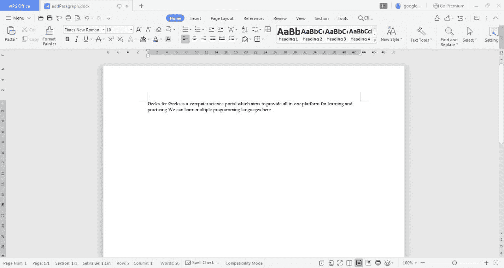

# 在 Word 文档中编写段落的 Java 程序

> 原文：[https://www.geeksforgeeks.org/java-program-to-write-a-paragraph-in-a-word-document/](https://www.geeksforgeeks.org/java-program-to-write-a-paragraph-in-a-word-document/)

Java 为我们提供了内置于环境中的各种包，这有助于轻松阅读、编写和修改文档。包 `org.apache.poi.xwpf.usermodel` 为我们提供了在 Word 文档中格式化和追加内容的各种功能。这个包中有各种各样的类，比如创建新 Word 文档的 `XWPFDocument` 和创建新段落并将其写入相应创建的文档的 `XWPFParagraph`。`File` 类可用于在指定的路径名创建文件，`FileOutputStream` 可用于创建文件流连接。

## 方法

按照以下程序在文档中添加一个段落：

### 1. XWPFDocument

一个可以创建和使用的 Java 类。`.docx` 文件每次都是一片空白。`.docx` 文档已创建。首先，使用 Java 中的 `new XWPFDocument()` 创建这个类的一个对象。文件输出流也是并行创建的，用于在本地系统上创建文档内容并将其附加到文件中。流连接是通过使用 `FileOutputStream` 类建立的。

### 2. XWPFParagraph

一个 Java 类，用来创建与所创建的 `XWPFDocument` 相对应的段落。可以在单个文档中创建多个段落，每个段落都使用指定的文档进行实例化。下面的方法是使用在 Java 中创建的 `XWPFDocument` 对象调用的。

## 语法

### 1. createParagraph()

```java
xwpfdocument.createParagraph()
```

返回类型：`XWPFParagraph` 类的一个对象。

### 2. createRun()

`XWPFRun` 是一个 Java 类，为文档中创建的每个段落添加一个 Run。`XWPFRun` 使用 `createRun()` 方法模拟向段落中添加内容。在 Java 中创建的段落上调用以下方法：

```java
xwpfparagraph.createRun()
```

返回类型：`XWPFRun` 类的一个对象。

### 3. setText()

在这个创建的运行对象上调用 `setText()` 方法来添加 Java 内容：

```java
xwpfrun.setText(content)
```

参数：字符串形式的内容被接受为参数。

返回类型：不返回任何东西。

注意：然后使用流连接对象将文档中指定的内容写入文件流连接，并通过在 `XWPFDocument` 对象上调用 `write()` 方法进行追加。然后，连接相继关闭。

## 实现

在 Word 文档中编写段落的 Java 编程。

### Java 代码

```java
// Java Programming to Write a paragraph in a Word Document

// Importing required packages
import java.io.File;
import java.io.FileOutputStream;
import org.apache.poi.xwpf.usermodel.XWPFDocument;
import org.apache.poi.xwpf.usermodel.XWPFParagraph;
import org.apache.poi.xwpf.usermodel.XWPFRun;

public class GFG {

// Main driver method
    public static void main(String[] args) throws Exception
    {

// Create a blank document
        XWPFDocument xwpfdocument = new XWPFDocument();

// Create a blank file at C:
        File file = new File("C:/addParagraph.docx");

// Create a file output stream connection
        FileOutputStream ostream
            = new FileOutputStream(file);

/* Create a new paragraph using the document */

// CreateParagraph() method is used
        // to instantiate a new paragraph
        XWPFParagraph para = xwpfdocument.createParagraph();

// CreateRun method appends a new run to the
        // paragraph created
        XWPFRun xwpfrun = para.createRun();

// SetText sets the text to the run
        // created using XWPF run
        xwpfrun.setText(
            "Geeks for Geeks is a computer science portal which aims "
            + "to provide all in one platform for learning and "
            + "practicing.We can learn multiple programming languages here. ");

// Write content set using XWPF classes available
        xwpfdocument.write(ostream);

// Close connection
        ostream.close();
    }
}
```

### 输出

程序在本地目录中生成以下文件：

