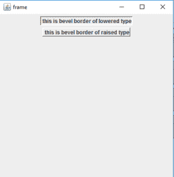
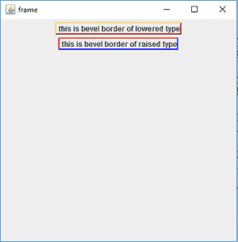
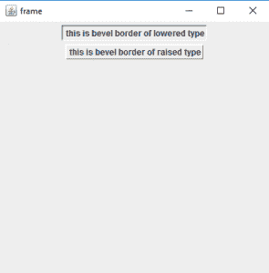
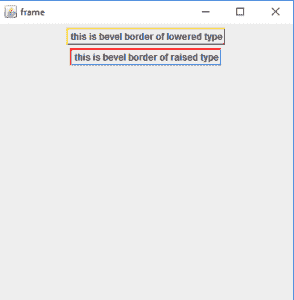

# Java Swing 斜边框和软斜边框

> 原文：[https://www.geeksforgeeks.org/java-swing-bevelborder-and-softbevelborder/](https://www.geeksforgeeks.org/java-swing-bevelborder-and-softbevelborder/)

斜面边框和软斜面边框是 `javax.swing.border` 包的一部分。此包包含不同的组件边框。斜面边框是一个简单的双线斜面边框的实现。斜角边框和软斜角边框几乎相同，但软斜角边框软化了边角。

### `BevelBorder` 类的构造函数

1.  `BevelBorder(int type)`：创建具有指定类型的斜边框，其颜色将从传递到画笔命令方法中的组件的背景颜色中派生。
2.  `BevelBorder(int type, Color h, Color s)`：用指定的类型、高光和阴影颜色创建斜边框。
3.  `BevelBorder(int type, Color highlightOuterColor, Color highlightInnerColor, Color shadowOuterColor, Color shadowInnerColor)`：创建具有指定类型、高光和阴影颜色的斜边框。

### `SoftBevelBorder` 类的构造函数

1.  `SoftBevelBorder(int type)`：创建具有指定类型的斜边框，其颜色将从传递到画笔命令方法中的组件的背景颜色中导出。
2.  `SoftBevelBorder(int type, Color h, Color s)`：使用指定的类型、高光和阴影颜色创建斜边框。
3.  `SoftBevelBorder(int type, Color highlightOuterColor, Color highlightInnerColor, Color shadowOuterColor, Color shadowInnerColor)`：创建具有指定类型、高光和阴影颜色的斜边框。

### 常用的方法

| 方法 | 说明 |
| --- | --- |
| `getBevelType()` | 返回斜角边框的类型 |
| `getBorderInsets(Component c, Insets insets)` | 用此边框的当前 insets 重新初始化 Insets 参数。 |
| `getHighlightInnerColor()` | 返回斜面边框的内部高亮颜色。 |
| `getHighlightInnerColor(Component c)` | 返回在指定组件上呈现时斜面边框的内部高亮颜色。 |
| `getHighlightOuterColor()` | 返回斜面边框的外部高亮颜色。 |
| `getHighlightOuterColor(Component c)` | 返回在指定组件上呈现时斜面边框的外部高亮颜色。 |
| `getShadowInnerColor()` | 返回斜面边框的内部阴影颜色。 |
| `getShadowInnerColor(Component c)` | 返回在指定组件上呈现时斜面边框的内部阴影颜色。 |
| `getShadowOuterColor()` | 返回斜面边框的外部阴影颜色。 |
| `getShadowOuterColor(Component c)` | 返回在指定组件上呈现时斜面边框的外部阴影颜色。 |
| `isBorderOpaque()` | 返回边框是否不透明 |

下面的程序说明了 `BevelBorder` 类：

### 示例1：创建指定类型的简单斜角边框

要创建斜角边框，我们首先创建一个 `JPanel` 对象 `p`，所有边框都将应用到这个对象。`JPanel` 将托管在 `JFrame f` 中，这是这个程序中最外层的容器。为了设置斜面边框，我们创建了两个 `JLabel` 对象，“l”和“l1”，一个用于凸起的文字边框，另一个用于降低的文字边框。边界由函数 `l.setBorder()` 和 `l1.setBorder()` 应用。最后，边界由 `p.add()` 函数添加到 `JPanel` 中，结果由 `f.show()` 显示。

```java
// Java Program to create a simple bevel
// border with specified type
import java.awt.event.*;
import java.awt.*;
import javax.swing.*;
import javax.swing.border.*;
class bevel extends JFrame {

    // frame
    static JFrame f;

    // main class
    public static void main(String[] args)
    {
        // create a new frame
        f = new JFrame("frame");

        // create a object
        bevel s = new bevel();

        // create a panel
        JPanel p = new JPanel();

        // create a label
        JLabel l = new JLabel(" this is bevel border of raised type");

        // create a label
        JLabel l1 = new JLabel(" this is bevel border of lowered type");

        // set border for panel
        l.setBorder(new BevelBorder(BevelBorder.RAISED));

        // set border for label
        l1.setBorder(new BevelBorder(BevelBorder.LOWERED));

        // add button to panel
        p.add(l1);
        p.add(l);

        f.add(p);

        // set the size of frame
        f.setSize(400, 400);

        f.show();
    }
}
```

**输出**：



### 示例2：应用指定颜色的斜角边框进行高亮和阴影

要创建高亮颜色的斜角边框，我们首先创建一个 `JPanel` 对象 `p`，所有的边框都会应用到这个对象上。`JPanel` 将托管在 `JFrame f` 中，这是这个程序中最外层的容器。为了设置斜面边框，我们创建了两个 `JLabel` 对象，“l”和“l1”，一个用于凸起的文字边框，另一个用于降低的文字边框。边界由函数 `l.setBorder()` 和 `l1.setBorder()` 应用。颜色作为参数传递给这些构造函数，例如：`Color.red` 等。最后，边界由 `p.add()` 函数添加到 `JPanel` 中，结果由 `f.show()` 显示。

```java
// java Program to  apply bevel border with
// specified colors to highlight and shadow
import java.awt.event.*;
import java.awt.*;
import javax.swing.*;
import javax.swing.border.*;
class bevel1 extends JFrame {

    // frame
    static JFrame f;

    // main class
    public static void main(String[] args)
    {
        // create a new frame
        f = new JFrame("frame");

        // create a object
        bevel1 s = new bevel1();

        // create a panel
        JPanel p = new JPanel();

        // create a label
        JLabel l = new JLabel(" this is bevel border of raised type");

        // create a label
        JLabel l1 = new JLabel(" this is bevel border of lowered type");

        // set border for panel
        l.setBorder(new BevelBorder(BevelBorder.RAISED, Color.red,
                                                       Color.blue));

        // set border for label
        l1.setBorder(new BevelBorder(BevelBorder.LOWERED, Color.black,
                      Color.red, Color.pink, Color.yellow));

        // add button to panel
        p.add(l1);
        p.add(l);

        f.add(p);

        // set the size of frame
        f.setSize(400, 400);

        f.show();
    }
}
```

**输出**：



下面的程序说明了 `SoftBevelBorder` 类：

### 示例3：创建一个简单的指定类型的软斜角边框

要创建一个软斜角边框，我们首先创建一个 `JPanel` 对象 `p`，所有的边框都会应用到这个对象上。`JPanel` 将托管在 `JFrame f` 中。为了设置斜面边框，我们创建了两个 `JLabel` 对象，“l”和“l1”。边界由函数 `l.setBorder()` 和 `l1.setBorder()` 应用。为了使边框变软，我们在 `setBorder()` 方法的参数中调用构造函数，该参数由行“`SoftBevelBorder()`”表示。最后，边界由 `p.add()` 函数添加到 `JPanel` 中，结果由 `f.show()` 显示。

```java
// java Program to create a simple Soft bevel border
// with specified type
import java.awt.event.*;
import java.awt.*;
import javax.swing.*;
import javax.swing.border.*;
class bevel2 extends JFrame {

    // frame
    static JFrame f;

    // main class
    public static void main(String[] args)
    {
        // create a new frame
        f = new JFrame("frame");

        // create a object
        bevel2 s = new bevel2();

        // create a panel
        JPanel p = new JPanel();

        // create a label
        JLabel l = new JLabel(" this is bevel border of raised type");

        // create a label
        JLabel l1 = new JLabel(" this is bevel border of lowered type");

        // set border for panel
        l.setBorder(new SoftBevelBorder(BevelBorder.RAISED));

        // set border for label
        l1.setBorder(new SoftBevelBorder(BevelBorder.LOWERED));

        // add button to panel
        p.add(l1);
        p.add(l);

        f.add(p);

        // set the size of frame
        f.setSize(400, 400);

        f.show();
    }
}
```

**输出**：



### 示例4：应用指定颜色的软斜角边框进行高亮和阴影

要创建一个软斜角边框，我们首先创建一个 `JPanel` 对象 `p`，所有的边框都会应用到这个对象上。`JPanel` 将托管在 `JFrame f` 中。为了设置斜面边框，我们创建了两个 `JLabel` 对象，“l”和“l1”。边界由函数 `l.setBorder()` 和 `l1.setBorder()` 应用。为了使边框变软，我们在 `setBorder()` 方法的参数中调用构造函数，该参数由行“`SoftBevelBorder()`”表示。颜色作为参数传递给这些构造函数，例如：`Color.red` 等。最后，边界由 `p.add()` 函数添加到 `JPanel` 中，结果由 `f.show()` 显示。

```java
// Java Program to  apply soft bevel border with
// specified colors to highlight and shadow
import java.awt.event.*;
import java.awt.*;
import javax.swing.*;
import javax.swing.border.*;
class bevel3 extends JFrame {

    // frame
    static JFrame f;

    // main class
    public static void main(String[] args)
    {
        // create a new frame
        f = new JFrame("frame");

        // create a object
        bevel3 s = new bevel3();

        // create a panel
        JPanel p = new JPanel();

        // create a label
        JLabel l = new JLabel(" this is bevel border of raised type");

        // create a label
        JLabel l1 = new JLabel(" this is bevel border of lowered type");

        // set border for panel
        l.setBorder(new SoftBevelBorder(BevelBorder.RAISED, Color.red,
                                                         Color.blue));

        // set border for label
        l1.setBorder(new SoftBevelBorder(BevelBorder.LOWERED, Color.black,
                      Color.red, Color.pink, Color.yellow));

        // add button to panel
        p.add(l1);
        p.add(l);

        f.add(p);

        // set the size of frame
        f.setSize(400, 400);

        f.show();
    }
}
```

**输出**：



**注意**：上述程序可能无法在联机 IDE 中运行，请使用脱机编译。

**参考**：

*   [https://docs.oracle.com/javase/7/docs/api/javax/swing/border/BevelBorder.html](https://docs.oracle.com/javase/7/docs/api/javax/swing/border/BevelBorder.html)
*   [https://docs.oracle.com/javase/7/docs/api/javax/swing/border/SoftBevelBorder.html](https://docs.oracle.com/javase/7/docs/api/javax/swing/border/SoftBevelBorder.html)