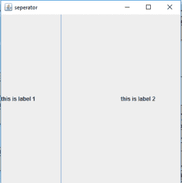
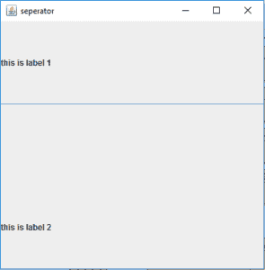
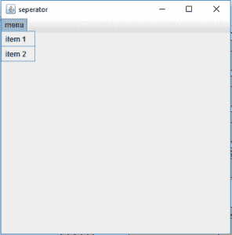

# Java Swing | JSeparator 带示例

> 原文: [https://www.geeksforgeeks.org/java-swing-jseparator-with-examples/](https://www.geeksforgeeks.org/java-swing-jseparator-with-examples/)

## 简介

`JSeparator` 是 Java Swing 框架的一部分。它用于在两个组件之间创建分界线。更具体地说，它主要用于在 `JMenu` 中的菜单项之间创建分界线。在 `JMenu` 或 `JPopupMenu` 中，`addSeparator()` 函数也可以用来创建分隔符。

## 构造方法与常用方法

该类的构造方法为：

1.  `JSeparator()`: 创建新的水平分隔符。
2.  `JSeparator(int o)`: 以指定的水平或垂直方向创建新的分隔符。

常用方法：

| 方法 | 说明 |
| --- | --- |
| `setOrientation(int o)` | 设置分隔符的方向。 |
| `getOrientation()` | 返回分隔符的方向。 |
| `addSeparator()` | 在 `JMenu` 或 `JPopupMenu` 中添加分隔符。 |

## 程序示例

下面的程序将说明 `JSeparator` 的使用。

### 1. 创建垂直分隔符

在这个程序中，我们创建了一个名为 `f` 的框架，标题为“separator”（框架是其他组件的容器）。我们创建一个面板来保存标签和分隔符。我们将分隔符的方向设置为垂直（使用 `setOrientation(SwingConstants.VERTICAL)`），并将分隔符和标签添加到面板（使用 `add()` 函数），然后将面板添加到框架。我们为面板设置网格布局（使用 `new GridLayout(1,0)`）。我们使用 `setSize(400,400)` 将框架的大小设置为 400x400。我们使用 `show()` 函数来显示框架。

```java
// java Program to create a vertical separator
import java.awt.*;
import javax.swing.*;
class separator extends JFrame
{
    // constructor for the class
    separator()
    {
    }

    // main class
    public static void main(String args[])
    {
        // create a frame
        JFrame f = new JFrame("separator");

        // create a panel
        JPanel p = new JPanel();

        // create a label
        JLabel l = new JLabel("this is label 1");
        JLabel l1 = new JLabel("this is label 2");

        // create a separator
        JSeparator s = new JSeparator();

        // set layout as vertical
        s.setOrientation(SwingConstants.VERTICAL);

        p.add(l);
        p.add(s);
        p.add(l1);

        // set layout
        p.setLayout(new GridLayout(1,0));

        f.add(p);

        // show the frame
        f.setSize(400,400);
        f.show();
    }
}
```

**输出**:



### 2. 创建水平分隔符

在这个程序中，我们创建了一个名为 `f` 的框架，标题为“separator”（框架是其他组件的容器）。我们创建一个面板来保存标签和分隔符。我们将分隔符的方向设置为水平（使用 `setOrientation(SwingConstants.HORIZONTAL)`），并将分隔符和标签添加到面板（使用 `add()` 函数），然后将面板添加到框架。我们为面板设置网格布局（使用 `new GridLayout(0,1)`）。我们使用 `setSize(400,400)` 将框架的大小设置为 400x400。我们使用 `show()` 函数来显示框架。

```java
// java Program to create a HORIZONTAL separator
import java.awt.*;
import javax.swing.*;
class separator_1 extends JFrame
{
    // constructor for the class
    separator_1()
    {
    }

    // main class
    public static void main(String args[])
    {
        // create a frame
        JFrame f = new JFrame("separator");

        // create a panel
        JPanel p = new JPanel();

        // create a label
        JLabel l = new JLabel("this is label 1");
        JLabel l1 = new JLabel("this is label 2");

        // create a separator
        JSeparator s = new JSeparator();

        // set layout as horizontal
        s.setOrientation(SwingConstants.HORIZONTAL);

        p.add(l);
        p.add(s);
        p.add(l1);

        // set layout
        p.setLayout(new GridLayout(0,1));

        f.add(p);

        // show the frame
        f.setSize(400,400);
        f.show();
    }
}
```

**输出**:



### 3. 使用 `addSeparator()` 函数

在这个程序中，我们创建了一个名为 `f` 的框架，标题为“separator”（框架是其他组件的容器）。为了说明 `addSeparator()` 功能的使用，我们将创建一个 `JMenuBar` `mb`。然后创建一个 `JMenu` 来保存菜单项。我们将创建两个 `JMenuItem`，并通过使用 `addSeparator()` 函数在它们之间添加一个分隔符。我们将分别使用 `add()` 和 `addMenuBar()` 函数将菜单添加到菜单栏，并将菜单栏添加到框架。我们使用 `setSize(400,400)` 将框架的大小设置为 400x400。我们使用 `show()` 函数来显示框架。

```java
// java Program to create a separator
// using addSeparator function
import java.awt.*;
import javax.swing.*;
class separator extends JFrame
{
    // constructor for the class
    separator()
    {
    }

    // main class
    public static void main(String args[])
    {
        // create a frame
        JFrame f = new JFrame("separator");

        // create a menubar
        JMenuBar mb = new JMenuBar();

        // create a menu
        JMenu m = new JMenu("menu");

        // create menuitems
        JMenuItem m1 = new JMenuItem("item 1");
        JMenuItem m2 = new JMenuItem("item 2");

        // add menuitems
        m.add(m1);
        m.addSeparator();
        m.add(m2);

        // add menu
        mb.add(m);

        f.setJMenuBar(mb);

        // show the frame
        f.setSize(400,400);
        f.show();
    }
}
```

**输出**:

