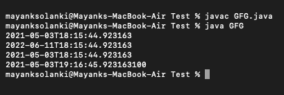
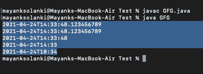
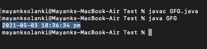

# Java 中的 java.time.LocalDateTime 类

> 原文：[https://www.geeksforgeeks.org/java-time-localdatetime-class-in-java/](https://www.geeksforgeeks.org/java-time-localdatetime-class-in-java/)

[Java 8 中引入的 `java.time.LocalDateTime` 类](https://www.geeksforgeeks.org/java-time-localdate-class-in-java/)，代表一个没有时区信息的本地日期时间对象。Java 中的 `LocalDateTime` 类是一个不可变的日期时间对象，它以 `yyyy-MM-DD-HH-MM-ss.zzz` 格式表示日期。它实现了 `ChronoLocalDateTime` 接口，继承了 `Object` 类。

无论我们需要在没有时区引用的情况下表示时间，我们都可以使用 `LocalDateTime` 实例。例如，`LocalDateTime` 可用于在任何应用程序中启动批处理作业。作业将在服务器所在时区的固定时间运行。请注意，`LocalDateTime` 实例是不可变的，并且是线程安全的。

**语法：类声明**

```java
public final class LocalDateTime
    extends Object
    implements Temporal, TemporalAdjuster, ChronoLocalDateTime<LocalDate>, Serializable
```

该类的方法如下：

| 方法 | 描述 |
| --- | --- |
| `format()` | 它用于使用指定的格式化程序格式化此日期时间。 |
| `get()` | 它用于从该日期时间中获取指定字段的值作为 `int`。 |
| `minusMinutes()` | 返回减去指定分钟数后的本地日期时间的副本。 |
| `minusYears()` | 返回减去指定年数后的本地日期时间的副本。 |
| `minusDays()` | 返回减去指定天数后的本地日期时间的副本。 |
| `now()` | 它用于从默认时区的系统时钟获取当前日期时间。 |
| `plusHours()` | 返回添加了指定小时数的本地日期时间的副本。 |
| `plusYears()` | 返回添加了指定年数的本地日期时间的副本。 |
| `plusDays()` | 返回添加了指定天数的本地日期时间的副本。 |

还有一些修改本地时间的方法如下：`LocalDateTime` 中的方法可以用来获取相对于现有 `LocalDateTime` 实例的新 `LocalDateTime` 实例。具体如下：

`plusYears()`、`plusMonths()`、`plusDays()`、`plusHours()`、`plusMinutes()`、`plusSeconds()`、`plusNanos()`、`minusYears()`、`minusMonths()`、`minusDays()`、`minusHours()`、`minusMinutes()`、`minusSeconds()`

## 实施例 1

```java
// Java Program to illustrate LocalDateTime Class of java.time package

// Importing LocalDateTime class from java.time package
import java.time.LocalDateTime;

// Main class for LocalDateTime
public class GFG {

    // Main driver method
    public static void main(String[] args)
    {
        // Creating an object of LocalDateTime class
        // in the main() method
        LocalDateTime now = LocalDateTime.now();

        // Print statement
        System.out.println(now);

        // Adding 1 year, 1 month, 1 week and 1 day
        LocalDateTime localDateTime1 = now.plusYears(1)
                                           .plusMonths(1)
                                           .plusWeeks(1)
                                           .plusDays(1);
        // Print statement
        System.out.println(localDateTime1);

        // Subtracting 1 year, 1 month, 1 week and 1 day
        LocalDateTime localDateTime2
            = localDateTime1.minusYears(1)
                  .minusMonths(1)
                  .minusWeeks(1)
                  .minusDays(1);
        // Print statement
        System.out.println(localDateTime2);

        // Adding 1 hour, 1 minute, 1 second and 100
        // nanoseconds
        LocalDateTime localDateTime3
            = localDateTime2.plusHours(1)
                  .plusMinutes(1)
                  .plusSeconds(1)
                  .plusNanos(100);
        // Print statement
        System.out.println(localDateTime3);

        // Subtracting 1 hour, 1 minute, 1 second and 100
        // nanoseconds
        LocalDateTime localDateTime4
            = localDateTime3.minusHours(1)
                  .minusMinutes(1)
                  .minusSeconds(1)
                  .minusNanos(100);
        // Print statement
        System.out.println(localDateTime4);
    }
}
```

**输出：**



## 示例 2：创建指定时间

```java
// Java Program to illustrate LocalDateTime Class
// of java.time package by creating specific time

// Importing required classes from resp packages
import java.time.*;
import java.time.format.*;

// main class
class GFG {

    // Main driver method
    public static void main(String[] args)
    {

        // Milliseconds
        LocalDateTime localDateTime1 = LocalDateTime.of(
            2021, 04, 24, 14, 33, 48, 123456789);
        // Print statement
        System.out.println(localDateTime1);

        // Month
        LocalDateTime localDateTime2 = LocalDateTime.of(
            2021, Month.APRIL, 24, 14, 33, 48, 123456789);
        // Print statement
        System.out.println(localDateTime2);

        // Seconds
        LocalDateTime localDateTime3 = LocalDateTime.of(
            2021, Month.APRIL, 24, 14, 33, 48);
        // Print statement
        System.out.println(localDateTime3);

        // Minutes
        LocalDateTime localDateTime4 = LocalDateTime.of(
            2021, Month.APRIL, 24, 14, 33);
        // Print statement
        System.out.println(localDateTime4);

        // Local date + Local time
        LocalDate date = LocalDate.of(2021, 04, 24);
        LocalTime time = LocalTime.of(10, 34);

        LocalDateTime localDateTime5
            = LocalDateTime.of(date, time);
        // Print statement
        System.out.println(localDateTime5);
    }
}
```

**输出：**



## 示例 3：将本地日期时间格式化为字符串

若要将本地时间格式化为所需的字符串表示形式，请使用 `LocalDateTime.format(DateTimeFormatter)` 方法。

```java
// Java Program to illustrate LocalDateTime Class by
// Formatting LocalDateTime to string

// Importing all classes from java.time package
import java.time.LocalDateTime;
import java.time.format.*;
import java.util.*;

// Main class
class GFG {

    // Main driver method
    public static void main(String[] args)
    {

        // Creating an object of DateTimeFormatter class
        DateTimeFormatter formatter
            = DateTimeFormatter.ofPattern(
                "yyyy-MM-dd HH:mm:ss a");

        // Creating an object of LocalDateTime class
        // and getting local date and time using now()
        // method
        LocalDateTime now = LocalDateTime.now();

        // Formatting LocalDateTime to string
        String dateTimeString = now.format(formatter);

        // Print and Display
        System.out.println(dateTimeString);
    }
}
```

**输出：**



> **注意：** 为了将字符串解析为 `LocalDateTime`，将字符串中的时间转换为本地时间实例，`LocalDateTime` 类有两个重载的 `parse()` 方法。
> * `parse(CharSequence text)`
> * `parse(CharSequence text, DateTimeFormatter formatter)`