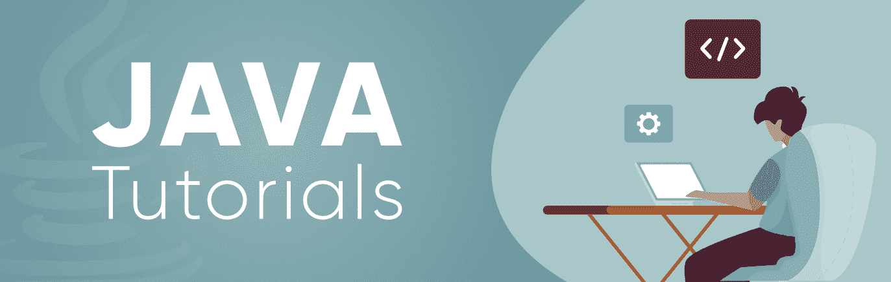
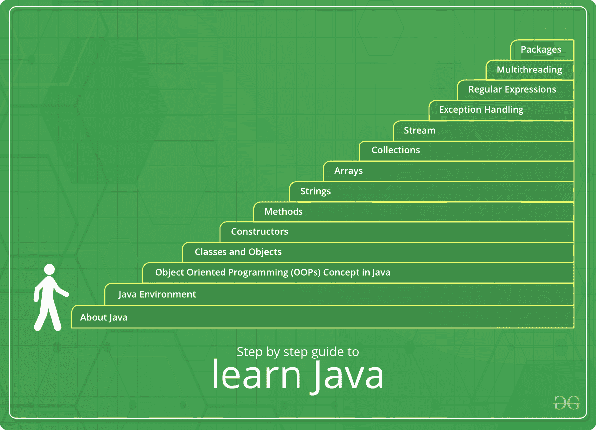

# Java 教程

> 原文:[https://www.geeksforgeeks.org/java-tutorial/](https://www.geeksforgeeks.org/java-tutorial/)

Java 是最流行、应用最广泛的编程语言和平台之一。平台是一种有助于开发和运行用任何编程语言编写的程序的环境。

Java 快速、可靠、安全。从桌面到网络应用，从科学超级计算机到游戏机，从手机到互联网，Java 被应用到每一个角落。

Java 很容易学习，语法简单易懂。它基于 C++(所以对懂 C++的程序员来说更容易)。Java 删除了许多令人困惑且很少使用的特性，例如显式指针、运算符重载等。Java 还负责内存管理，为此，它提供了一个自动垃圾收集器。这将自动收集未使用的对象。

以下是如何开始使用 Java 并使自己精通它的完整指南。

## 学习路径

### 1. [About Java](https://www.geeksforgeeks.org/java-how-to-start-learning-java/)
在迈出第一步之前，最重要的事情是弄清楚所有的“为什么”。这指的是诸如“什么是Java”、“为什么它流行”、“它有哪些特性”等问题。通过阅读提到的文章，你不仅能学到关于Java的重要知识，还能理解如何开始学习它。

**在这里了解 Java:[如何开始学习 Java](https://www.geeksforgeeks.org/java-how-to-start-learning-java/)**

### 2. [Java Environment](https://www.geeksforgeeks.org/jvm-works-jvm-architecture/)
要在任何编程语言上工作，首先需要了解其环境。环境指的是编程语言运行的环境以及程序如何工作。Java 运行在 `JVM` 环境上。点击文章了解更多关于 `JVM`、其架构以及它如何工作。

**在这里了解 JVM:[JVM](https://www.geeksforgeeks.org/jvm-works-jvm-architecture/)**

### 3. [Java Programming Basics](https://www.geeksforgeeks.org/java-programming-basics/)
要精通任何编程语言，首先需要理解该语言的基础。因此，本文将以非常简单的格式为您提供 Java 基础的深入知识。

通过阅读本文，您将了解到从如何设置 Java 环境到其编码细节的主题。

**在这里了解 Java 编程基础知识: [Java 编程基础知识](https://www.geeksforgeeks.org/java-programming-basics/)**

### 4. [Object Oriented Programming (OOPs) Concept in Java](https://www.geeksforgeeks.org/object-oriented-programming-oops-concept-in-java/)
Java 是一种面向对象的编程语言。`OOP` 通过将程序划分为多个对象来使整个程序更简单。对象可以作为桥梁，让数据在函数之间流动。我们可以根据需要轻松修改数据和函数。因此，学习 `OOPs` 概念是学习 Java 的重要一步。

**在此了解 Java 中的 OOPs 概念:[Java 中的面向对象编程(OOPs)概念](https://www.geeksforgeeks.org/object-oriented-programming-oops-concept-in-java/)**

### 5. [Classes and Objects in Java](https://www.geeksforgeeks.org/classes-objects-java/)
类和对象是面向对象编程的基本概念，它们围绕现实世界的实体和 Java 编程。这意味着要在 Java 中实现任何功能，都需要创建类和对象。本文将让您深入了解类和对象，并帮助您将其与现实世界联系起来。

**在这里了解 Java 中的类和对象:[Java 中的类和对象](https://www.geeksforgeeks.org/classes-objects-java/)**

### 6. [Constructors in Java](https://www.geeksforgeeks.org/constructors-in-java/)
为了有效地使用类和对象，需要了解 Java 中的构造函数。构造函数用于初始化对象的状态。与方法类似，构造函数也包含一系列在对象创建时执行的语句（即指令）。

**在此了解 Java 中的构造函数:[Java 中的构造函数](https://www.geeksforgeeks.org/constructors-in-java/)**

### 7. [Methods in Java](https://www.geeksforgeeks.org/methods-in-java/)
方法是执行特定任务并返回结果给调用者的一组语句。一个方法也可以执行特定任务而不返回任何内容。方法允许我们重用代码而无需重新输入。在 Java 中，每个方法都必须是某个类的一部分，这与 C、C++ 和 Python 等语言不同。方法节省时间，帮助我们重用代码。这不仅使方法成为 Java 的重要组成部分，也是学习者必须掌握的主题。

**在此了解 Java 中的方法:[Java 中的方法](https://www.geeksforgeeks.org/methods-in-java/)**

### 8. [Strings in Java](https://www.geeksforgeeks.org/strings-in-java/)
字符串被定义为字符数组。与其他编程语言不同，Java 提供了非常易于实现的字符串操作，即使是初学者也能学会。浏览这篇文章，深入了解 Java 中的字符串。

**在此了解 Java 中的字符串:[Java 中的字符串](https://www.geeksforgeeks.org/strings-in-java/)**

### 9. [Arrays in Java](https://www.geeksforgeeks.org/arrays-in-java/)
数组是一组相同类型的变量，通过一个共同的名称来引用。Java 中的数组工作方式与 C/C++ 中的不同。要了解更多，请参考文章。

**在此了解 Java 中的数组:[Java 中的数组](https://www.geeksforgeeks.org/arrays-in-java/)**

### 10. [Collections in Java](https://www.geeksforgeeks.org/collections-in-java-2/)
集合是一组表示为单个单元的独立对象。Java 提供了集合框架，定义了多个类和接口来将一组对象表示为单个单元。Java 集合框架不仅是学习数据结构和算法的重要部分，也是编程语言中最有用的模块。

**在此了解 Java 中的收藏:[Java 中的收藏](https://www.geeksforgeeks.org/collections-in-java-2/)**

### 11. [Generics in Java](https://www.geeksforgeeks.org/generics-in-java/)
Java 中的泛型类似于 C++ 中的模板。其思想是允许类型（`Integer`、`String` 等以及用户定义类型）作为方法、类和接口的参数。例如，`HashSet`、`ArrayList`、`HashMap` 等类很好地使用了泛型。我们可以将它们用于任何类型。因此，泛型不仅是编程中非常重要的资产，也是编写高效代码的支柱。

**在这里了解 Java 中的泛型:[Java 中的泛型](https://www.geeksforgeeks.org/generics-in-java/)**

### 12. [Stream In Java](https://www.geeksforgeeks.org/stream-in-java/)
在 Java 8 中引入的 `Stream API` 用于处理对象集合。流是一个支持各种方法的对象序列，这些方法可以被流水线化以产生所需的结果。尽管这是在 Java 后期引入的，但它在 Java 编程中迅速获得了巨大的重要性。为了能够在 Java 中流畅地处理数据，必须学习 `Stream`。

**在此了解 Java 中的 Stream:[Java 中的 Stream](https://www.geeksforgeeks.org/stream-in-java/)**

### 13. [Exceptions and Exception Handling in Java](https://www.geeksforgeeks.org/exceptions-in-java/)
在迄今为止的 Java 学习中，你一定多次遇到过“异常”这个词。异常是在程序执行期间（即运行时）发生的不必要或意外事件，它会破坏程序指令的正常流程。因此，要开发一个不会崩溃的模块，就必须学习如何处理异常。

**在这里了解 Java 中的异常和异常处理:[Java 中的异常和异常处理](https://www.geeksforgeeks.org/exceptions-in-java/)**

## 14. [Regular Expressions (ReGex) in Java](https://www.geeksforgeeks.org/regular-expressions-in-java/)
Though this word might seem new to you, `Regular Expression` is a very important part of Development. `Regular Expressions` or `Regex` (in short) is an `API` for defining `String` patterns that can be used for searching, manipulating and editing text. It is widely used to define a constraint on strings such as a `password`.

**在这里了解正则表达式:[Java 中的正则表达式(ReGex)](https://www.geeksforgeeks.org/regular-expressions-in-java/)T3**

## 15. [Multithreading in Java](https://www.geeksforgeeks.org/multithreading-in-java/)
`Multithreading` is a `Java` feature that allows concurrent execution of two or more parts of a program for maximum utilization of `CPU`. Each part of such a program is called a `thread`. So, `threads` are light-weight processes within a process. Though this might seem difficult at first, its a very important part of concurrent programming in `Java`.

**在此了解 Java 多线程:[Java 多线程](https://www.geeksforgeeks.org/multithreading-in-java/)
T4】**

## 16. [File Handling in Java](https://www.geeksforgeeks.org/file-handling-in-java-with-crud-operations/)
`Java` too supports `file handling` and allows users to handle files i.e., to read and write files, along with many other file handling options, to operate on files. The concept of file handling has stretched over various other languages, but the implementation is either complicated or lengthy, but alike other concepts of `Java`, this concept here is also easy and short.

**在这里了解 Java 中的文件处理:[Java 中的文件处理](https://www.geeksforgeeks.org/file-handling-in-java-with-crud-operations)
T4】**

## 17. [Packages in Java](https://www.geeksforgeeks.org/packages-in-java/)
`Package` in `Java` is a mechanism to encapsulate a group of `classes`, `sub packages` and `interfaces`. In other words, a `package` in `Java` refers to a collection of `classes`, `interfaces`, `abstract classes`, and `exceptions` that will help in a module in `Java` programming.

**在这里了解 Java 中的包:[Java 中的包](https://www.geeksforgeeks.org/packages-in-java/)
T4】**