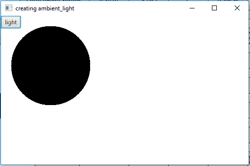
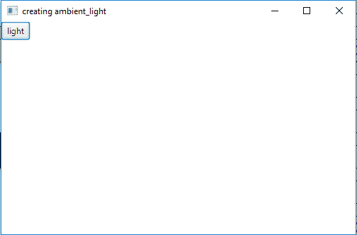
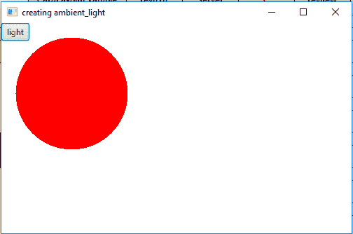
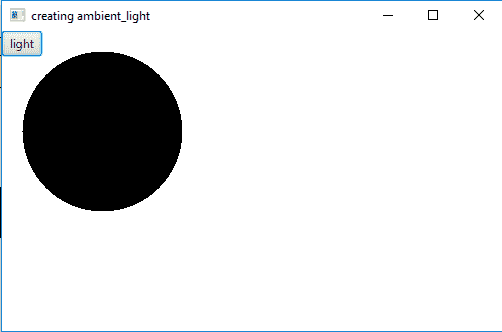

# JavaFX | AmbientLight 类

> 原文: [https://www.geeksforgeeks.org/javafx-ambientlight-class/](https://www.geeksforgeeks.org/javafx-ambientlight-class/)

`AmbientLight` 类是 JavaFX 的一部分。这个类定义了一个环境光对象。`AmbientLight` 类创建一个似乎来自所有方向的光源。

## 构造函数

1.  `AmbientLight()`: 创建默认为白色的环境光源。
2.  `AmbientLight(Color c)`: 创建指定颜色的环境光源。

## 继承自 LightBase 的方法

| 方法 | 说明 |
| --- | --- |
| `getColor()` | 返回光线的颜色 |
| `isLightOn()` | 返回灯是否亮着 |
| `setColor(Color value)` | 设置灯光的颜色 |
| `setLightOn(boolean value)` | 设置 `lightOn` 属性的值 |

下面的程序将说明 `AmbientLight` 类的使用。

## 示例程序

### 1. 创建默认颜色的环境光

这个程序创建一个名为 `sphere` 的球体（半径作为参数传递）。创建一个名为 `ambient_light` 的默认白色环境光。创建一个名为 `button` 的按钮，用于打开或关闭环境光。球体将在场景中创建，而场景又将托管在舞台（`Stage`）中。函数 `setTitle()` 用于为舞台提供标题。然后创建一个 `Group`，并将球体、按钮和环境光附加到其中。该组被附加到场景。最后，调用 `show()` 方法来显示最终结果。

```java
// Java program to create a ambient light of default color
import javafx.application.Application;
import javafx.scene.Scene;
import javafx.scene.shape.DrawMode;
import javafx.scene.layout.*;
import javafx.event.ActionEvent;
import javafx.scene.AmbientLight;
import javafx.scene.shape.Sphere;
import javafx.scene.control.*;
import javafx.stage.Stage;
import javafx.scene.Group;
import javafx.scene.PerspectiveCamera;
import javafx.scene.paint.Color;
import javafx.event.ActionEvent;
import javafx.event.EventHandler;

public class ambient_light_1 extends Application {

    // launch the application
    public void start(Stage stage) {

        // set title for the stage
        stage.setTitle("creating ambient_light");

        // create a sphere
        Sphere sphere = new Sphere(80.0f);

        // create a ambient light
        AmbientLight ambient_light = new AmbientLight();

        // create a button
        Button button = new Button("light");

        // create a Group
        Group group = new Group(sphere, ambient_light, button);

        // translate the sphere to a position
        sphere.setTranslateX(100);
        sphere.setTranslateY(100);

        // action event
        EventHandler<ActionEvent> event =
            new EventHandler<ActionEvent>() {
                public void handle(ActionEvent e) {
                    ambient_light.setLightOn(!ambient_light.isLightOn());
                }
            };

        // set on action
        button.setOnAction(event);

        // create a scene
        Scene scene = new Scene(group, 500, 300);

        // set the scene
        stage.setScene(scene);

        stage.show();
    }

    // Main Method
    public static void main(String args[]) {
        // launch the application
        launch(args);
    }
}
```

**输出:**



### 2. 创建指定颜色的环境光

这个程序创建一个名为 `sphere` 的球体（半径作为参数传递）。创建一个名为 `ambient_light` 的指定颜色（红色）的环境光。创建一个名为 `button` 的按钮，用于打开或关闭环境光。球体将在场景中创建，而场景又将托管在舞台（`Stage`）中。函数 `setTitle()` 用于为舞台提供标题。然后创建一个 `Group`，并将球体、按钮和环境光附加到其中。该组被附加到场景。最后，调用 `show()` 方法来显示最终结果。

```java
// Java program to create a ambient light
// of a specified color
import javafx.application.Application;
import javafx.scene.Scene;
import javafx.scene.shape.DrawMode;
import javafx.scene.layout.*;
import javafx.event.ActionEvent;
import javafx.scene.AmbientLight;
import javafx.scene.shape.Sphere;
import javafx.scene.control.*;
import javafx.stage.Stage;
import javafx.scene.Group;
import javafx.scene.PerspectiveCamera;
import javafx.scene.paint.Color;
import javafx.event.ActionEvent;
import javafx.event.EventHandler;

public class ambient_light_2 extends Application {

    // launch the application
    public void start(Stage stage) {

        // set title for the stage
        stage.setTitle("creating ambient_light");

        // create a sphere
        Sphere sphere = new Sphere(80.0f);

        // create a ambient light
        AmbientLight ambient_light = new AmbientLight(Color.RED);

        // create a button
        Button button = new Button("light");

        // create a Group
        Group group = new Group(sphere, ambient_light, button);

        // translate the sphere to a position
        sphere.setTranslateX(100);
        sphere.setTranslateY(100);

        // action event
        EventHandler<ActionEvent> event =
            new EventHandler<ActionEvent>() {
                public void handle(ActionEvent e) {
                    ambient_light.setLightOn(!ambient_light.isLightOn());
                }
            };

        // set on action
        button.setOnAction(event);

        // create a scene
        Scene scene = new Scene(group, 500, 300);

        // set the scene
        stage.setScene(scene);

        stage.show();
    }

    // Main Method
    public static void main(String args[]) {
        // launch the application
        launch(args);
    }
}
```

**输出:**



## 注意

上述程序可能无法在在线 IDE 中运行。请使用离线编译器。

## 参考

[https://docs.oracle.com/javase/8/javafx/api/javafx/scene/AmbientLight.html](https://docs.oracle.com/javase/8/javafx/api/javafx/scene/AmbientLight.html)