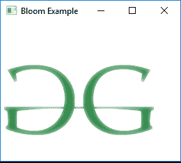

# JavaFX | Bloom 类

> 原文：[https://www.geeksforgeeks.org/javafx-bloom-class/](https://www.geeksforgeeks.org/javafx-bloom-class/)

`Bloom` 类是 JavaFX 的一部分。布隆是一种高级效果，根据可配置的阈值，它使输入图像的较亮部分看起来发光。`Bloom` 类继承 `Effect` 类。

## 类的构造函数

1.  `Bloom()`: 创建一个新的 `Bloom` 对象。
2.  `Bloom(double t)`: 用指定的阈值创建新的 `Bloom` 效果。

## 常用方法

| 方法 | 说明 |
| --- | --- |
| `getInput()` | 获取属性 `input` 的值 |
| `getThreshold()` | 返回阈值的值 |
| `setInput(Effect v)` | 设置属性 `input` 的值 |
| `setThreshold(double v)` | 设置效果的阈值 |

下面的程序说明了 `Bloom` 类的使用：

## 1. 导入图片并添加布隆效果

在这个程序中，创建了一个 `FileInputStream`，并从文件中读取图片作为输入。使用文件输入流的输入创建了一个名为 `image` 的 `Image`。从该图像创建了一个 `ImageView` 对象，并将其添加到 `VBox` 中。然后将 `VBox` 添加到场景，场景再添加到舞台。创建一个带有指定参数的 `Bloom` 效果，并使用 `setEffect()` 函数将效果设置到图像视图上。

```java
// Java program to import an image
// and add bloom effect to it
import javafx.application.Application;
import javafx.scene.Scene;
import javafx.scene.control.*;
import javafx.scene.layout.*;
import javafx.stage.Stage;
import javafx.scene.image.*;
import javafx.scene.effect.*;
import java.io.*;
import javafx.event.ActionEvent;
import javafx.event.EventHandler;
import javafx.scene.Group;

public class bloom_1 extends Application {

// launch the application
        public void start(Stage stage) throws Exception
        {

// set title for the stage
            stage.setTitle("Bloom Example");

// create a input stream
            FileInputStream input = new FileInputStream("D:\\GFG.png");

// create a image
            Image image = new Image(input);

// create a image View
            ImageView imageview = new ImageView(image);

// create a bloom effect
            Bloom bloom = new Bloom(0.9);

// set effect
            imageview.setEffect(bloom);

// create a VBox
            VBox vbox = new VBox(imageview);

// create a scene
            Scene scene = new Scene(vbox, 200, 200);

// set the scene
            stage.setScene(scene);

stage.show();
        }

// Main Method
        public static void main(String args[])
        {

// launch the application
            launch(args);
        }
    }
```

**输入图像：**

[](https://media.geeksforgeeks.org/wp-content/uploads/GFG-14.png)

**输出：**

[](https://media.geeksforgeeks.org/wp-content/uploads/Bloom_1.png)

## 2. 使用按钮控制布隆效果的阈值

在这个程序中，创建了一个 `FileInputStream`，并从文件中读取图片作为输入。使用文件输入流的输入创建了一个名为 `image` 的 `Image`。从该图像创建了一个 `ImageView` 对象，并将其添加到 `VBox` 中。然后将 `VBox` 添加到场景，场景再添加到舞台。创建一个带有指定参数的 `Bloom` 效果，并使用 `setEffect()` 函数将效果设置到图像视图上。创建了一个名为 `button` 的 `Button`，用于增加图像的布隆效果。该按钮也被添加到 `VBox` 中。使用 `setThreshold()` 函数增加图像的布隆效果。按钮相关的事件使用 `EventHandler` 处理。

```java
// Java program to import an image and
// set bloom effect to it. The Threshold
// value of the bloom effect can be 
// controlled using the button
import javafx.application.Application;
import javafx.scene.Scene;
import javafx.scene.control.*;
import javafx.scene.layout.*;
import javafx.stage.Stage;
import javafx.scene.image.*;
import javafx.scene.effect.*;
import java.io.*;
import javafx.event.ActionEvent;
import javafx.event.EventHandler;
import javafx.scene.Group;

public class bloom_2 extends Application {

double level = 0.1;

// launch the application
        public void start(Stage stage) throws Exception
        {

// set title for the stage
            stage.setTitle("Bloom Example");

// create a input stream
            FileInputStream input = new FileInputStream("D:\\GFG.png");

// create a image
            Image image = new Image(input);

// create a image View
            ImageView imageview = new ImageView(image);

// create a bloom effect
            Bloom bloom = new Bloom(level);

// create a button
            Button button = new Button("bloom");

// action event
            EventHandler<ActionEvent> event = new EventHandler<ActionEvent>() {

public void handle(ActionEvent e)
                {

// increase the level
                    level += 0.1;
                    if (level > 1)
                        level = 0.0;

// set Level for bloom
                    bloom.setThreshold(level);
                }
            };

// set on action of button
            button.setOnAction(event);

// set effect
            imageview.setEffect(bloom);

// create a VBox
            VBox vbox = new VBox(imageview, button);

// create a scene
            Scene scene = new Scene(vbox, 200, 200);

// set the scene
            stage.setScene(scene);

stage.show();
        }

// Main Method
        public static void main(String args[])
        {

// launch the application
            launch(args);
        }
    }
```

**输入图像：**

[](https://media.geeksforgeeks.org/wp-content/uploads/GFG-14.png)

**输出：**

<video class="wp-video-shortcode" id="video-219554-1" width="640" height="360" preload="metadata" controls=""><source type="video/mp4" src="https://media.geeksforgeeks.org/wp-content/uploads/Bloom_2.mp4?_=1">[https://media.geeksforgeeks.org/wp-content/uploads/Bloom_2.mp4](https://media.geeksforgeeks.org/wp-content/uploads/Bloom_2.mp4)</video>

**注意：** 上述程序可能无法在在线 IDE 中运行。请使用离线编译器。

**参考：** [https://docs.oracle.com/javase/8/javafx/api/javafx/scene/effect/Bloom.html](https://docs.oracle.com/javase/8/javafx/api/javafx/scene/effect/Bloom.html)