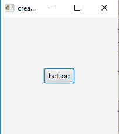
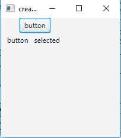
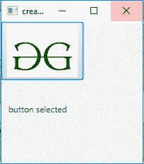
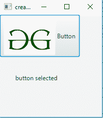
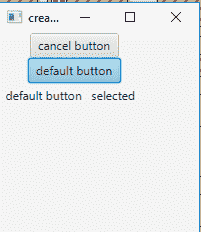
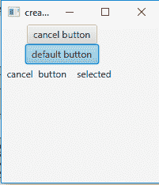

# JavaFX 按钮示例

> 原文: [https://www.geeksforgeeks.org/javafx-button-with-examples/](https://www.geeksforgeeks.org/javafx-button-with-examples/)

按钮类是 JavaFX 包的一部分，它可以有文本或图形，或者两者都有。

JavaFX 中的按钮可以有三种不同的类型：

1.  **正常按钮**：正常按钮
2.  **默认按钮**：接收键盘 VK 输入的默认按钮
3.  **取消按钮**：接收键盘 VK 输入的取消按钮

当按钮被按下时，一个动作事件被发送。此操作事件可以由事件处理程序管理。按钮还可以通过实现事件处理程序来处理鼠标事件，从而响应鼠标事件。

## 按钮类的构造函数

1.  `Button()`：创建一个标签为空字符串的按钮。
2.  `Button(String t)`：创建一个以指定文本为标签的按钮。
3.  `Button(String t, Node g)`：用指定的文本和图标为其标签创建一个按钮。

## 常用方法

| 方法 | 说明 |
| --- | --- |
| `setCancelButton(boolean v)` | 设置取消按钮属性的值。 |
| `setDefaultButton(boolean v)` | 设置属性默认值按钮的值 |
| `isDefaultButton()` | 获取属性 defaultButton 的值。 |
| `isCancelButton()` | 获取取消按钮属性的值。 |
| `cancelButtonProperty()` | 取消按钮是接收键盘 VK 按下的按钮 |
| `defaultButtonProperty()` | 默认按钮是接收键盘 VK 输入的按钮 |
| `createDefaultSkin()` | 为此控件创建默认外观的新实例。 |

下面的程序说明了按钮在 JavaFX 中的使用。

## 1. 创建按钮并添加到舞台

此程序创建一个由名称 `b` 指示的 `Button`。按钮将在场景（`Scene`）内创建，而场景又将托管在舞台（`Stage`）内。函数 `setTitle()` 用于为舞台提供标题。然后创建一个平铺窗格（`TilePane`），在其上调用 `addChildren()` 方法以将按钮附加到场景中。最后，调用 `show()` 方法以显示最终结果。

```java
// Java Program to create a button and add it to the stage
import javafx.application.Application;
import javafx.scene.Scene;
import javafx.scene.control.Button;
import javafx.scene.layout.StackPane;
import javafx.stage.Stage;
public class button extends Application {

    // launch the application
    public void start(Stage s)
    {
        // set title for the stage
        s.setTitle("creating buttons");

        // create a button
        Button b = new Button("button");

        // create a stack pane
        StackPane r = new StackPane();

        // add button
        r.getChildren().add(b);

        // create a scene
        Scene sc = new Scene(r, 200, 200);

        // set the scene
        s.setScene(sc);

        s.show();
    }

    public static void main(String args[])
    {
        // launch the application
        launch(args);
    }
}
```

**输出**：


## 2. 创建按钮并为其添加事件处理程序

此程序创建一个由名称 `b` 指示的 `Button`。按钮将在场景（`Scene`）内创建，而场景又将托管在舞台（`Stage`）内。我们将创建一个标签（`Label`）来显示按钮是否被按下。函数 `setTitle()` 用于为舞台提供标题。然后创建一个平铺窗格（`TilePane`），在其上调用 `addChildren()` 方法以将按钮和标签附加到场景中。最后，调用 `show()` 方法以显示最终结果。我们将创建一个事件处理程序来处理按钮事件。事件处理程序将使用 `setOnAction()` 函数添加到按钮。

```java
// Java program to create a button and add event handler to it
import javafx.application.Application;
import javafx.scene.Scene;
import javafx.scene.control.Button;
import javafx.scene.layout.*;
import javafx.event.ActionEvent;
import javafx.event.EventHandler;
import javafx.scene.control.Label;
import javafx.stage.Stage;
public class button_1 extends Application {

    // launch the application
    public void start(Stage s)
    {
        // set title for the stage
        s.setTitle("creating buttons");

        // create a button
        Button b = new Button("button");

        // create a stack pane
        TilePane r = new TilePane();

        // create a label
        Label l = new Label("button not selected");

        // action event
        EventHandler<ActionEvent> event = new EventHandler<ActionEvent>() {
            public void handle(ActionEvent e)
            {
                l.setText("   button   selected    ");
            }
        };

        // when button is pressed
        b.setOnAction(event);
```

// add button
`r.getChildren().add(b);`
`r.getChildren().add(l);`

// create a scene
`Scene sc = new Scene(r, 200, 200);`

// set the scene
`s.setScene(sc);`

`s.show();`
    }

`public static void main(String args[])`
    {
        // launch the application
        `launch(args);`
    }
}
```

### 输出


## 3. Java Program to create a button with a image and add event handler to it
This program creates a `Button` with an image on it indicated by the name `b`. The image will be included using the `FileInputStream` that imports the image. we will then create an `Image` using the object of file input stream and then create an `ImageView` using the image file. The button will be created inside a `Scene`, which in turn will be hosted inside a `Stage`.we would create a `Label` to show if the button is pressed or not. The function `setTitle()` is used to provide title to the stage. Then a `TilePane` is created, on which `addChildren()` method is called to attach the button and label inside the scene. Finally, the `show()` method is called to display the final results.we would create an event handler to handle the button events. The event handler would be added to the button using `setOnAction()` function.

```java
// Java Program to create a button with a image and
// add event handler to it
import javafx.application.Application;
import javafx.scene.Scene;
import javafx.scene.control.Button;
import javafx.scene.layout.*;
import javafx.scene.image.*;
import java.io.*;
import javafx.event.ActionEvent;
import javafx.event.EventHandler;
import javafx.scene.control.Label;
import javafx.stage.Stage;
import java.net.*;
public class button_2 extends Application {

    // launch the application
    public void start(Stage s) throws Exception
    {
        // set title for the stage
        s.setTitle("creating buttons");

        // create a input stream
        FileInputStream input = new FileInputStream("f:\\gfg.png");

        // create a image
        Image i = new Image(input);

        // create a image View
        ImageView iw = new ImageView(i);

        // create a button
        Button b = new Button("", iw);

        // create a stack pane
        TilePane r = new TilePane();

        // create a label
        Label l = new Label("button not selected");

        // action event
        EventHandler<ActionEvent> event = new EventHandler<ActionEvent>() {
            public void handle(ActionEvent e)
            {
                l.setText("button selected    ");
            }
        };

        // when button is pressed
        b.setOnAction(event);

        // add button
        r.getChildren().add(b);
        r.getChildren().add(l);

        // create a scene
        Scene sc = new Scene(r, 200, 200);

        // set the scene
        s.setScene(sc);

        s.show();
    }

    public static void main(String args[])
    {
        // launch the application
        launch(args);
    }
}
```

### 输出


## 4. Java Program to create a button with a image and text and add event handler to it
这个程序创建一个按钮，按钮上有一个图像和一个由名称 `b` 表示的文本。图像将使用导入图像的 `FileInputStream` 来包含。然后我们将使用 `FileInputStream` 的对象创建一个 `Image`，然后使用图像文件创建一个 `ImageView`。按钮将在 `Scene` 中创建，而场景又将在 `Stage` 中托管。我们将创建一个 `Label` 来显示按钮是否被按下。函数 `setTitle()` 用于为舞台提供标题。然后创建一个 `TilePane`，在该窗格上调用 `addChildren()` 方法在场景内部附加按钮和标签。最后，调用 `show()` 方法来显示最终结果。事件处理程序将使用 `setOnAction()` 函数添加到按钮中。

```java
// Java Program to create a button with a image
// and text and add event handler to it
import javafx.application.Application;
import javafx.scene.Scene;
import javafx.scene.control.Button;
import javafx.scene.layout.*;
import javafx.scene.image.*;
import java.io.*;
import javafx.event.ActionEvent;
import javafx.event.EventHandler;
import javafx.scene.control.Label;
import javafx.stage.Stage;
import java.net.*;
public class button_3 extends Application {
```

# 创建带图标的按钮

```java
// launch the application
public void start(Stage s) throws Exception
{
    // set title for the stage
    s.setTitle("creating buttons");

    // create a input stream
    FileInputStream input = new FileInputStream("f:\\gfg.png");

    // create a image
    Image i = new Image(input);

    // create a image View
    ImageView iw = new ImageView(i);

    // create a button
    Button b = new Button("Button", iw);

    // create a stack pane
    TilePane r = new TilePane();

    // create a label
    Label l = new Label("button not selected");

    // action event
    EventHandler<ActionEvent> event = new EventHandler<ActionEvent>() {
        public void handle(ActionEvent e)
        {
            l.setText("button selected    ");
        }
    };

    // when button is pressed
    b.setOnAction(event);

    // add button
    r.getChildren().add(b);
    r.getChildren().add(l);

    // create a scene
    Scene sc = new Scene(r, 200, 200);

    // set the scene
    s.setScene(sc);

    s.show();
}

public static void main(String args[])
{
    // launch the application
    launch(args);
}
```

**输出**:


# 创建默认按钮和取消按钮

这个程序创建一个名为`b`和`b1`的`Button`。按钮`b`将作为取消按钮，响应键盘的`Escape`键按下；按钮`b1`将作为默认按钮，响应键盘的`Enter`键按下。按钮将创建在`Scene`内，而`Scene`则托管在`Stage`内。我们将创建一个`Label`来显示哪个按钮被按下。`setTitle()`函数用于为`Stage`提供标题。然后创建一个`TilePane`，在其上调用`addChildren()`方法，将按钮和标签附加到场景中。最后，调用`show()`方法显示最终结果。我们将创建一个事件处理器来处理按钮事件。事件处理器将使用`setOnAction()`函数添加到按钮上。

```java
// Java program to create a default button and a
// cancel button and add event handler to it
import javafx.application.Application;
import javafx.scene.Scene;
import javafx.scene.control.Button;
import javafx.scene.layout.*;
import javafx.event.ActionEvent;
import javafx.event.EventHandler;
import javafx.scene.control.Label;
import javafx.stage.Stage;
public class button_4 extends Application {

    // launch the application
    public void start(Stage s)
    {
        // set title for the stage
        s.setTitle("creating buttons");

        // create a button
        Button b = new Button("cancel button");

        // set cancel button
        b.setCancelButton(true);

        // create a button
        Button b1 = new Button("default button");

        // set default button
        b1.setDefaultButton(true);

        // create a stack pane
        TilePane r = new TilePane();

        // create a label
        Label l = new Label("button not selected");

        // action event
        EventHandler<ActionEvent> event = new EventHandler<ActionEvent>() {
            public void handle(ActionEvent e)
            {
                l.setText("  cancel  button    selected    ");
            }
        };
        EventHandler<ActionEvent> event1 = new EventHandler<ActionEvent>() {
            public void handle(ActionEvent e)
            {
                l.setText("  default button   selected    ");
            }
        };

        // when button is pressed
        b.setOnAction(event);
        b1.setOnAction(event1);

        // add button
        r.getChildren().add(b);
        r.getChildren().add(b1);
        r.getChildren().add(l);

        // create a scene
        Scene sc = new Scene(r, 200, 200);

        // set the scene
        s.setScene(sc);

        s.show();
    }

    public static void main(String args[])
    {
        // launch the application
        launch(args);
    }
}
```

**输出**:



**注意**：上述程序可能无法在联机IDE中运行，请使用脱机编译器。

**参考**：[https://docs.oracle.com/javase/8/javafx/api/javafx/scene/control/Button.html](https://docs.oracle.com/javase/8/javafx/api/javafx/scene/control/Button.html)