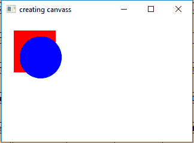
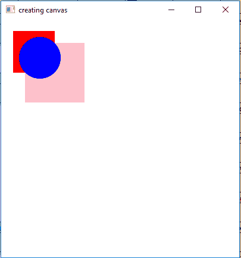

# JavaFX Canvas类

> 原文：[https://www.geeksforgeeks.org/javafx-canvas-class/](https://www.geeksforgeeks.org/javafx-canvas-class/)

`Canvas`类是JavaFX的一部分。`Canvas`类基本上创建了一个图像，可以使用`GraphicsContext`提供的一组图形命令来绘制。画布具有指定的高度和宽度，所有的绘制操作都被裁剪到画布的边界。

## 类的构造函数

1.  `Canvas()`：创建新的画布对象。
2.  `Canvas(double w, double h)`：创建具有指定宽度和高度的新`Canvas`对象。

## 常用方法

| 方法 | 说明 |
| --- | --- |
| `getGraphicsContext2D()` | 返回与画布关联的图形上下文。 |
| `getHeight()` | 返回画布的高度。 |
| `getWidth()` | 返回画布的宽度。 |
| `setHeight(double v)` | 设置画布的高度。 |
| `setWidth(double d)` | 设置画布的宽度。 |

下面的程序说明了`Canvas`类的使用：

### 示例1：通过构造函数创建画布并绘制图形

Java程序，通过构造函数创建具有指定宽度和高度的画布，将其添加到舞台，并在上面绘制一个圆形和一个矩形。在此程序中，我们将创建一个名为`canvas`的`Canvas`，并使用`getGraphicsContext2D()`函数提取`GraphicsContext`，然后绘制一个矩形和一个椭圆。接着，创建一个名为`group`的`Group`并将画布添加到组中。最后，创建一个场景，将组添加到场景，再将场景附加到舞台，并调用`show()`函数显示结果。

```java
// Java Program to create a canvas with specified
// width and height(as arguments of constructor),
// add it to the stage and also add a circle and
// rectangle on it
import javafx.application.Application;
import javafx.scene.Scene;
import javafx.scene.control.*;
import javafx.scene.layout.*;
import javafx.stage.Stage;
import javafx.event.ActionEvent;
import javafx.event.EventHandler;
import javafx.scene.canvas.*;
import javafx.scene.paint.Color;
import javafx.scene.Group;

public class canvas extends Application {

    // launch the application
    public void start(Stage stage)
    {
        // set title for the stage
        stage.setTitle("creating canvas");

        // create a canvas
        Canvas canvas = new Canvas(100.0f, 100.0f);

        // graphics context
        GraphicsContext graphics_context =
            canvas.getGraphicsContext2D();

        // set fill for rectangle
        graphics_context.setFill(Color.RED);
        graphics_context.fillRect(20, 20, 70, 70);

        // set fill for oval
        graphics_context.setFill(Color.BLUE);
        graphics_context.fillOval(30, 30, 70, 70);

        // create a Group
        Group group = new Group(canvas);

        // create a scene
        Scene scene = new Scene(group, 200, 200);

        // set the scene
        stage.setScene(scene);

        stage.show();
    }

    // Main Method
    public static void main(String args[])
    {
        // launch the application
        launch(args);
    }
}
```

**输出：**



### 示例2：使用setHeight()和setWidth()创建画布并绘制图形

Java程序，创建一个画布并使用`setHeight()`和`setWidth()`函数设置画布大小，将其添加到舞台，并在上面绘制一个圆形和一个矩形。在此程序中，我们将创建一个名为`canvas`的`Canvas`，并使用`setWidth()`和`setHeight()`函数设置宽度和高度。然后，使用`getGraphicsContext2D()`函数提取`GraphicsContext`，绘制两个矩形和一个椭圆。接着，创建一个名为`group`的`Group`并将画布添加到组中。最后，创建一个场景，将组添加到场景，再将场景附加到舞台，并调用`show()`函数显示结果。

```java
// Java Program to create a canvas and use
// setHeight() and setWidth() function to
// set canvas size and add it to the stage
// and also add a circle and rectangle on it
import javafx.application.Application;
import javafx.scene.Scene;
import javafx.scene.control.*;
import javafx.scene.layout.*;
import javafx.stage.Stage;
import javafx.event.ActionEvent;
import javafx.event.EventHandler;
import javafx.scene.canvas.*;
import javafx.scene.paint.Color;
import javafx.scene.Group;

public class canvas1 extends Application {

    // launch the application
    public void start(Stage stage)
    {
        // set title for the stage
        stage.setTitle("creating canvas");

        // create a canvas
        Canvas canvas = new Canvas();

        // set height and width
        canvas.setHeight(400);
        canvas.setWidth(400);

        // graphics context
        GraphicsContext graphics_context =
            canvas.getGraphicsContext2D();

        // set fill for rectangle
        graphics_context.setFill(Color.PINK);
        graphics_context.fillRect(40, 40, 100, 100);

        // set fill for rectangle
        graphics_context.setFill(Color.RED);
        graphics_context.fillRect(20, 20, 70, 70);

        // set fill for oval
        graphics_context.setFill(Color.BLUE);
        graphics_context.fillOval(30, 30, 70, 70);

        // create a Group
        Group group = new Group(canvas);

        // create a scene
        Scene scene = new Scene(group, 400, 400);

        // set the scene
        stage.setScene(scene);

        stage.show();
    }

    // Main Method
    public static void main(String args[])
    {
        // launch the application
        launch(args);
    }
}
```

**输出：**



**注意：** 上述程序可能无法在在线IDE中运行。请使用离线编译器。

**参考：** [https://docs.oracle.com/javase/8/javafx/api/javafx/scene/canvas/Canvas.html](https://docs.oracle.com/javase/8/javafx/api/javafx/scene/canvas/Canvas.html)