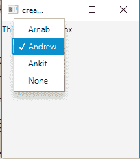
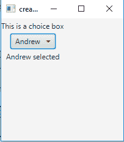

# JavaFX | ChoiceBox

> 原文：`https://www.geeksforgeeks.org/javafx-choicebox/`

ChoiceBox 是 JavaFX 包的一部分。ChoiceBox 显示一组项目，并允许用户选择一个选项，它将在顶部显示当前选择的项目。除非另外选择，否则默认情况下，选项框没有选定的项目。可以先指定项目，然后指定选定项目，也可以先指定选定项目，然后指定项目。

## 构造函数

`ChoiceBox` 类的构造函数为：

1.  `ChoiceBox()`：新建一个空的 `ChoiceBox`。
2.  `ChoiceBox(ObservableList items)`：用给定的一组项目创建一个新的 `ChoiceBox`。

## 常用方法

| 方法 | 说明 |
| --- | --- |
| `getItem()` | 获取属性项的值。 |
| `getValue()` | 获取属性值。 |
| `hide()` | 关闭选项列表。 |
| `setItems(ObservableList value)` | 设置属性项的值。 |
| `setValue(T value)` | 设置属性值。 |
| `show()` | 打开选项列表。 |

## 程序示例

下面的程序说明了 `ChoiceBox` 的使用：

### 1. 创建 ChoiceBox 并添加项目

此程序创建一个名为 `c` 的 `ChoiceBox`，并使用 `ChoiceBox(FXCollections.observableArrayList(string_array))` 向其添加一个字符串列表。我们将把选择框和一个标签添加到 `TilePane`（使用 `getChildren().add()` 函数）。然后，我们将创建一个舞台（容器），将 `TilePane` 添加到场景，再将场景添加到舞台。最后，使用 `show()` 函数显示舞台。

```java
// Java Program to create a ChoiceBox and add items to it.
import javafx.application.Application;
import javafx.scene.Scene;
import javafx.scene.control.*;
import javafx.scene.layout.*;
import javafx.event.ActionEvent;
import javafx.event.EventHandler;
import javafx.collections.*;
import javafx.stage.Stage;
public class Choice_1 extends Application {

    // launch the application
    public void start(Stage s)
    {
        // set title for the stage
        s.setTitle("creating ChoiceBox");

        // create a button
        Button b = new Button("show");

        // create a tile pane
        TilePane r = new TilePane();

        // create a label
        Label l = new Label("This is a choice box");

        // string array
        String st[] = { "Arnab", "Andrew", "Ankit", "None" };

        // create a choiceBox
        ChoiceBox c = new ChoiceBox(FXCollections.observableArrayList(st));

        // add ChoiceBox
        r.getChildren().add(l);
        r.getChildren().add(c);

        // create a scene
        Scene sc = new Scene(r, 200, 200);

        // set the scene
        s.setScene(sc);

        s.show();
    }

    public static void main(String args[])
    {
        // launch the application
        launch(args);
    }
}
```

**输出**：


### 2. 创建 ChoiceBox 并添加监听器

此程序创建一个名为 `c` 的 `ChoiceBox`，并使用 `ChoiceBox(FXCollections.observableArrayList(string_array))` 向其添加一个字符串列表。我们将添加一个更改监听器来检测用户何时选择了一个选项（使用 `addListener()` 函数添加监听器）。更改监听器有一个函数 `public void changed(ObservableValue ov, Number value, Number new_value)`，当选择的选项发生更改时会被调用。我们将把选择框和一个标签添加到 `TilePane`（使用 `getChildren().add()` 函数）。然后，我们将创建一个舞台（容器），将 `TilePane` 添加到场景，再将场景添加到舞台。最后，使用 `show()` 函数显示舞台。

```java
// Java Program to create a ChoiceBox and add listener to it.
import javafx.application.Application;
import javafx.scene.Scene;
import javafx.scene.control.*;
import javafx.scene.layout.*;
import javafx.event.ActionEvent;
import javafx.event.EventHandler;
import javafx.collections.*;
import javafx.beans.value.*;
import javafx.stage.Stage;
public class Choice_2 extends Application {

    // launch the application
    public void start(Stage s)
    {
        // set title for the stage
        s.setTitle("creating ChoiceBox");

        // create a button
        Button b = new Button("show");

        // create a tile pane
        TilePane r = new TilePane();

        // create a label
        Label l = new Label("This is a choice box");
        Label l1 = new Label("nothing selected");

        // string array
        String st[] = { "Arnab", "Andrew", "Ankit", "None" };

        // create a choiceBox
        ChoiceBox c = new ChoiceBox(FXCollections.observableArrayList(st));

        // add a listener
        c.getSelectionModel().selectedIndexProperty().addListener(new ChangeListener<Number>() {

            // if the item of the list is changed
            public void changed(ObservableValue ov, Number value, Number new_value)
            {

                // set the text for the label to the selected item
                l1.setText(st[new_value.intValue()] + " selected");
            }
        });

        // add ChoiceBox
        r.getChildren().add(l);
        r.getChildren().add(c);
        r.getChildren().add(l1);

        // create a scene
        Scene sc = new Scene(r, 200, 200);

        // set the scene
        s.setScene(sc);

        s.show();
    }

    public static void main(String args[])
    {
        // launch the application
        launch(args);
    }
}
```

**输出**：


**注意**：上述程序可能无法在联机 IDE 中运行，请使用脱机编译器。

**参考**：`https://docs.oracle.com/javase/8/javafx/api/javafx/scene/control/ChoiceBox.html`