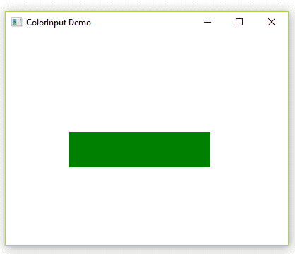

# JavaFX ColorInput 类

> 原文：[https://www.geeksforgeeks.org/javafx-colorinput-class/](https://www.geeksforgeeks.org/javafx-colorinput-class/)

`ColorInput` 类是 JavaFX 的一部分。它用于创建一个效果，渲染一个矩形区域，填充给定的颜色。这相当于将一个填充的矩形渲染到图像中，并使用 `ImageInput` 效果，只是它更方便，而且效率可能更高。它主要作为输入传递到其他效果中。

## 类的构造函数

1.  `ColorInput()`：使用默认参数创建颜色输入的新实例。
2.  `ColorInput(double x, double y, double width, double height, Paint paint)`：使用指定的 x，y，宽度，高度和 `Paint` 创建 `ColorInput` 的新实例。

## 常用方法

| 方法 | 描述 |
| --- | --- |
| `getX()` | 获取属性 x 的值。 |
| `getY()` | 获取属性 y 的值。 |
| `setHeight(double value)` | 设置属性高度的值。 |
| `setPaint(Paint value)` | 设置属性绘制的值。 |
| `setWidth(double value)` | 设置属性宽度的值。 |
| `setX(double value)` | 设置属性 x 的值。 |
| `setY(double value)` | 设置属性 y 的值。 |
| `getHeight()` | 获取属性高度的值。 |
| `getPaint()` | 获取属性 paint 的值。 |
| `getWidth()` | 获取属性宽度的值。 |

## Java 程序演示 ColorInput 类

在这个程序中，创建了 `ColorInput` 效果，然后我们设置 `ColorInput` 区域的颜色、高度、宽度和坐标。创建了一个 `Group` 对象和 `Scene` 对象。将场景添加到舞台，然后设置舞台的标题。

```java
// Java program to Demonstrate ColorInput class
import javafx.application.Application;
import javafx.scene.Group;
import javafx.scene.Scene;
import javafx.scene.effect.ColorInput;
import javafx.scene.paint.Color;
import javafx.scene.shape.Rectangle;
import javafx.stage.Stage;

public class ColorInputDemo extends Application {

    // Main Method
    public static void main(String[] args)
    {
        // launch the application
        launch(args);
    }

    // launch the application
    public void start(Stage primaryStage) throws Exception
    {
        // Instantiating the ColorInput class
        ColorInput color = new ColorInput();

        // set the color
        color.setPaint(Color.GREEN);

        // sets the height of the region of color input
        color.setHeight(50);

        // sets the width of the region of color input
        color.setWidth(200);

        // set the coordinates of the Colorinput
        color.setX(90);
        color.setY(140);

        // create a rectangle
        Rectangle rect = new Rectangle();

        // applying coloradjust effect
        rect.setEffect(color);

        // create a group object
        Group root = new Group();

        // create a scene object
        Scene scene = new Scene(root, 400, 300);

        root.getChildren().add(rect);

        // adding scene to the stage
        primaryStage.setScene(scene);

        // set title of the stage
        primaryStage.setTitle("ColorInput Demo");

        primaryStage.show();
    }
}
```

**输出：**



## 使用 EventHandler 通过点击按钮将 ColorInput 类应用于创建的矩形

在这个程序中，我们首先设置矩形的高度、宽度和坐标，然后创建一个相同维度的矩形。现在，创建一个按钮并设置按钮的布局。然后，使用 `EventHandler`，首先使用适当的维度实例化 `ColorInput` 类，然后将 `ColorInput` 效果设置到按钮上。创建一个 `Group` 对象并将按钮和矩形添加到其中。然后创建一个 `Scene` 并将其添加到舞台。

```java
// Java program to apply ColorInput class to
// the created rectangle by clicking on the
// button using EventHandler
import javafx.application.Application;
import javafx.event.ActionEvent;
import javafx.event.EventHandler;
import javafx.scene.Group;
import javafx.scene.Scene;
import javafx.scene.control.Button;
import javafx.scene.effect.ColorInput;
import javafx.scene.paint.Color;
import javafx.scene.shape.Rectangle;
import javafx.stage.Stage;

public class ColorInputExample extends Application {

    public void start(Stage stage)
    {
        double x = 10;
        double y = 10;
        double w = 40;
        double h = 180;

        // Rectangle
        Rectangle rect = new Rectangle(x, y, w, h);
        rect.setFill(Color.WHITE);
        rect.setStrokeWidth(1);
        rect.setStroke(Color.BLACK);

        // Button
        Button button = new Button("Click To See the Effects!");

        // set button layout coordinates
        button.setLayoutX(100);
        button.setLayoutY(30);

        button.setPrefSize(250, 150);

        button.setOnAction(new EventHandler<ActionEvent>() {
            public void handle(ActionEvent event)
            {
                // instantiating the colorinput class
                ColorInput colorInput = new ColorInput(x, y,
                                     w, h, Color.STEELBLUE);

                // Setting ColorInput effect
                button.setEffect(colorInput);
            }
        });

        // create the Group object
        Group root = new Group();

        root.getChildren().addAll(button, rect);

        Scene scene = new Scene(root, 450, 300);
        stage.setTitle("JavaFX ColorInput Effect");
        stage.setScene(scene);

        stage.show();
    }

    // Main Method
    public static void main(String args[])
    {
        // Launch the application
        launch(args);
    }
}
```

**输出：**

<video class="wp-video-shortcode" id="video-221408-1" width="640" height="360" preload="metadata" controls=""><source type="video/mp4" src="https://media.geeksforgeeks.org/wp-content/uploads/ColorInput.mp4?_=1">[https://media.geeksforgeeks.org/wp-content/uploads/ColorInput.mp4](https://media.geeksforgeeks.org/wp-content/uploads/ColorInput.mp4)</video>

**注意：** 上述程序可能无法在在线 IDE 中运行。请使用离线编译器。

**参考：** [https://docs.oracle.com/javafx/2/api/javafx/scene/effect/ColorInput.html](https://docs.oracle.com/javafx/2/api/javafx/scene/effect/ColorInput.html)