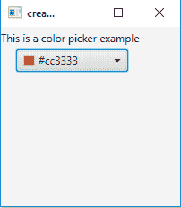
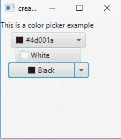
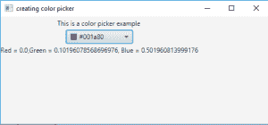

# JavaFx | ColorPicker 常见示例

> 原文: [https://www.geeksforgeeks.org/javafx-colorpicker-with-examples/](https://www.geeksforgeeks.org/javafx-colorpicker-with-examples/)

## 简介

`ColorPicker` 是 JavaFX 的一部分。颜色选择器允许用户从给定的一组颜色中选择一种颜色，或者自定义颜色。可以使用 `setValue()` 函数设置初始颜色，或者在构造函数中定义它，用户选择的颜色可以使用 `getValue()` 函数找到。

当用户从颜色选择器中选择一种颜色时，会生成一个 `Action` 事件。此事件可以使用事件处理程序来处理。

**拾色器外观有三种控制方式:**

*   简单的按钮模式
*   菜单按钮模式
*   分割菜单按钮模式

## 构造函数

**该类的构造函数为:**

1.  `ColorPicker()`: 创建一个默认的颜色选择器实例，所选颜色设置为白色。
2.  `ColorPicker(Color c)`: 创建一个颜色选择器实例，并将选定的颜色设置为给定的颜色。

## 常用方法

| 方法 | 说明 |
| --- | --- |
| `getCustomColors()` | 获取用户添加到调色板的自定义颜色列表。 |
| `setValue(Color c)` | 将拾色器的颜色设置为 `c` 色 |
| `getValue()` | 返回一个 `Color` 对象，该对象定义用户选择的颜色 |

## 示例程序

以下程序将说明拾色器的使用:

### 1. 创建颜色选择器并添加到舞台

此程序创建一个 `ColorPicker`，名称为 `cp`。颜色选择器将在场景中创建，而场景又将托管在舞台（顶级 JavaFX 容器）中。函数 `setTitle()` 用于为舞台提供标题。然后创建一个 `TilePane`，在其上调用 `getChildren().add()` 方法将颜色选择器附加到场景中，代码中指定的分辨率为 `(200, 200)`。最后，调用 `show()` 方法显示最终结果。

```java
// Java Program to create a color picker and add it to the stage
import javafx.application.Application;
import javafx.scene.Scene;
import javafx.scene.control.*;
import javafx.scene.layout.*;
import javafx.event.ActionEvent;
import javafx.event.EventHandler;
import javafx.collections.*;
import javafx.stage.Stage;
import javafx.scene.text.Text.*;
import javafx.scene.paint.*;
import javafx.scene.text.*;
public class colorpicker extends Application {
    // labels
    Label l;

    // launch the application
    public void start(Stage s)
    {
        // set title for the stage
        s.setTitle("creating color picker");

        // create a tile pane
        TilePane r = new TilePane();

        // create a label
        l = new Label("This is a color picker example ");

        // create a color picker
        ColorPicker cp = new ColorPicker(Color.BLUE);

        // add label
        r.getChildren().add(l);
        r.getChildren().add(cp);

        // create a scene
        Scene sc = new Scene(r, 200, 200);

        // set the scene
        s.setScene(sc);

        s.show();
    }

    public static void main(String args[])
    {
        // launch the application
        launch(args);
    }
}
```

**输出:**


### 2. 创建三种不同外观的颜色选择器

此程序创建三个 `ColorPicker`，名称为 `cp`、`cp1`、`cp2`。`cp` 将具有菜单按钮的外观，`cp1` 将具有按钮的外观，`cp2` 将具有分割按钮的外观。颜色选择器将在场景中创建，而场景又将托管在舞台（顶级 JavaFX 容器）中。函数 `setTitle()` 用于为舞台提供标题。然后创建一个 `TilePane`，在其上调用 `getChildren().add()` 方法将颜色选择器附加到场景中，代码中指定的分辨率为 `(200, 200)`。最后，调用 `show()` 方法显示最终结果。

```java
// Java Program to create color picker of three different appearance
import javafx.application.Application;
import javafx.scene.Scene;
import javafx.scene.control.*;
import javafx.scene.layout.*;
import javafx.event.ActionEvent;
import javafx.event.EventHandler;
import javafx.collections.*;
import javafx.stage.Stage;
import javafx.scene.text.Text.*;
import javafx.scene.paint.*;
import javafx.scene.text.*;
public class colorpicker_1 extends Application {
    // labels
    Label l;

    // launch the application
    public void start(Stage s)
    {
        // set title for the stage
        s.setTitle("creating color picker");

        // create a tile pane
        TilePane r = new TilePane();

        // create a label
        l = new Label("This is a color picker example ");

        // create a color picker
        ColorPicker cp = new ColorPicker(Color.BLUE);

        // create a color picker
        ColorPicker cp1 = new ColorPicker(Color.BLUE);

        // set the appearance of color picker to button
        cp1.getStyleClass().add("button");

        // create a color picker
        ColorPicker cp2 = new ColorPicker(Color.BLUE);

        // set the appearance of color picker to split button
        cp2.getStyleClass().add("split-button");

        // add label
        r.getChildren().add(l);
        r.getChildren().add(cp);
        r.getChildren().add(cp1);
        r.getChildren().add(cp2);

        // create a scene
        Scene sc = new Scene(r, 200, 200);

        // set the scene
        s.setScene(sc);

        s.show();
    }

    public static void main(String args[])
    {
        // launch the application
        launch(args);
    }
}
```

**输出:**


### 3. 创建颜色选择器并为其添加监听器

此程序创建一个 `ColorPicker`，名称为 `cp`。我们将创建一个事件处理器和一个标签 `l2`，用于显示用户选择的颜色。事件处理器将处理颜色选择器的事件，并将标签 `l2` 的文本设置为所选颜色的 `RGB` 值。事件将使用 `setOnAction()` 方法与颜色选择器关联。颜色选择器将在场景中创建，而场景又将托管在舞台（顶级 JavaFX 容器）中。函数 `setTitle()` 用于为舞台提供标题。然后创建一个 `TilePane`，在其上调用 `getChildren().add()` 方法将颜色选择器附加到场景中，代码中指定的分辨率为 `(200, 200)`。最后，调用 `show()` 方法显示最终结果。

```java
// Java Program to create color picker and add listener to it
import javafx.application.Application;
import javafx.scene.Scene;
import javafx.scene.control.*;
import javafx.scene.layout.*;
import javafx.event.ActionEvent;
import javafx.event.EventHandler;
import javafx.collections.*;
import javafx.stage.Stage;
import javafx.scene.text.Text.*;
import javafx.scene.paint.*;
import javafx.scene.text.*;
public class colorpicker_2 extends Application {
    // labels
    Label l;

    // launch the application
    public void start(Stage s)
    {
        // set title for the stage
        s.setTitle("creating color picker");

        // create a tile pane
        TilePane r = new TilePane();

        // create a label
        l = new Label("This is a color picker example ");
        Label l1 = new Label("no selected color ");

        // create a color picker
        ColorPicker cp = new ColorPicker();
```

// create a event handler
```java
EventHandler<ActionEvent> event = new EventHandler<ActionEvent>() {
    public void handle(ActionEvent e)
    {
        // color
        Color c = cp.getValue();

        // set text of the label to RGB value of color
        l1.setText("Red = " + c.getRed() + ", Green = " + c.getGreen() 
                 + ", Blue = " + c.getBlue());
    }
};

// set listener
cp.setOnAction(event);

// add label
r.getChildren().add(l);
r.getChildren().add(cp);
r.getChildren().add(l1);

// create a scene
Scene sc = new Scene(r, 500, 200);

// set the scene
s.setScene(sc);

s.show();
}

public static void main(String args[])
{
    // launch the application
    launch(args);
}
}
```

## 输出


## 注意
上述程序可能无法在联机 IDE 中运行，请使用脱机编译器。

## 参考
[https://docs.oracle.com/javase/8/javafx/api/javafx/scene/control/ColorPicker.html](https://docs.oracle.com/javase/8/javafx/api/javafx/scene/control/ColorPicker.html)