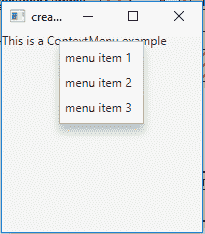
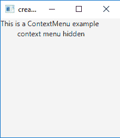
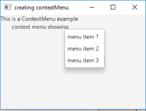

# JavaFX 上下文菜单（ContextMenu）及示例

> 原文：[https://www.geeksforgeeks.org/javafx-contextmenu-with-examples/](https://www.geeksforgeeks.org/javafx-contextmenu-with-examples/)

`ContextMenu` 是 JavaFX 库的一部分。它可以与标签（`Label`）、文本框（`TextField`）等控件相关联。右键单击相关控件时，上下文菜单被激活，并显示一个包含若干菜单项或子菜单的弹出窗口。

## 构造函数

该类的构造函数为：

1.  `ContextMenu()`: 新建一个空的上下文菜单。
2.  `ContextMenu(MenuItem… i)`: 创建包含 `MenuItem` 的上下文菜单。

## 常用方法

| 方法 | 说明 |
| --- | --- |
| `getItems()` | 返回上下文菜单的项目 |
| `getOnAction()` | 返回操作属性的值 |
| `hide()` | 隐藏上下文菜单 |
| `setOnAction(EventHandler v)` | 设置“动作”属性的值 |
| `show(Node a, double x, double y)` | 在屏幕的指定位置显示上下文菜单 |

## 示例 1：创建上下文菜单并添加到标签

以下程序说明了上下文菜单的使用：创建一个名为 `contextMenu` 的 `ContextMenu`，并添加 3 个菜单项：`menuItem1`、`menuItem2`、`menuItem3`。然后将此菜单与一个名为 `label` 的标签关联。该标签将在场景（`Scene`）中创建，而场景则托管在舞台（`Stage`）内。`setTitle()` 函数用于为舞台提供标题。接着创建一个 `VBox`，在其上调用 `addChildren()` 方法以将菜单栏附加到场景中。最后，调用 `show()` 方法显示最终结果。

```java
// Program to create a context menu and add it to label
import javafx.application.Application;
import javafx.scene.Scene;
import javafx.scene.control.*;
import javafx.scene.layout.*;
import javafx.event.ActionEvent;
import javafx.event.EventHandler;
import javafx.collections.*;
import javafx.stage.Stage;
import javafx.scene.text.Text.*;
import javafx.scene.paint.*;
import javafx.scene.text.*;
public class contextMenu_1 extends Application {
    // labels
    Label l;

    // launch the application
    public void start(Stage stage)
    {
        // set title for the stage
        stage.setTitle("creating contextMenu ");

        // create a label
        Label label1 = new Label("This is a ContextMenu example ");

        // create a menu
        ContextMenu contextMenu = new ContextMenu();

        // create menuitems
        MenuItem menuItem1 = new MenuItem("menu item 1");
        MenuItem menuItem2 = new MenuItem("menu item 2");
        MenuItem menuItem3 = new MenuItem("menu item 3");

        // add menu items to menu
        contextMenu.getItems().add(menuItem1);
        contextMenu.getItems().add(menuItem2);
        contextMenu.getItems().add(menuItem3);

        // create a tilepane
        TilePane tilePane = new TilePane(label1);

        // setContextMenu to label
        label1.setContextMenu(contextMenu);

        // create a scene
        Scene sc = new Scene(tilePane, 200, 200);

        // set the scene
        stage.setScene(sc);

        stage.show();
    }

    public static void main(String args[])
    {
        // launch the application
        launch(args);
    }
}
```

**输出：**


## 示例 2：关联窗口事件监听器

创建一个名为 `contextMenu` 的 `ContextMenu`，并添加 3 个菜单项 `menuItem1`、`menuItem2`、`menuItem3`。将此 `contextMenu` 与标签 `l` 关联。该标签将在场景（`Scene`）中创建，而场景则托管在舞台（`Stage`）内。`setTitle()` 函数用于为舞台提供标题。接着创建一个 `VBox`，在其上调用 `addChildren()` 方法以将菜单栏附加到场景中。最后，调用 `show()` 方法显示最终结果。创建一个窗口事件（`WindowEvent`）来处理上下文菜单的窗口事件，并通过标签 `label` 显示上下文菜单的状态。该窗口事件将使用 `setOnHiding()` 和 `setOnShowing()` 函数与标签关联。

```java
// Program to create a context menu and add it to label
// and associate the context menu with window event listener
import javafx.application.Application;
import javafx.scene.Scene;
import javafx.scene.control.*;
import javafx.scene.layout.*;
import javafx.stage.WindowEvent;
import javafx.event.EventHandler;
import javafx.collections.*;
import javafx.stage.Stage;
import javafx.scene.text.Text.*;
import javafx.scene.paint.*;
import javafx.scene.text.*;
public class contextMenu extends Application {
    // labels
    Label label;

    // launch the application
    public void start(Stage stage)
    {
        // set title for the stage
        stage.setTitle("creating contextMenu ");

        // create a label
        Label label1 = new Label("This is a ContextMenu example ");

        // create a menu
        ContextMenu contextMenu = new ContextMenu();

        // create menuitems
        MenuItem menuItem1 = new MenuItem("menu item 1");
        MenuItem menuItem2 = new MenuItem("menu item 2");
        MenuItem menuItem3 = new MenuItem("menu item 3");

        // add menu items to menu
        contextMenu.getItems().add(menuItem1);
        contextMenu.getItems().add(menuItem2);
        contextMenu.getItems().add(menuItem3);

        // label to display events
        Label label = new Label("context menu hidden");

        // create window event
        EventHandler<WindowEvent> event = new EventHandler<WindowEvent>() {
            public void handle(WindowEvent e)
            {
                if (contextMenu.isShowing())
                    label.setText("context menu showing");
                else
                    label.setText("context menu hidden");
            }
        };

        // add event
        contextMenu.setOnShowing(event);
        contextMenu.setOnHiding(event);

        // create a tilepane
        TilePane tilePane = new TilePane(label1);

        tilePane.getChildren().add(label);

        // setContextMenu to label
        label.setContextMenu(contextMenu);

        // create a scene
        Scene sc = new Scene(tilePane, 200, 200);

        // set the scene
        stage.setScene(sc);

        stage.show();
    }

    public static void main(String args[])
    {
        // launch the application
        launch(args);
    }
}
```

**输出：**




**注意：** 上述程序可能无法在在线编译器中运行，请使用离线 IDE。

**参考：** [https://docs.oracle.com/javase/8/javafx/api/javafx/scene/control/ContextMenu.html](https://docs.oracle.com/javase/8/javafx/api/javafx/scene/control/ContextMenu.html)