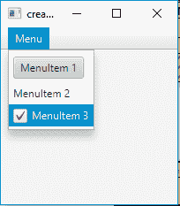
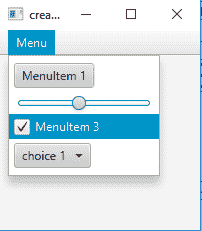

# JavaFX | CustomMenuItem

> 原文: [https://www.geeksforgeeks.org/javafx-custommenuitem/](https://www.geeksforgeeks.org/javafx-custommenuitem/)

`CustomMenuItem` 是 JavaFX 库的一部分。`CustomMenuItem` 允许不同类型的节点作为其菜单项。`customMenuItem` 的一个有用属性是 `hideOnClick`。此属性说明当用户单击 `menuitem` 时是否应隐藏菜单。

`CustomMenuItem` 的构造函数:

1.  `CustomMenuItem(Node n)` : 用指定的节点创建一个菜单项。
2.  `CustomMenuItem(Node n, boolean b)` : 用指定的节点和点击隐藏属性创建一个菜单项。

常用方法:

| 方法 | 说明 |
| --- | --- |
| `getContent()` | 获取属性 `content` 的值。 |
| `isHideOnClick()` | 获取 `hideOnClick` 属性的值。 |
| `setHideOnClick(boolean v)` | 设置 `hideOnClick` 属性的值。 |
| `setContent(Node v)` | 将节点设置为菜单项的内容。 |

下面的程序将说明 `CustomMenuItem` 的使用:

## 示例程序1：创建自定义菜单项并将其添加到菜单

该程序创建一个由菜单栏名称指示的菜单栏。将创建一个名为 `menu` 的菜单，并将 3 个自定义菜单项 `menuitem_1`、`menuitem_2`、`menuitem_3` 添加到菜单中，并将菜单添加到菜单栏中。菜单栏将在场景中创建，而场景又将托管在舞台中。函数 `setTitle()` 用于为舞台提供标题。然后创建一个 `VBox`，在其上调用 `getChildren().add()` 方法将菜单栏附加到场景中。最后，调用 `show()` 方法显示最终结果。自定义菜单将包含一个按钮、标签和一个复选框。

```java
// Program to create a custom menu items and add it to the menu
import javafx.application.Application;
import javafx.scene.Scene;
import javafx.scene.control.*;
import javafx.scene.layout.*;
import javafx.event.ActionEvent;
import javafx.event.EventHandler;
import javafx.collections.*;
import javafx.stage.Stage;
import javafx.scene.text.Text.*;
import javafx.scene.paint.*;
import javafx.scene.text.*;

public class CustomMenuItem_1 extends Application {

    // Launch the application
    public void start(Stage stage)
    {
        // Set title for the stage
        stage.setTitle("creating CustomMenuItem ");

        // Create a tile pane
        TilePane r = new TilePane();

        // Create a label
        Label description_label =
                    new Label("This is a CustomMenuItem example ");

        // Create a menu
        Menu menu = new Menu("Menu");

        // Create menuitems
        CustomMenuItem menuitem_1 =
                    new CustomMenuItem(new Button("MenuItem 1"));
        CustomMenuItem menuitem_2 =
                    new CustomMenuItem(new Label("MenuItem 2"));
        CustomMenuItem menuitem_3 =
                    new CustomMenuItem(new CheckBox("MenuItem 3"));

        // Add menu items to menu
        menu.getItems().add(menuitem_1);
        menu.getItems().add(menuitem_2);
        menu.getItems().add(menuitem_3);

        // Create a menubar
        MenuBar menubar = new MenuBar();

        // Add menu to menubar
        menubar.getMenus().add(menu);

        // Create a VBox
        VBox vbox = new VBox(menubar);

        // Create a scene
        Scene scene = new Scene(vbox, 200, 200);

        // Set the scene
        stage.setScene(scene);

        stage.show();
    }

    public static void main(String args[])
    {
        // Launch the application
        launch(args);
    }
}
```

**输出:**



## 示例程序2：使用 hideOnClick 属性

该程序创建一个由 `MenuBar` 名称指示的菜单栏。将创建一个名为 `menu` 的菜单，并将 4 个自定义菜单项 `menuitem_1`、`menuitem_2`、`menuitem_3`、`menuitem_4` 添加到菜单中，并将菜单添加到菜单栏中。菜单栏将在场景中创建，而场景又将托管在舞台中。函数 `setTitle()` 用于为舞台提供标题。然后创建一个 `VBox`，在其上调用 `getChildren().add()` 方法将菜单栏附加到场景中。最后，调用 `show()` 方法显示最终结果。`CustomMenuItem` 将包含一个按钮、一个滑块、一个复选框和一个选项框。自定义菜单项 `menuitem_2` 和 `menuitem_4` 的 `hideOnClick` 属性将设置为 `false`，`menuitem_1` 和 `menuitem_3` 的 `hideOnClick` 属性将设置为 `true`。点击 `menuitem_2` 和 `menuitem_4` 不会在点击时消失。

```java
// Program to create custom menu items and
// Add it to the menu and use the property hide on click

import javafx.application.Application;
import javafx.scene.Scene;
import javafx.scene.control.*;
import javafx.scene.layout.*;
import javafx.event.ActionEvent;
import javafx.event.EventHandler;
import javafx.collections.*;
import javafx.stage.Stage;
import javafx.scene.text.Text.*;
import javafx.scene.paint.*;
import javafx.scene.text.*;

public class CustomMenuItem_2 extends Application {

    // Launch the application
    public void start(Stage stage)
    {
        // Set title for the stage
        stage.setTitle("creating CustomMenuItem ");

        // Create a tile pane
        TilePane r = new TilePane();

        // Create a label
        Label description_label =
                   new Label("This is a CustomMenuItem example ");

        // Create a menu
        Menu menu = new Menu("Menu");

        // Create menuitems
        CustomMenuItem menuitem_1 =
                   new CustomMenuItem(new Button("MenuItem 1"));
        CustomMenuItem menuitem_2 =
                   new CustomMenuItem(new Slider());
        CustomMenuItem menuitem_3 =
                   new CustomMenuItem(new CheckBox("MenuItem 3"));
        CustomMenuItem menuitem_4 =
                   new CustomMenuItem(new ChoiceBox(FXCollections
                     .observableArrayList("choice 1",
                                   "choice 2", "choice 3")));

        // Set hide on click property
        menuitem_2.setHideOnClick(false);
        menuitem_4.setHideOnClick(false);
        menuitem_1.setHideOnClick(true);
        menuitem_3.setHideOnClick(true);

        // Add menu items to menu
        menu.getItems().add(menuitem_1);
        menu.getItems().add(menuitem_2);
        menu.getItems().add(menuitem_3);
        menu.getItems().add(menuitem_4);

        // Create a menubar
        MenuBar menubar = new MenuBar();

        // Add menu to menubar
        menubar.getMenus().add(menu);

        // Create a VBox
        VBox vbox = new VBox(menubar);

        // Create a scene
        Scene scene = new Scene(vbox, 200, 200);

        // Set the scene
        stage.setScene(scene);

        stage.show();
    }

    public static void main(String args[])
    {
        // Launch the application
        launch(args);
    }
}
```

**输出:**



**注意:** 上述程序可能无法在联机 IDE 中运行，请使用脱机编译器。

**参考:** [https://docs.oracle.com/javafx/2/api/javafx/scene/control/CustomMenuItem.html](https://docs.oracle.com/javafx/2/api/javafx/scene/control/CustomMenuItem.html)