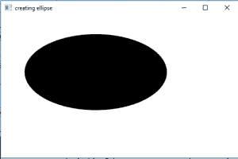
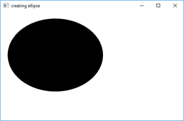
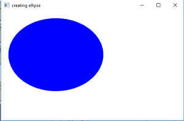

# JavaFX Ellipse 详解与示例

> 原文：[https://www.geeksforgeeks.org/javafx-ellipse-with-examples/](https://www.geeksforgeeks.org/javafx-ellipse-with-examples/)

`Ellipse`类是 JavaFX 库的一部分。`Ellipse`类通过提供中心以及 X 和 Y 半径来创建椭圆。`Ellipse`类扩展了`Shape`类。

## 类的构造函数

1.  `Ellipse()`：创建椭圆的空实例。
2.  `Ellipse(double X, double Y)`：用给定的 X 和 Y 半径创建一个椭圆。
3.  `Ellipse(double X, double Y, double radiusX, double radiusY)`：创建具有给定中心和半径的椭圆。

## 常用方法

| 方法 | 说明 |
| --- | --- |
| `getCenterX()` | 返回椭圆中心的 X 坐标 |
| `getCenterY()` | 返回椭圆中心的 Y 坐标 |
| `getRadiusX()` | 返回 X 半径的值（沿主轴） |
| `getRadiusY()` | 返回 Y 半径的值（沿短轴） |
| `setCenterX(double v)` | 设置椭圆中心的 X 坐标 |
| `setCenterY(double v)` | 设置椭圆中心的 Y 坐标 |
| `setRadiusX(double v)` | 设置 X 半径的值（沿主轴） |
| `setRadiusY(double v)` | 设置 Y 半径的值（沿短轴） |
| `setFill(Color c)` | 设置椭圆的填充 |

下面的程序将说明`Ellipse`类的使用：

## 示例 1：通过构造函数参数创建椭圆

该程序创建一个由名称`ellipse`指示的椭圆（中心和半径的坐标作为参数传递）。椭圆将在场景内创建，而场景又将在舞台内托管。函数`setTitle()`用于为舞台提供标题。然后创建一个`Group`，并附加椭圆。这个小组附属于现场。最后，调用`show()`方法显示最终结果。

```java
// Java program to create ellipse by passing the
// coordinates of the center and radius as arguments in constructor
import javafx.application.Application;
import javafx.scene.Scene;
import javafx.scene.control.Button;
import javafx.scene.layout.*;
import javafx.event.ActionEvent;
import javafx.scene.shape.Ellipse;
import javafx.scene.control.*;
import javafx.stage.Stage;
import javafx.scene.Group;
public class ellipse_0 extends Application {

    // launch the application
    public void start(Stage stage)
    {
        // set title for the stage
        stage.setTitle("creating ellipse");

        // create a ellipse
        Ellipse ellipse = new Ellipse(200.0f, 120.0f, 150.0f, 80.f);

        // create a Group
        Group group = new Group(ellipse);

        // create a scene
        Scene scene = new Scene(group, 500, 300);

        // set the scene
        stage.setScene(scene);

        stage.show();
    }

    public static void main(String args[])
    {
        // launch the application
        launch(args);
    }
}
```

**输出：**


## 示例 2：使用 setter 方法创建椭圆

该程序创建一个由名称`ellipse`表示的椭圆。中心和半径的坐标将使用函数`setCenterX()`、`setCenterY()`、`setRadiusX()`和`setRadiusY()`函数来设置。椭圆将在场景内创建，而场景又将在舞台内托管。函数`setTitle()`用于为舞台提供标题。然后创建一个`Group`，并附加椭圆。这个小组附属于现场。最后，调用`show()`方法显示最终结果。

```java
// Java program to create ellipse by passing the
// coordinates of the center and radius using
// functions setCenterX(), setCenterY() etc.
import javafx.application.Application;
import javafx.scene.Scene;
import javafx.scene.control.Button;
import javafx.scene.layout.*;
import javafx.event.ActionEvent;
import javafx.scene.shape.Ellipse;
import javafx.scene.control.*;
import javafx.stage.Stage;
import javafx.scene.Group;
public class ellipse_1 extends Application {

    // launch the application
    public void start(Stage stage)
    {
        // set title for the stage
        stage.setTitle("creating ellipse");

        // create a ellipse
        Ellipse ellipse = new Ellipse();

        // set center
        ellipse.setCenterX(150.0f);
        ellipse.setCenterY(120.0f);

        // set radius
        ellipse.setRadiusX(130.0f);
        ellipse.setRadiusY(100.0f);

        // create a Group
        Group group = new Group(ellipse);

        // create a scene
        Scene scene = new Scene(group, 500, 300);

        // set the scene
        stage.setScene(scene);

        stage.show();
    }

    public static void main(String args[])
    {
        // launch the application
        launch(args);
    }
}
```

**输出：**


## 示例 3：使用 setter 方法并设置填充颜色

该程序创建一个由名称`ellipse`表示的椭圆。中心和半径的坐标将使用函数`setCenterX()`、`setCenterY()`、`setRadiusX()`和`setRadiusY()`函数来设置。函数`setFill()`将用于设置椭圆的填充。椭圆将在场景内创建，而场景又将在舞台内托管。函数`setTitle()`用于为舞台提供标题。然后创建一个`Group`，并附加椭圆。这个小组附属于现场。最后，调用`show()`方法显示最终结果。

```java
// Java program to create ellipse by passing the
// coordinates of the center and radius using
// functions setCenterX(), setCenterY(), and
// set a fill using setFill() function
import javafx.application.Application;
import javafx.scene.Scene;
import javafx.scene.control.Button;
import javafx.scene.layout.*;
import javafx.event.ActionEvent;
import javafx.scene.shape.Ellipse;
import javafx.scene.control.*;
import javafx.scene.paint.Color;
import javafx.stage.Stage;
import javafx.scene.Group;
public class ellipse_2 extends Application {

    // launch the application
    public void start(Stage stage)
    {
        // set title for the stage
        stage.setTitle("creating ellipse");

        // create a ellipse
        Ellipse ellipse = new Ellipse();

        // set center
        ellipse.setCenterX(150.0f);
        ellipse.setCenterY(120.0f);

        // set radius
        ellipse.setRadiusX(130.0f);
        ellipse.setRadiusY(100.0f);

        // set fill
        ellipse.setFill(Color.BLUE);

        // create a Group
        Group group = new Group(ellipse);

        // create a scene
        Scene scene = new Scene(group, 500, 300);

        // set the scene
        stage.setScene(scene);

        stage.show();
    }

    public static void main(String args[])
    {
        // launch the application
        launch(args);
    }
}
```

**输出：**


**注意：** 上述程序可能无法在联机 IDE 中运行，请使用脱机编译器。
**参考：** [https://docs.oracle.com/javase/8/javafx/api/javafx/scene/shape/Ellipse.html](https://docs.oracle.com/javase/8/javafx/api/javafx/scene/shape/Ellipse.html)