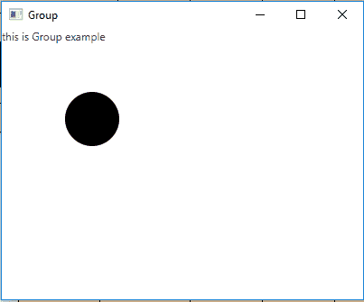
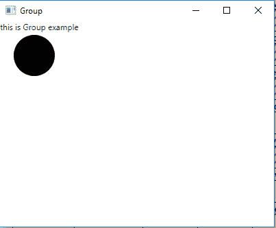

# JavaFX Group类

> 原文：[https://www.geeksforgeeks.org/javafx-group-class/](https://www.geeksforgeeks.org/javafx-group-class/)

`Group`类是JavaFX的一部分。组包含节点的数量。组将采用其子代的集体边界，并且不能直接调整大小。组类继承父类。

## 该类的构造函数

1.  `Group()`：构建一个新的组。
2.  `Group(Collection<Node> children)`：构造一个具有指定节点的新组。
3.  `Group(Node... c)`：用指定的节点构建一个新的组。

## 常用方法

| 方法 | 说明 |
| --- | --- |
| `getChildren()` | 返回组的子代。 |
| `isAutoSizeChildren()` | 获取属性`autoSizeChildren`的值。 |
| `minHeight(double width)` | 返回用于布局计算的节点最小高度。 |
| `minWidth(double height)` | 返回用于布局计算的节点最小宽度。 |
| `prefHeight(double width)` | 组将首选高度简单地定义为其布局边界的高度。 |
| `prefWidth(double height)` | 组将首选宽度简单地定义为其布局边界的宽度。 |
| `setAutoSizeChildren(boolean v)` | 设置属性`autoSizeChildren`的值。 |

以下程序说明了`Group`类的使用：

## 1. 创建Group并添加到舞台的Java程序

在此程序中，我们创建一个名为`label`的`Label`和一个名为`circle`的`Circle`。然后创建一个名为`group`的`Group`，并使用`getChildren().add()`函数将标签和圆添加到其中。创建一个场景并将组添加到场景中。将场景添加到舞台并显示舞台以查看最终结果。

```java
// Java Program to create a Group
// and add it to the stage
import javafx.application.Application;
import javafx.scene.Scene;
import javafx.scene.control.*;
import javafx.scene.layout.*;
import javafx.stage.Stage;
import javafx.event.ActionEvent;
import javafx.event.EventHandler;
import javafx.scene.canvas.*;
import javafx.scene.web.*;
import javafx.scene.Group;
import javafx.scene.shape.*;

public class Group_1 extends Application {

    // launch the application
    public void start(Stage stage)
    {
        try {
            // set title for the stage
            stage.setTitle("Group");

            // create a Group
            Group group = new Group();

            // create a label
            Label label = new Label("this is Group example");

            // add label to group
            group.getChildren().add(label);

            // circle
            Circle c = new Circle(100, 100, 30);

            // add Circle to Group
            group.getChildren().add(c);

            // create a scene
            Scene scene = new Scene(group, 400, 300);

            // set the scene
            stage.setScene(scene);

            stage.show();
        }
        catch (Exception e) {
            System.out.println(e.getMessage());
        }
    }

    // Main Method
    public static void main(String args[])
    {
        // launch the application
        launch(args);
    }
}
```

**输出：**



## 2. 创建Group、设置自动调整大小为true并添加到舞台的Java程序

在此程序中，我们创建一个名为`label`的`Label`和一个名为`circle`的`Circle`。然后创建一个名为`group`的`Group`，并使用`getChildren().add()`函数将标签和圆添加到其中。使用`setAutoSizeChildren()`函数将自动调整大小子项设置为`true`。创建一个场景并将组添加到场景中。将场景添加到舞台并显示舞台以查看最终结果。

```java
// Java Program to create a Group,
// set auto resize to true
// and add it to the stage
import javafx.application.Application;
import javafx.scene.Scene;
import javafx.scene.control.*;
import javafx.scene.layout.*;
import javafx.stage.Stage;
import javafx.event.ActionEvent;
import javafx.event.EventHandler;
import javafx.scene.canvas.*;
import javafx.scene.web.*;
import javafx.scene.Group;
import javafx.scene.shape.*;

public class Group_2 extends Application {

    // launch the application
    public void start(Stage stage)
    {
        try {
            // set title for the stage
            stage.setTitle("Group");

            // create a Group
            Group group = new Group();

            // create a label
            Label label = new Label("this is Group example");

            // add label to group
            group.getChildren().add(label);

            // circle
            Circle c = new Circle(50, 50, 30);

            // set auto resize
            group.setAutoSizeChildren(true);

            // add Circle to Group
            group.getChildren().add(c);

            // create a scene
            Scene scene = new Scene(group, 400, 300);

            // set the scene
            stage.setScene(scene);

            stage.show();
        }
        catch (Exception e) {
            System.out.println(e.getMessage());
        }
    }

    // Main Method
    public static void main(String args[])
    {
        // launch the application
        launch(args);
    }
}
```

**输出：**



**注意：** 上述程序可能无法在在线IDE中运行。请使用离线编译器。

**参考：** [https://docs.oracle.com/javase/8/javafx/api/javafx/scene/Group.html](https://docs.oracle.com/javase/8/javafx/api/javafx/scene/Group.html)