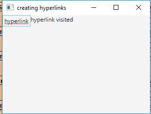
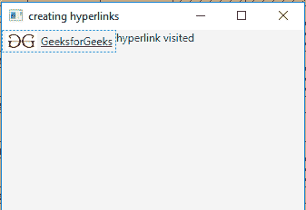

# JavaFX Hyperlink 类

> 原文: [https://www.geeksforgeeks.org/javafx-hyperlink-class/](https://www.geeksforgeeks.org/javafx-hyperlink-class/)

`Hyperlink` 类是 JavaFX 的一部分。超链接是一种 HTML 类型的标签，可以包含文本和/或图形。它响应翻转和点击。当点击/按下超链接时，`visited` 属性变为真。`Hyperlink` 的行为类似于按钮。按下并释放超链接时，会发送一个 `ActionEvent`。因此您的应用程序可以基于此事件执行一些操作。

## 类的构造函数

1.  `Hyperlink()`: 创建没有文本或图形的超链接。
2.  `Hyperlink(String t)`: 创建一个以指定文本为标签的超链接。
3.  `Hyperlink(String t, Node g)`: 创建一个以指定文本和图形为标签的超链接。

## 常用方法

| 方法 | 说明 |
| --- | --- |
| `isVisited()` | 如果尚未访问超链接，则返回 `true`，否则返回 `false`。 |
| `setVisited(boolean v)` | 设置 `visited` 属性的值。 |
| `setOnAction(EventHandler<ActionEvent> v)` | 设置 `onAction` 属性的值。 |
| `fire()` | 如果定义了 `ActionEvent`，则实现为调用该 `ActionEvent`。 |

下面的程序说明了 `Hyperlink` 类的使用。

### 1. 创建超链接并添加到舞台，同时添加事件处理器

此程序创建一个名为 `hyperlink` 的 `Hyperlink`。该 `Hyperlink` 将在 `Scene` 中创建，而 `Scene` 又托管在 `Stage` 中。我们将创建一个 `Label` 来显示超链接是否已被访问。`setTitle()` 函数用于为 `Stage` 提供标题。然后创建一个 `HBox`，在其上调用 `getChildren().add()` 方法将 `Hyperlink` 和 `Label` 附加到场景中。最后，调用 `show()` 方法显示最终结果。我们将创建一个事件处理器来处理按钮事件。该事件处理器将使用 `setOnAction()` 函数添加到超链接。

```java
// Java Program to create a hyperlink and add
// it to the stage also add an event handler
// to handle the events
import javafx.application.Application;
import javafx.scene.Scene;
import javafx.scene.control.*;
import javafx.scene.layout.*;
import javafx.stage.Stage;
import javafx.event.ActionEvent;
import javafx.event.EventHandler;

public class hyperlink extends Application {

    // launch the application
    public void start(Stage stage)
    {
        // set title for the stage
        stage.setTitle("creating hyperlinks");

        // create a hyperlink
        Hyperlink hyperlink = new Hyperlink("hyperlink");

        // create a HBox
        HBox hbox = new HBox();

        // create a label
        Label label = new Label("hyperlink not visited");

        // action event
        EventHandler<ActionEvent> event =
        new EventHandler<ActionEvent>() {
            public void handle(ActionEvent e)
            {
                label.setText("hyperlink visited ");
            }
        };

        // when hyperlink is pressed
        hyperlink.setOnAction(event);

        // add hyperlink
        hbox.getChildren().add(hyperlink);
        hbox.getChildren().add(label);

        // create a scene
        Scene scene = new Scene(hbox, 200, 200);

        // set the scene
        stage.setScene(scene);

        stage.show();
    }

    // Main Method
    public static void main(String args[])
    {
        // launch the application
        launch(args);
    }
}
```

**输出:**



### 2. 创建带有文本和图像的超链接并添加事件处理器

此程序创建一个名为 `hyperlink` 的 `Hyperlink`，其上包含图像和文本。图像将使用 `FileInputStream` 导入。然后我们将使用文件输入流的对象创建一个 `Image`，再使用该图像文件创建一个 `ImageView`。该 `Hyperlink` 将在 `Scene` 中创建，而 `Scene` 又托管在 `Stage` 中。我们将创建一个 `Label` 来显示超链接是否已被访问。`setTitle()` 函数用于为 `Stage` 提供标题。然后创建一个 `HBox`，在其上调用 `getChildren().add()` 方法将 `Hyperlink` 和 `Label` 附加到场景中。最后，调用 `show()` 方法显示最终结果。我们将创建一个事件处理器来处理按钮事件。该事件处理器将使用 `setOnAction()` 函数添加到超链接。

```java
// Java Program to create a hyperlink with
// both text and image on it and also add
// an event handler to it
import javafx.application.Application;
import javafx.scene.Scene;
import javafx.scene.control.*;
import javafx.scene.layout.*;
import javafx.stage.Stage;
import javafx.event.ActionEvent;
import javafx.event.EventHandler;
import java.io.*;
import javafx.scene.image.*;

public class hyperlink_1 extends Application {

    // launch the application
    public void start(Stage stage)
    {
        try {
            // set title for the stage
            stage.setTitle("creating hyperlinks");

            // create a input stream
            FileInputStream input = new FileInputStream("f:\\gfg.png");

            // create a image
            Image image = new Image(input);

            // create a image View
            ImageView imageview = new ImageView(image);

            // create a hyperlink
            Hyperlink hyperlink = new Hyperlink("GeeksforGeeks", imageview);

            // create a HBox
            HBox hbox = new HBox();

            // create a label
            Label label = new Label("hyperlink not visited");

            // action event
            EventHandler<ActionEvent> event =
             new EventHandler<ActionEvent>() {
                public void handle(ActionEvent e)
                {
                    label.setText("hyperlink visited ");
                }
            };

            // when hyperlink is pressed
            hyperlink.setOnAction(event);

            // add hyperlink
            hbox.getChildren().add(hyperlink);
            hbox.getChildren().add(label);

            // create a scene
            Scene scene = new Scene(hbox, 200, 200);

            // set the scene
            stage.setScene(scene);

            stage.show();
        }
        catch (Exception e) {
            System.err.println(e.getMessage());
        }
    }

    // Main Method
    public static void main(String args[])
    {
        // launch the application
        launch(args);
    }
}
```

**输出:**



**注意:** 上述程序可能无法在在线 IDE 中运行。请使用离线编译器。

**参考:** [https://docs.oracle.com/javase/8/javafx/api/javafx/scene/control/Hyperlink.html](https://docs.oracle.com/javase/8/javafx/api/javafx/scene/control/Hyperlink.html)