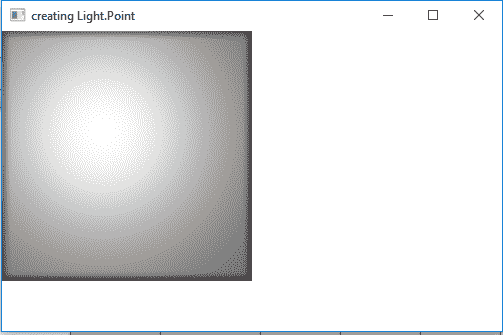
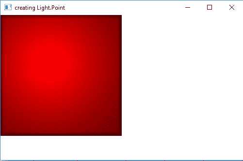

# JavaFX | Light.Point类

> 原文：[https://www.geeksforgeeks.org/javafx-light-point-class/](https://www.geeksforgeeks.org/javafx-light-point-class/)

`Light.Point`类是JavaFX的一部分。`Light.Point`类表示三维空间中的点光源。`Light.Point`类扩展了`Light`类。

## 类的构造函数

1.  `Point()`：用默认值创建一个新的点光源对象。
2.  `Point(double x, double y, double z, Color color)`：用`x`，`y`，`z`和`color`值创建一个新的点光源对象。

## 常用方法

| 方法 | 说明 |
| --- | --- |
| `getX()` | 返回`x`的值。 |
| `getY()` | 返回`y`的值。 |
| `getZ()` | 返回`z`的值。 |
| `setX(double v)` | 设置`x`的值。 |
| `setY(double v)` | 设置`y`的值。 |
| `setZ(double v)` | 设置`z`的值。 |
| `getColor()` | 返回光的颜色。 |
| `setColor(Color v)` | 设置灯光的颜色。 |

下面的程序说明了`Light.Point`类的使用：

### 1. Java Program to create a Point light and add it to a rectangle

在这个程序中，我们将创建一个具有指定高度和宽度的`Rectangle`，名为`rectangle`。我们还将创建一个`Light.Point`对象，名为`light`。我们将使用`setX()`、`setY()`和`setZ()`函数来设置`x`、`y`、`z`值。现在创建一个`Lighting`对象，并使用`setLight()`函数将`light`对象添加到`lighting`中。我们将把`Lighting`效果设置到`Rectangle`上，并将其添加到`Scene`中，再将`Scene`添加到`Stage`，最后调用`show`函数来显示结果。

```java
// Java Program to create a Point light
// and add it to a rectangle
import javafx.application.Application;
import javafx.scene.Scene;
import javafx.scene.shape.Rectangle;
import javafx.scene.control.*;
import javafx.stage.Stage;
import javafx.scene.Group;
import javafx.scene.effect.Light.*;
import javafx.scene.effect.*;
import javafx.scene.paint.Color;

public class Point_1 extends Application {

    // launch the application
    public void start(Stage stage)
    {
        // set title for the stage
        stage.setTitle("creating Light.Point");

        // create point Light object
        Light.Point light = new Light.Point();

        // set coordinates
        light.setX(100);
        light.setY(100);
        light.setZ(100);

        // create a lighting
        Lighting lighting = new Lighting();

        // set Light of lighting
        lighting.setLight(light);

        // create a rectangle
        Rectangle rect = new Rectangle(250, 250);

        // set fill
        rect.setFill(Color.WHITE);

        // set effect
        rect.setEffect(lighting);

        // create a Group
        Group group = new Group(rect);

        // create a scene
        Scene scene = new Scene(group, 500, 300);

        // set the scene
        stage.setScene(scene);

        stage.show();
    }

    // Main Method
    public static void main(String args[])
    {
        // launch the application
        launch(args);
    }
}
```

**输出：**



### 2. Java Program to create a Point light and add it to a rectangle and set the color of the light to red

在这个程序中，我们将创建一个具有指定高度和宽度的`Rectangle`，名为`rectangle`。我们还将创建一个`Light.Point`对象，名为`light`。现在将`x`、`y`、`z`和`color`值作为构造函数的参数传递。我们将创建一个`Lighting`对象，并使用`setLight()`函数将`light`对象添加到`lighting`中。我们将把`Lighting`效果设置到`Rectangle`上，并将其添加到`Scene`中，再将`Scene`添加到`Stage`，最后调用`show`函数来显示结果。

```java
// Java Program to create a Point light and add it to
// a rectangle and set the color of the light to red
import javafx.application.Application;
import javafx.scene.Scene;
import javafx.scene.shape.Rectangle;
import javafx.scene.control.*;
import javafx.stage.Stage;
import javafx.scene.Group;
import javafx.scene.effect.Light.*;
import javafx.scene.effect.*;
import javafx.scene.paint.Color;

public class Point_2 extends Application {

    // launch the application
    public void start(Stage stage)
    {
        // set title for the stage
        stage.setTitle("creating Light.Point");

        // create point Light object
        Light.Point light = new Light.Point(100, 100,
                100, Color.RED);

        // create a lighting
        Lighting lighting = new Lighting();

        // set Light of lighting
        lighting.setLight(light);

        // create a rectangle
        Rectangle rect = new Rectangle(250, 250);

        // set fill
        rect.setFill(Color.WHITE);

        // set effect
        rect.setEffect(lighting);

        // create a Group
        Group group = new Group(rect);

        // create a scene
        Scene scene = new Scene(group, 500, 300);

        // set the scene
        stage.setScene(scene);

        stage.show();
    }

    // Main Method
    public static void main(String args[])
    {
        // launch the application
        launch(args);
    }
}
```

**输出：**



**注意：** 上述程序可能无法在在线IDE中运行。请使用离线编译器。

**参考：** [https://docs.oracle.com/javase/8/javafx/api/javafx/scene/effect/Light.Point.html](https://docs.oracle.com/javase/8/javafx/api/javafx/scene/effect/Light.Point.html)