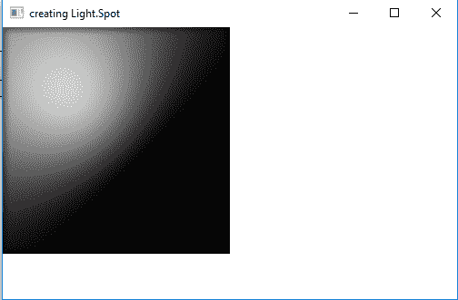
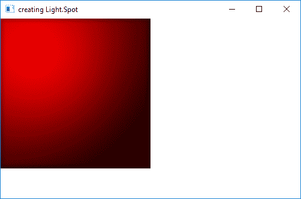

# JavaFX | Light.Spot 类

> 原文: [https://www.geeksforgeeks.org/javafx-light-spot-class/](https://www.geeksforgeeks.org/javafx-light-spot-class/)

`Light.Spot` 类是 JavaFX 的一部分。`Light.Spot` 类用于创建一个聚光灯，该聚光灯具有可配置的三维空间中的灯光方向向量、焦点和颜色值。`Light.Spot` 类继承自 [`Light.Point`](https://www.geeksforgeeks.org/javafx-light-point-class/) 类。

## 类的构造函数

1.  `Spot()`: 使用默认值创建聚光灯。
2.  `Spot(double x, double y, double z, double s, Color c)`: 创建具有指定的 x, y, z 值，镜面成分和灯光颜色的聚光灯。

## 常用方法

| 方法 | 说明 |
| --- | --- |
| `getPointsAtX()` | 返回光线方向向量的 x 坐标。 |
| `getPointsAtY()` | 返回光线方向向量的 y 坐标。 |
| `getPointsAtZ()` | 返回光线方向向量的 z 坐标。 |
| `getSpecularExponent()` | 返回镜面反射指数的值。 |
| `setPointsAtX(double v)` | 设置光线方向向量的 x 坐标值。 |
| `setPointsAtY(double v)` | 设置光线方向向量的 y 坐标值。 |
| `setPointsAtZ(double v)` | 设置光线方向向量的 z 坐标值。 |
| `setSpecularExponent(double v)` | 设置镜面反射指数的值。 |

下面的程序说明了 `Light.Spot` 类的使用。

### 1. Java Program to create a Spot light and add it to a rectangle

在这个程序中，我们将创建一个具有指定高度和宽度的 `Rectangle`，命名为 `rectangle`。我们还将创建一个名为 `light` 的 `Light.Spot` 对象。我们将使用 `setX()`、`setY()` 和 `setZ()` 函数设置 x, y, z 值。现在创建一个 `Lighting` 对象，并使用 `setLight()` 函数将 `light` 对象添加到 `lighting` 中。我们将把 `Lighting` 效果设置到 `Rectangle` 上，并将其添加到场景中，再将场景添加到舞台，最后调用 `show` 函数来显示结果。

```java
// Java Program to create a Spot light
// and add it to a rectangle
import javafx.application.Application;
import javafx.scene.Scene;
import javafx.scene.shape.Rectangle;
import javafx.scene.control.*;
import javafx.stage.Stage;
import javafx.scene.Group;
import javafx.scene.effect.Light.*;
import javafx.scene.effect.*;
import javafx.scene.paint.Color;

public class Spot_1 extends Application {

    // launch the application
    public void start(Stage stage) {

        // set title for the stage
        stage.setTitle("creating Light.Spot");

        // create Spot Light object
        Light.Spot light = new Light.Spot();

        // set coordinates
        light.setX(100);
        light.setY(100);
        light.setZ(100);

        // create a lighting
        Lighting lighting = new Lighting();

        // set Light of lighting
        lighting.setLight(light);

        // create a rectangle
        Rectangle rect = new Rectangle(250, 250);

        // set fill
        rect.setFill(Color.WHITE);

        // set effect
        rect.setEffect(lighting);

        // create a Group
        Group group = new Group(rect);

        // create a scene
        Scene scene = new Scene(group, 500, 300);

        // set the scene
        stage.setScene(scene);

        stage.show();
    }

    // Main Method
    public static void main(String args[]) {

        // launch the application
        launch(args);
    }
}
```

**输出:**



### 2. Java Program to create a Spotlight and add it to a rectangle and set the coordinates of the direction vector of light and color of light

在这个程序中，我们将创建一个具有指定高度和宽度的 `Rectangle`，命名为 `rectangle`。我们还将创建一个名为 `light` 的 `Light.Spot` 对象。我们将使用 `setX()`、`setY()` 和 `setZ()` 函数设置 x, y, z 值。灯光的方向向量坐标使用 `setPointsAtX()`、`setPointsAtY()` 和 `setPointsAtZ()` 设置，并使用 `setColor()` 函数指定颜色值。现在创建一个 `Lighting` 对象，并使用 `setLight()` 函数将 `light` 对象添加到 `lighting` 中。我们将把 `Lighting` 效果设置到 `Rectangle` 上，并将其添加到场景中，再将场景添加到舞台，最后调用 `show` 函数来显示结果。

```java
// Java Program to create a Spot light
// and add it to a rectangle and set the
// coordinates of direction vector of
// light and color of light
import javafx.application.Application;
import javafx.scene.Scene;
import javafx.scene.shape.Rectangle;
import javafx.scene.control.*;
import javafx.stage.Stage;
import javafx.scene.Group;
import javafx.scene.effect.Light.*;
import javafx.scene.effect.*;
import javafx.scene.paint.Color;

public class Spot_2 extends Application {

    // launch the application
    public void start(Stage stage) {

        // set title for the stage
        stage.setTitle("creating Light.Spot");

        // create Spot Light object
        Light.Spot light = new Light.Spot();

        // set coordinate of direction
        // the vector of this light
        light.setPointsAtX(0);
        light.setPointsAtY(0);
        light.setPointsAtZ(-60);

        // set specular exponent
        light.setSpecularExponent(2);

        // set color of light
        light.setColor(Color.RED);

        // set coordinates
        light.setX(100);
        light.setY(100);
        light.setZ(200);

        // create a lighting
        Lighting lighting = new Lighting();

        // set Light of lighting
        lighting.setLight(light);

        // create a rectangle
        Rectangle rect = new Rectangle(250, 250);

        // set fill
        rect.setFill(Color.WHITE);

        // set effect
        rect.setEffect(lighting);

        // create a Group
        Group group = new Group(rect);

        // create a scene
        Scene scene = new Scene(group, 500, 300);

        // set the scene
        stage.setScene(scene);

        stage.show();
    }

    // Main Method
    public static void main(String args[]) {

        // launch the application
        launch(args);
    }
}
```

**输出:**



**注意:** 上述程序可能无法在在线 IDE 中运行。请使用离线编译器。

**参考:** [https://docs.oracle.com/javase/8/javafx/api/javafx/scene/effect/Light.Spot.html](https://docs.oracle.com/javase/8/javafx/api/javafx/scene/effect/Light.Spot.html)