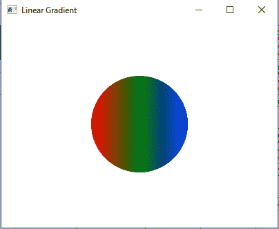
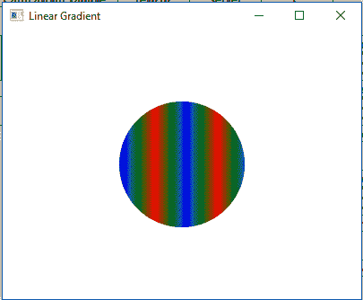

# JavaFX LinearGradient 类

> 原文：[https://www.geeksforgeeks.org/javafx-lineargradient-class/](https://www.geeksforgeeks.org/javafx-lineargradient-class/)

`LinearGradient` 类是 JavaFX 的一部分。线性渐变类用线性颜色渐变图案填充形状。用户可以指定一个以上的线性渐变模式，系统将提供颜色之间的插值。

## 类的构造函数

1.  `LinearGradient(double sX, double sY, double eX, double eY, boolean prop, CycleMethod c, List s)`：创建一个新的 `LinearGradient` 对象。
2.  `LinearGradient(double sX, double sY, double eX, double eY, boolean prop, CycleMethod c, Stop… s)`：创建一个新的 `LinearGradient` 对象。

## 常用方法

| 方法 | 说明 |
| --- | --- |
| `equals(Object o)` | 返回线性渐变对象是否相等。 |
| `getCycleMethod()` | 返回线性渐变对象的循环方法。 |
| `getEndX()` | 返回线性渐变端点的 x 坐标。 |
| `getEndY()` | 返回线性渐变终点的 y 坐标。 |
| `getStartX()` | 返回线性渐变起点的 x 坐标。 |
| `getStartY()` | 返回线性渐变起点的 y 坐标。 |
| `getStops()` | 返回线性渐变的停止点。 |
| `isOpaque()` | 返回线性渐变是否不透明。 |
| `isProportional()` | 返回线性渐变是否成比例。 |
| `valueOf(String v)` | 从字符串表示形式创建线性渐变值。 |

下面的程序说明了 `LinearGradient` 类的使用：

## 1. 创建 LinearGradient 对象并应用到圆形

在这个程序中，我们将创建一个 `Stop` 对象数组，其偏移值范围从 0 到 1。使用指定的停止点创建一个 `LinearGradient` 对象。现在创建一个具有指定 x、y 位置和半径的圆形，并将线性渐变应用到它。然后创建一个 `VBox` 并设置其对齐方式。将圆形添加到 `vbox`，将 `vbox` 添加到场景，将场景添加到舞台，并调用 `show()` 函数来显示结果。

```java
// Java program to create a LinearGradient 
// object and add stops to it and apply it
// to the circle
import javafx.application.Application;
import javafx.scene.Scene;
import javafx.scene.control.*;
import javafx.scene.layout.*;
import javafx.stage.Stage;
import javafx.scene.layout.*;
import javafx.scene.paint.*;
import javafx.scene.text.*;
import javafx.geometry.*;
import javafx.scene.layout.*;
import javafx.scene.shape.*;
import javafx.scene.paint.*;

public class Linear_Gradient_1 extends Application {

    // launch the application
    public void start(Stage stage) {
        try {
            // set title for the stage
            stage.setTitle("Linear Gradient");

            // create stops
            Stop[] stop = {new Stop(0, Color.RED), 
                           new Stop(0.5, Color.GREEN), 
                           new Stop(1, Color.BLUE)};

            // create a Linear gradient object
            LinearGradient linear_gradient = new LinearGradient(0, 0,
                      1, 0, true, CycleMethod.NO_CYCLE, stop);

            // create a circle
            Circle circle = new Circle(100, 100, 70);

            // set fill
            circle.setFill(linear_gradient);

            // create VBox
            VBox vbox = new VBox(circle);

            // set Alignment
            vbox.setAlignment(Pos.CENTER);

            // create a scene
            Scene scene = new Scene(vbox, 400, 300);

            // set the scene
            stage.setScene(scene);

            stage.show();
        } catch (Exception e) {
            System.out.println(e.getMessage());
        }
    }

    // Main Method
    public static void main(String args[]) {
        // launch the application
        launch(args);
    }
}
```

**输出：**



## 2. 创建 LinearGradient 对象并设置 CycleMethod 和 proportional 属性

在这个程序中，我们将创建一个 `Stop` 对象数组，其偏移值范围从 0 到 1。然后使用指定的停止点创建一个 `LinearGradient` 对象。将 `CycleMethod` 设置为 `reflect` 并将 `proportional` 设置为 `false`。创建一个具有指定 x、y 位置和半径的圆形，并将线性渐变应用到它。然后创建一个 `VBox` 并设置其对齐方式。将圆形添加到 `vbox`，将 `vbox` 添加到场景，将场景添加到舞台，并调用 `show()` 函数来显示结果。

```java
// Java program to create a LinearGradient object 
// and add stops to it and set the CycleMethod to
// reflect and set proportional to false and 
// apply it to the circle
import javafx.application.Application;
import javafx.scene.Scene;
import javafx.scene.control.*;
import javafx.scene.layout.*;
import javafx.stage.Stage;
import javafx.scene.layout.*;
import javafx.scene.paint.*;
import javafx.scene.text.*;
import javafx.geometry.*;
import javafx.scene.layout.*;
import javafx.scene.shape.*;
import javafx.scene.paint.*;

public class Linear_Gradient_2 extends Application {

    // launch the application
    public void start(Stage stage) {
        try {
            // set title for the stage
            stage.setTitle("Linear Gradient");

            // create stops
            Stop[] stop = {new Stop(0, Color.RED), new Stop(0.5, 
                          Color.GREEN), new Stop(1, Color.BLUE)};

            // create a Linear gradient object
            LinearGradient linear_gradient = new LinearGradient(0, 0, 
                            35, 0, false, CycleMethod.REFLECT, stop);

            // create a circle
            Circle circle = new Circle(100, 100, 70);

            // set fill
            circle.setFill(linear_gradient);

            // create VBox
            VBox vbox = new VBox(circle);

            // set Alignment
            vbox.setAlignment(Pos.CENTER);

            // create a scene
            Scene scene = new Scene(vbox, 400, 300);

            // set the scene
            stage.setScene(scene);

            stage.show();
        } catch (Exception e) {
            System.out.println(e.getMessage());
        }
    }

    // Main Method
    public static void main(String args[]) {
        // launch the application
        launch(args);
    }
}
```

**输出：**



**注意：** 上述程序可能无法在联机 IDE 中运行，请使用脱机编译器。

**参考：** [https://docs.oracle.com/javase/8/javafx/api/javafx/scene/paint/LinearGradient.html](https://docs.oracle.com/javase/8/javafx/api/javafx/scene/paint/LinearGradient.html)