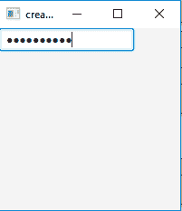
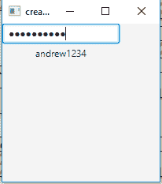

# JavaFX PasswordField

> 原文: [https://www.geeksforgeeks.org/javafx-passwordfield/](https://www.geeksforgeeks.org/javafx-passwordfield/)

`PasswordField` 类是 JavaFX 包的一部分。它是一个文本字段，用于屏蔽输入的字符（输入的字符不会显示给用户）。它允许用户输入单行的无格式文本，因此不允许多行输入。

## PasswordField 类的构造函数

1.  `PasswordField()`: 创建新的密码字段。

（`PasswordField` 继承了 `TextField`，所以 `TextField` 的所有方法都可以在这里使用。`PasswordField` 没有单独的方法，都是从 `TextField` 继承的。）

## 示例程序

下面的程序说明了 `PasswordField` 类的使用。

### 1. 创建密码字段

这个程序创建一个名为 `b` 的 `PasswordField`。`PasswordField` 将在 `Scene` 中创建，而 `Scene` 又将被容纳在 `Stage`（顶级 JavaFX 容器）中。`setTitle()` 函数用于为 `Stage` 提供标题。然后创建一个 `TilePane`，在其上调用 `getChildren().add()` 方法将 `PasswordField` 附加到 `Scene` 中，代码中指定的分辨率为 (200, 200)。最后，调用 `show()` 方法显示最终结果。

```java
// Java program to create a passwordfield
import javafx.application.Application;
import javafx.scene.Scene;
import javafx.scene.control.*;
import javafx.scene.layout.*;
import javafx.event.ActionEvent;
import javafx.event.EventHandler;
import javafx.scene.control.Label;
import javafx.stage.Stage;
public class Passwordfield extends Application
{

// launch the application
    public void start(Stage s)
    {
        // set title for the stage
        s.setTitle("creating Passwordfield");

// create a Passwordfield
        PasswordField b = new PasswordField();

// create a tile pane
        TilePane r = new TilePane();

// add password field
        r.getChildren().add(b);

// create a scene
        Scene sc = new Scene(r,200,200);

// set the scene
        s.setScene(sc);

s.show();

}

public static void main(String args[])
    {
        // launch the application
       launch(args);
    }
}
```

**输出**:


### 2. 创建密码字段并添加事件处理程序

这个程序创建一个名为 `b` 的 `PasswordField`。我们将创建一个 `Label`，当按下回车键时显示密码。我们将创建一个事件处理程序来处理密码字段的事件，并使用 `setOnAction()` 方法将事件处理程序添加到密码字段。`PasswordField` 将在 `Scene` 中创建，而 `Scene` 又将被容纳在 `Stage`（顶级 JavaFX 容器）中。`setTitle()` 函数用于为 `Stage` 提供标题。然后创建一个 `TilePane`，在其上调用 `getChildren().add()` 方法将 `PasswordField` 和一个 `Label` 附加到 `Scene` 中，代码中指定的分辨率为 (200, 200)。最后，调用 `show()` 方法显示最终结果。

```java
// Java program to create a passwordfield and add
// a event handler to handle the event of Passwordfield
import javafx.application.Application;
import javafx.scene.Scene;
import javafx.scene.control.*;
import javafx.scene.layout.*;
import javafx.event.ActionEvent;
import javafx.event.EventHandler;
import javafx.scene.control.Label;
import javafx.stage.Stage;
public class Passwordfield_1 extends Application
{

// launch the application
    public void start(Stage s)
    {
        // set title for the stage
        s.setTitle("creating Passwordfield");

// create a Passwordfield
        PasswordField b = new PasswordField();

// create a tile pane
        TilePane r = new TilePane();

// create a label
        Label l = new Label("no Password");

// action event
        EventHandler<ActionEvent> event = new EventHandler<ActionEvent>(){
        public void handle(ActionEvent e)
        {
            l.setText(b.getText());
        }
        };

// when enter is pressed
        b.setOnAction(event);

// add password field
        r.getChildren().add(b);
        r.getChildren().add(l);

// create a scene
        Scene sc = new Scene(r,200,200);

// set the scene
        s.setScene(sc);

s.show();

}

public static void main(String args[])
    {
        //launch the application
       launch(args);
    }
}
```

**输出**:


**注意**: 上述程序可能无法在联机 IDE 中运行，请使用脱机编译器。

**参考**: [https://docs.oracle.com/javase/8/javafx/api/javafx/scene/control/PasswordField.html](https://docs.oracle.com/javase/8/javafx/api/javafx/scene/control/PasswordField.html)