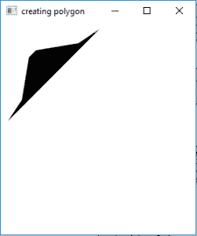
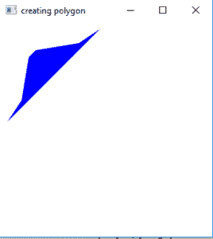

# JavaFX 多边形（带示例）

> 原文：[https://www.geeksforgeeks.org/javafx-polygon-with-examples/](https://www.geeksforgeeks.org/javafx-polygon-with-examples/)

多边形是 JavaFX 库的一部分。`Polygon`类用给定的一组 x 和 y 坐标创建一个多边形。`Polygon`类继承了`Shape`类。

## 类的构造函数

1.  `Polygon()`：创建一个空多边形，没有一组定义的点（顶点）坐标。
2.  `Polygon(double[] points)`：用一组定义的点（顶点）坐标创建多边形。

## 常用方法

| 方法 | 说明 |
| --- | --- |
| `getPoints()` | 获取多边形顶点的坐标。 |
| `setFill(Paint p)` | 设置多边形的填充。 |

下面的程序将说明 JavaFX 的`Polygon`类：

## 程序示例 1：使用给定顶点集创建多边形

此程序创建一个名为`polygon`的`Polygon`。多边形顶点的坐标作为参数传递。`Polygon`将在一个`Scene`内创建，而该`Scene`又将托管在一个`Stage`内。`setTitle()`函数用于为`Stage`提供标题。然后创建一个`Group`，并将多边形附加到其中。该`Group`被附加到`Scene`。最后，调用`show()`方法以显示最终结果。

```java
// Java Program to create a polygon with a given set of vertices
import javafx.application.Application;
import javafx.scene.Scene;
import javafx.scene.control.Button;
import javafx.scene.layout.*;
import javafx.scene.paint.Color;
import javafx.scene.shape.Polygon;
import javafx.scene.control.*;
import javafx.stage.Stage;
import javafx.scene.Group;

public class polygon_0 extends Application {

    // launch the application
    public void start(Stage stage) {
        // set title for the stage
        stage.setTitle("creating polygon");

        // coordinates of the points of polygon
        double points[] = { 10.0d, 140.0d, 30.0d, 110.0d, 40.0d,
          50.0d, 50.0d, 40.0d, 110.0d, 30.0d, 140.0d, 10.0d };

        // create a polygon
        Polygon polygon = new Polygon(points);

        // create a Group
        Group group = new Group(polygon);

        // create a scene
        Scene scene = new Scene(group, 500, 300);

        // set the scene
        stage.setScene(scene);

        stage.show();
    }

    public static void main(String args[]) {
        // launch the application
        launch(args);
    }
}
```

**输出：**


## 程序示例 2：使用给定顶点集和指定填充创建多边形

此程序创建一个名为`polygon`的`Polygon`。多边形顶点的坐标作为参数传递。`setFill()`函数用于设置多边形的填充。`Polygon`将在一个`Scene`内创建，而该`Scene`又将托管在一个`Stage`内。`setTitle()`函数用于为`Stage`提供标题。然后创建一个`Group`，并将多边形附加到其中。该`Group`被附加到`Scene`。最后，调用`show()`方法以显示最终结果。

```java
// Java Program to create a polygon with a
// given set of vertices and specified fill
import javafx.application.Application;
import javafx.scene.Scene;
import javafx.scene.control.Button;
import javafx.scene.layout.*;
import javafx.scene.paint.Color;
import javafx.scene.shape.Polygon;
import javafx.scene.control.*;
import javafx.stage.Stage;
import javafx.scene.Group;

public class polygon_1 extends Application {

    // launch the application
    public void start(Stage stage) {
        // set title for the stage
        stage.setTitle("creating polygon");

        // coordinates of the points of polygon
        double points[] = { 10.0d, 140.0d, 30.0d, 110.0d, 40.0d,
            50.0d, 50.0d, 40.0d, 110.0d, 30.0d, 140.0d, 10.0d };

        // create a polygon
        Polygon polygon = new Polygon(points);

        // set fill for the polygon
        polygon.setFill(Color.BLUE);

        // create a Group
        Group group = new Group(polygon);

        // create a scene
        Scene scene = new Scene(group, 500, 300);

        // set the scene
        stage.setScene(scene);

        stage.show();
    }

    public static void main(String args[]) {
        // launch the application
        launch(args);
    }
}
```

**输出：**


**注意：** 上述程序可能无法在联机 IDE 中运行，请使用脱机 IDE。

**参考：** [https://docs.oracle.com/javase/8/javafx/api/javafx/scene/shape/Polygon.html](https://docs.oracle.com/javase/8/javafx/api/javafx/scene/shape/Polygon.html)