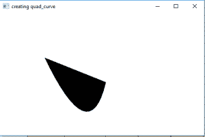
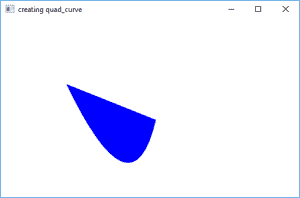

# JavaFX |带示例的四次曲线

> 原文: [https://www.geeksforgeeks.org/javafx-quadcurve-with-examples/](https://www.geeksforgeeks.org/javafx-quadcurve-with-examples/)

## 四次曲线
四次曲线是 JavaFX 的一部分。`QuadCurve` 类定义了 (x, y) 坐标空间中的二次贝塞尔参数曲线段。曲线穿过起点和终点以及控制点。指定的控制点用作贝塞尔控制点。

### 构造方法
1.  `QuadCurve()`: 创建四次曲线的空实例。
2.  `QuadCurve(double sX, double sY, double cX, double cY, double eX, double eY)`: 创建具有指定起点、终点和控制点的四次曲线的新实例。

### 常用方法
| 方法 | 说明 |
| --- | --- |
| `getControlX()` | 返回控制点的 x 坐标 |
| `getControlY()` | 返回控制点的 y 坐标 |
| `getEndX()` | 返回终点的 x 坐标 |
| `getEndY()` | 返回终点的 y 坐标 |
| `getStartX()` | 返回起点的 x 坐标 |
| `getStartY()` | 返回起点的 y 坐标 |
| `setControlX(double value)` | 设置控制点的 x 坐标 |
| `setControlY(double value)` | 设置控制点的 y 坐标 |
| `setEndX(double value)` | 设置终点的 x 坐标 |
| `setEndY(double value)` | 设置终点的 y 坐标 |
| `setStartX(double value)` | 设置起点的 x 坐标 |
| `setStartY(double value)` | 设置起点的 y 坐标 |

## 示例程序
以下程序将举例说明如何使用 `QuadCurve`。

### Java 程序创建四元曲线
该程序创建一条由变量 `quad_curve` 指示的四元曲线（控制点、起点和终点作为参数传递）。四曲线将在 `Scene` 中创建，而 `Scene` 又将托管在 `Stage` 中。函数 `setTitle()` 用于为舞台提供标题。然后创建一个 `Group`，并附加四元曲线。这个 `Group` 附属于 `Scene`。最后，调用 `show()` 方法显示最终结果。

```java
// Java program to create a quad curve
import javafx.application.Application;
import javafx.scene.Scene;
import javafx.scene.shape.DrawMode;
import javafx.scene.layout.*;
import javafx.event.ActionEvent;
import javafx.scene.shape.QuadCurve;
import javafx.scene.control.*;
import javafx.stage.Stage;
import javafx.scene.Group;
public class quad_curve_0 extends Application {

    // launch the application
    public void start(Stage stage)
    {
        // set title for the stage
        stage.setTitle("creating quad_curve");

        // create a quad_curve
        QuadCurve quad_curve = new QuadCurve(10.0f, 10.0f, 120.0f, 240.0f, 160.0f, 70.0f);

        // create a Group
        Group group = new Group(quad_curve);

        // translate the quad_curve to a position
        quad_curve.setTranslateX(100);
        quad_curve.setTranslateY(100);

        // create a scene
        Scene scene = new Scene(group, 500, 300);

        // set the scene
        stage.setScene(scene);

        stage.show();
    }

    public static void main(String args[])
    {
        // launch the application
        launch(args);
    }
}
```

**输出:**


### Java 程序创建四元曲线并为四元曲线设置填充
该程序创建由变量 `quad_curve` 指示的四元曲线（控制点、起点和终点使用 `setControlX()`、`setControlY()`、`setStartX()`、`setStartY()`、`setEndX()` 和 `setEndY()` 函数设置）。四曲线将在 `Scene` 中创建，而 `Scene` 又将在 `Stage` 中托管。函数 `setTitle()` 用于为舞台提供标题。然后创建一个 `Group`，并附加四元曲线。这个 `Group` 附属于 `Scene`。最后，调用 `show()` 方法显示最终结果。函数 `setFill()` 用于设置四元曲线的填充。

```java
// Java program to create a quad curve
// and set a fill for quad curve
import javafx.application.Application;
import javafx.scene.Scene;
import javafx.scene.shape.DrawMode;
import javafx.scene.layout.*;
import javafx.event.ActionEvent;
import javafx.scene.shape.QuadCurve;
import javafx.scene.control.*;
import javafx.stage.Stage;
import javafx.scene.Group;
import javafx.scene.paint.Color;
public class quad_curve_1 extends Application {

    // launch the application
    public void start(Stage stage)
    {
        // set title for the stage
        stage.setTitle("creating quad_curve");

        // create a quad_curve
        QuadCurve quad_curve = new QuadCurve();

        // set start
        quad_curve.setStartX(10.0f);
        quad_curve.setStartY(10.0f);

        // set control coordinates
        quad_curve.setControlX(120.0f);
        quad_curve.setControlY(240.0f);

        // set end coordinates
        quad_curve.setEndX(160.0f);
        quad_curve.setEndY(70.0f);

        // create a Group
        Group group = new Group(quad_curve);

        // translate the quad_curve to a position
        quad_curve.setTranslateX(100);
        quad_curve.setTranslateY(100);

        // set fill for the quad curve
        quad_curve.setFill(Color.BLUE);

        // create a scene
        Scene scene = new Scene(group, 500, 300);

        // set the scene
        stage.setScene(scene);

        stage.show();
    }

    public static void main(String args[])
    {
        // launch the application
        launch(args);
    }
}
```

**输出:**


**注意:** 以上程序可能无法在在线 IDE 中运行，请使用离线编译器。

**参考:**
[https://docs.oracle.com/javase/8/javafx/api/javafx/scene/shape/QuadCurve.html](https://docs.oracle.com/javase/8/javafx/api/javafx/scene/shape/QuadCurve.html)