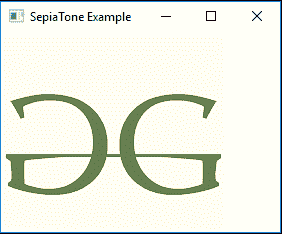

# JavaFX | SepiaTone 类

> 原文: [https://www.geeksforgeeks.org/javafx-sepiatone-class/](https://www.geeksforgeeks.org/javafx-sepiatone-class/)

`SepiaTone` 类是 JavaFX 的一部分。棕褐色类用于为图像添加棕褐色色调效果，类似于古董照片。在应用棕褐色效果时，图像上会出现红棕色调。

## 类的构造函数

1.  `SepiaTone()`: 创建 `SepiaTone` 类的新对象。
2.  `SepiaTone(double l)`: 创建一个具有指定级别的新 `SepiaTone` 对象。

## 常用方法

| 方法 | 说明 |
| --- | --- |
| `getInput()` | 返回属性输入的值。 |
| `setInput(Effect value)` | 设置属性输入的值。 |
| `setLevel(double v)` | 设置棕褐色调对象的级别值。 |
| `getLevel()` | 返回棕褐色调对象的级别值。 |

下面的程序说明了 `SepiaTone` 类的使用:

## 示例 1：导入图像并添加 SepiaTone 效果

在这个程序中，创建了一个 `FileInputStream`，并从文件中获取图像作为输入。使用来自文件输入流的输入创建名为 `image` 的图像。从图像创建一个 `ImageView` 对象，并将其添加到 `VBox` 中。然后将 `VBox` 添加到场景，场景再添加到舞台。创建一个 `SepiaTone` 效果，并将指定级别作为参数传递，然后使用 `setEffect()` 函数将效果设置到图像视图。

```java
// Java program to import an image 
// and add SepiaTone effect to it
import javafx.application.Application;
import javafx.scene.Scene;
import javafx.scene.control.*;
import javafx.scene.layout.*;
import javafx.stage.Stage;
import javafx.scene.image.*;
import javafx.scene.effect.*;
import java.io.*;
import javafx.event.ActionEvent;
import javafx.event.EventHandler;
import javafx.scene.Group;

public class sepia_tone_1 extends Application {

    // launch the application
    public void start(Stage stage) throws Exception
    {
        // set title for the stage
        stage.setTitle("SepiaTone Example");

        // create a input stream
        FileInputStream input = new FileInputStream("D:\\GFG.png");

        // create a image
        Image image = new Image(input);

        // create a image View
        ImageView imageview = new ImageView(image);

        // create a sepia_tone effect
        SepiaTone sepia_tone = new SepiaTone(0.5);

        // set effect
        imageview.setEffect(sepia_tone);

        // create a VBox
        VBox vbox = new VBox(imageview);

        // create a scene
        Scene scene = new Scene(vbox, 200, 200);

        // set the scene
        stage.setScene(scene);

        stage.show();
    }

    // Main Method
    public static void main(String args[])
    {
        // launch the application
        launch(args);
    }
}
```

**输入图像:**
[](https://media.geeksforgeeks.org/wp-content/uploads/GFG-15.png)

**输出:**
[](https://media.geeksforgeeks.org/wp-content/uploads/sepia_1.png)

## 示例 2：通过按钮控制 SepiaTone 效果级别

在这个程序中，创建了一个 `FileInputStream`，并从文件中获取图像作为输入。使用来自文件输入流的输入创建名为 `image` 的图像。从图像创建一个 `ImageView` 对象，并将其添加到 `VBox` 中。然后将 `VBox` 添加到场景，场景再添加到舞台。创建一个 `SepiaTone` 效果，并将指定级别作为参数传递，然后使用 `setEffect()` 函数将效果设置到图像视图。创建一个名为 `button` 的按钮，用于增加图像的 `SepiaTone`。该按钮也被添加到 `VBox` 中。使用 `setLevel()` 函数增加图像的 `SepiaTone`。按钮相关的事件使用 `EventHandler` 处理。

```java
// Java program to import an image and set
// SepiaTone effect to it. The Level of the
// SepiaTone effect can be controlled 
// using the button
import javafx.application.Application;
import javafx.scene.Scene;
import javafx.scene.control.*;
import javafx.scene.layout.*;
import javafx.stage.Stage;
import javafx.scene.image.*;
import javafx.scene.effect.*;
import java.io.*;
import javafx.event.ActionEvent;
import javafx.event.EventHandler;
import javafx.scene.Group;

public class sepia_tone_2 extends Application {

    double level = 0.1;

    // launch the application
    public void start(Stage stage) throws Exception
    {
        // set title for the stage
        stage.setTitle("SepiaTone Example");

        // create a input stream
        FileInputStream input = new FileInputStream("D:\\GFG.png");

        // create a image
        Image image = new Image(input);

        // create a image View
        ImageView imageview = new ImageView(image);

        // create a sepia_tone effect
        SepiaTone sepia_tone = new SepiaTone(level);

        // create a button
        Button button = new Button("increase");

        // action event
        EventHandler<ActionEvent> event = new EventHandler<ActionEvent>() {
            public void handle(ActionEvent e)
            {
                // increase the level
                level += 0.1;
                if (level > 1)
                    level = 0.0;

                // set Level for sepia_tone
                sepia_tone.setLevel(level);
            }
        };

        // set on action of button
        button.setOnAction(event);

        // set effect
        imageview.setEffect(sepia_tone);

        // create a VBox
        VBox vbox = new VBox(imageview, button);

        // create a scene
        Scene scene = new Scene(vbox, 300, 300);

        // set the scene
        stage.setScene(scene);

        stage.show();
    }

    // Main Method
    public static void main(String args[])
    {
        // launch the application
        launch(args);
    }
}
```

**输入图像:**
[](https://media.geeksforgeeks.org/wp-content/uploads/GFG-15.png)

**输出:**

<video class="wp-video-shortcode" id="video-220201-1" width="640" height="360" preload="metadata" controls=""><source type="video/mp4" src="https://media.geeksforgeeks.org/wp-content/uploads/Sepia_2.mp4?_=1">[https://media.geeksforgeeks.org/wp-content/uploads/Sepia_2.mp4](https://media.geeksforgeeks.org/wp-content/uploads/Sepia_2.mp4)</video>

**注意:** 上述程序可能无法在在线 IDE 中运行。请使用离线编译器。

**参考:** [https://docs.oracle.com/javase/8/javafx/api/javafx/scene/effect/SepiaTone.html](https://docs.oracle.com/javase/8/javafx/api/javafx/scene/effect/SepiaTone.html)