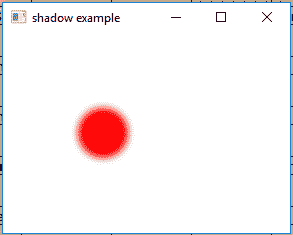
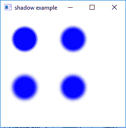

# JavaFX 阴影类

> 原文：[https://www.geeksforgeeks.org/javafx-shadow-class/](https://www.geeksforgeeks.org/javafx-shadow-class/)

阴影类是 JavaFX 的一部分。阴影类创建边缘模糊的单色阴影。阴影是黑色的（默认情况下），可以与原件结合来创建阴影。不同颜色的阴影可以添加到原始创建一个发光效果。阴影类继承 `Effect` 类。

## 类的构造函数

1.  `Shadow()`：创建一个新的阴影对象。
2.  `Shadow(BlurType t, Color c, double r)`：用指定的模糊类型、颜色和半径创建一个新的阴影对象。
3.  `Shadow(double r, Color c)`：用半径和颜色创建一个新的阴影对象。

## 常用方法

| 方法 | 说明 |
| --- | --- |
| `getBlurType()` | 返回效果的模糊类型。 |
| `getColor()` | 返回效果的颜色。 |
| `getInput()` | 返回属性输入的值。 |
| `getRadius()` | 返回阴影效果的半径。 |
| `setBlurType(BlurType v)` | 设置阴影效果的模糊类型。 |
| `setColor(Color v)` | 设置阴影效果的颜色。 |
| `setInput(Effect v)` | 设置属性输入的值。 |
| `setRadius(double v)` | 设置阴影效果的半径。 |

下面的程序说明了阴影类的使用：

### 1. Java program to create a Circle and add Shadow effect to it

在这个程序中，我们将创建一个名为 `circle` 的 `Circle`，并创建一个具有指定半径和颜色的 `Shadow` 效果 `shadow`。阴影效果将使用 `setEffect()` 函数添加到圆上，并将圆添加到 `Group` 中。圆将使用 `setTranslateX()` 和 `setTranslateY()` 函数平移到舞台中的特定位置。`Group` 将被添加到 `Scene`，`Scene` 将被添加到 `Stage`。

```java
// Java program to create a Circle 
// and add Shadow effect to it
import javafx.application.Application;
import javafx.scene.Scene;
import javafx.scene.control.*;
import javafx.scene.layout.*;
import javafx.stage.Stage;
import javafx.scene.image.*;
import javafx.scene.effect.*;
import java.io.*;
import javafx.scene.shape.Circle;
import javafx.scene.paint.Color;
import javafx.scene.Group;

public class shadow_1 extends Application {

    // launch the application
    public void start(Stage stage) throws Exception
    {
        // set title for the stage
        stage.setTitle("shadow example");

        // create a circle
        Circle circle = new Circle(50.0f, 50.0f, 25.0f);

        // translate to a position
        circle.setTranslateX(50.0f);
        circle.setTranslateY(50.0f);

        // create a shadow effect
        Shadow shadow = new Shadow(10, Color.RED);

        // set effect
        circle.setEffect(shadow);

        // create a Group
        Group group = new Group(circle);

        // create a scene
        Scene scene = new Scene(group, 200, 200);

        // set the scene
        stage.setScene(scene);

        stage.show();
    }

    // Main Method
    public static void main(String args[])
    {
        // launch the application
        launch(args);
    }
}
```

**输出：**



### 2. Java program to create four Circles and add Shadow effect to it (of different BlurType)

在这个程序中，我们将创建四个名为 `circle`、`circle1`、`circle2`、`circle3` 的 `Circle`，并创建四个名为 `shadow1`、`shadow2`、`shadow3`、`shadow4` 的 `Shadow` 效果，具有指定的半径、颜色和模糊类型。阴影效果将使用 `setEffect()` 函数添加到圆上，并将圆添加到 `Group` 中。圆将使用 `setTranslateX()` 和 `setTranslateY()` 函数平移到舞台中的特定位置。`Group` 将被添加到 `Scene`，`Scene` 将被添加到 `Stage`。

```java
// Java program to create four Circles and add Shadow
// effect to it which are of different BlurType
import javafx.application.Application;
import javafx.scene.Scene;
import javafx.scene.control.*;
import javafx.scene.layout.*;
import javafx.stage.Stage;
import javafx.scene.image.*;
import javafx.scene.effect.*;
import java.io.*;
import javafx.scene.shape.Circle;
import javafx.scene.paint.Color;
import javafx.scene.Group;

public class shadow_2 extends Application {

    // launch the application
    public void start(Stage stage) throws Exception
    {
        // set title for the stage
        stage.setTitle("shadow example");

        // create a circle
        Circle circle = new Circle(0.0f, 0.0f, 25.0f);
        Circle circle1 = new Circle(0.0f, 0.0f, 25.0f);
        Circle circle2 = new Circle(0.0f, 0.0f, 25.0f);
        Circle circle3 = new Circle(0.0f, 0.0f, 25.0f);

        // translate to a position
        circle.setTranslateX(50.0f);
        circle.setTranslateY(50.0f);

        // translate to a position
        circle1.setTranslateX(150.0f);
        circle1.setTranslateY(50.0f);

        // translate to a position
        circle2.setTranslateX(50.0f);
        circle2.setTranslateY(150.0f);

        // translate to a position
        circle3.setTranslateX(150.0f);
        circle3.setTranslateY(150.0f);

        // create shadow effect
        Shadow shadow1 = new Shadow(BlurType.values()[0], Color.BLUE, 10);
        Shadow shadow2 = new Shadow(BlurType.values()[1], Color.BLUE, 10);
        Shadow shadow3 = new Shadow(BlurType.values()[2], Color.BLUE, 10);
        Shadow shadow4 = new Shadow(BlurType.values()[3], Color.BLUE, 10);

        // set effect
        circle.setEffect(shadow1);
        circle1.setEffect(shadow2);
        circle2.setEffect(shadow3);
        circle3.setEffect(shadow4);

        // create a Group
        Group group = new Group(circle, circle1, circle2, circle3);

        // create a scene
        Scene scene = new Scene(group, 200, 200);

        // set the scene
        stage.setScene(scene);

        stage.show();
    }

    // Main Method
    public static void main(String args[])
    {
        // launch the application
        launch(args);
    }
}
```

**输出：**



**注意：** 上述程序可能无法在在线 IDE 中运行。请使用离线编译器。

**参考：** [https://docs.oracle.com/javase/8/javafx/api/javafx/scene/effect/Shadow.html](https://docs.oracle.com/javase/8/javafx/api/javafx/scene/effect/Shadow.html)