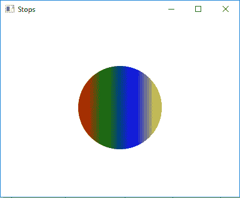

# JavaFX Stop类

> 原文：`https://www.geeksforgeeks.org/javafx-stop-class/`

Stop类是JavaFX的一部分。Stop类包含偏移量和颜色。它是定义渐变颜色的一个元素，用于渐变。Stop类继承自`Object`类。

## 该类的构造函数

*   `Stop(double o, Color c)`：用指定的偏移和颜色创建一个新的Stop对象。

## 常用方法

| 方法 | 说明 |
| --- | --- |
| `equals(Object o)` | 返回两个Stop对象是否相等。 |
| `getColor()` | 返回此偏移量处的颜色渐变。 |
| `getOffset()` | 返回停止点的偏移量。 |
| `hashCode()` | 返回Stop对象的哈希码。 |

## 创建停靠点的Java程序

将其添加到线性渐变中，并将其应用到圆中。在本程序中，我们将创建一个Stop对象的数组，其偏移值范围从0到1。创建具有指定停止点的LinearGradient对象。然后用指定的x，y位置和半径创建一个Circle，并添加线性渐变。创建一个VBox并设置它的对齐方式。将圆圈添加到`vbox`并将`vbox`添加到场景并将场景添加到舞台，并调用`show()`功能显示结果。

```java
// Java program to create stops add it to
// linear gradient and apply it to the circle
import javafx.application.Application;
import javafx.scene.Scene;
import javafx.scene.control.*;
import javafx.scene.layout.*;
import javafx.stage.Stage;
import javafx.scene.layout.*;
import javafx.scene.paint.*;
import javafx.scene.text.*;
import javafx.geometry.*;
import javafx.scene.layout.*;
import javafx.scene.shape.*;
import javafx.scene.paint.*;

public class STOP_1 extends Application {

// launch the application
    public void start(Stage stage)
    {

try {

// set title for the stage
            stage.setTitle("Stops");

// create stops
            Stop[] stop = {new Stop(0, Color.RED), 
                           new Stop(0.33, Color.GREEN), 
                           new Stop(0.66, Color.BLUE), 
                           new Stop(1, Color.YELLOW)};

// create a Linear gradient object
            LinearGradient linear_gradient = new LinearGradient(0, 0,
                             1, 0, true, CycleMethod.NO_CYCLE, stop);

// create a circle
            Circle circle = new Circle(100, 100, 70);

// set fill
            circle.setFill(linear_gradient);

// create VBox
            VBox vbox = new VBox(circle);

// ste Alignment
            vbox.setAlignment(Pos.CENTER);

// create a scene
            Scene scene = new Scene(vbox, 400, 300);

// set the scene
            stage.setScene(scene);

stage.show();
        }

catch (Exception e) {

System.out.println(e.getMessage());
        }
    }

// Main Method
    public static void main(String args[])
    {

// launch the application
        launch(args);
    }
}
```

## 输出



## 注意

上述程序可能无法在`联机IDE`中运行，请使用`脱机编译器`。

## 参考

`https://docs.oracle.com/javase/8/javafx/api/javafx/scene/paint/Stop.html`