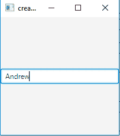
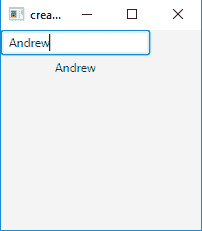
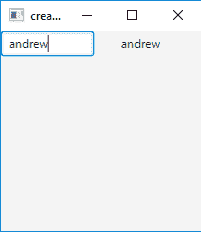
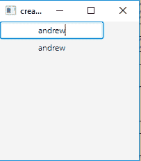

# JavaFX TextField

> 原文: [https://www.geeksforgeeks.org/javafx-textfield/](https://www.geeksforgeeks.org/javafx-textfield/)

`TextField` 类是 JavaFX 包的一部分。它是一个允许用户输入一行无格式文本的组件，不允许多行输入，只允许用户输入一行文本。然后可以根据需要使用文本。

## `TextField` 类的构造函数

1.  `TextField()`: 创建一个包含空文本内容的新文本字段。
2.  `TextField(String)`: 用初始文本创建一个新的文本字段。

## 常用方法

| 方法 | 说明 |
| --- | --- |
| `setPrefColumnCount(int v)` | 设置属性 `prefColumnCount` 的值。 |
| `setOnAction(EventHandler<ActionEvent> value)` | 设置 `onAction` 属性的值。 |
| `setAlignment(Pos v)` | 设置属性 `alignment` 的值。 |
| `prefColumnCountProperty()` | 首选的文本列数。 |
| `onActionProperty()` | 与此文本字段关联的操作处理程序，如果未分配操作处理程序，则为 `null`。 |
| `getPrefColumnCount()` | 获取属性 `prefColumnCount` 的值。 |
| `getOnAction()` | 获取 `onAction` 属性的值。 |
| `getAlignment()` | 获取属性 `alignment` 的值。 |
| `getCharacters()` | 返回支持文本字段内容的字符序列。 |

以下程序说明了 `TextField` 的使用：

## 1. 创建 TextField 并添加到舞台的 Java 程序

此程序创建一个由名称 `b` 指示的 `TextField`。`TextField` 将在 `Scene` 内创建，而 `Scene` 又将托管在 `Stage`（顶级 JavaFX 容器）内。`setTitle()` 函数用于为舞台提供标题。然后创建一个 `StackPane`，在其上调用 `getChildren().add()` 方法将 `TextField` 附加到场景中，代码中指定的分辨率为 (200, 200)。最后调用 `show()` 方法显示最终结果。

```java
// Java program to create a textfield and add it to stage
import javafx.application.Application;
import javafx.scene.Scene;
import javafx.scene.control.*;
import javafx.scene.layout.StackPane;
import javafx.stage.Stage;
public class Textfield extends Application {

    // launch the application
    public void start(Stage s)
    {
        // set title for the stage
        s.setTitle("creating TextField");

        // create a textfield
        TextField b = new TextField();

        // create a stack pane
        StackPane r = new StackPane();

        // add textfield
        r.getChildren().add(b);

        // create a scene
        Scene sc = new Scene(r, 200, 200);

        // set the scene
        s.setScene(sc);

        s.show();
    }

    public static void main(String args[])
    {
        // launch the application
        launch(args);
    }
}
```

**输出**:


## 2. 创建带初始文本的 TextField 并添加事件处理器的 Java 程序

此程序创建一个由名称 `b` 指示的 `TextField`。我们将创建一个 `Label`，当按下回车键时显示文本。我们将创建一个事件处理器来处理文本字段的事件，并使用 `setOnAction()` 方法将事件处理器添加到 `TextField`。`TextField` 将在 `Scene` 内创建，而 `Scene` 又将托管在 `Stage`（顶级 JavaFX 容器）内。`setTitle()` 函数用于为舞台提供标题。然后创建一个 `TilePane`，在其上调用 `getChildren().add()` 方法将 `TextField` 和 `Label` 附加到场景中，代码中指定的分辨率为 (200, 200)。最后调用 `show()` 方法显示最终结果。

```java
// Java program to create a textfield and add a
// event handler to handle the event of textfield
import javafx.application.Application;
import javafx.scene.Scene;
import javafx.scene.control.*;
import javafx.scene.layout.*;
import javafx.event.ActionEvent;
import javafx.event.EventHandler;
import javafx.scene.control.Label;
import javafx.stage.Stage;
public class Textfield_1 extends Application {

    // launch the application
    public void start(Stage s)
    {
        // set title for the stage
        s.setTitle("creating textfield");

        // create a textfield
        TextField b = new TextField("initial text");

        // create a tile pane
        TilePane r = new TilePane();

        // create a label
        Label l = new Label("no text");

        // action event
        EventHandler<ActionEvent> event = new EventHandler<ActionEvent>() {
            public void handle(ActionEvent e)
            {
                l.setText(b.getText());
            }
        };

        // when enter is pressed
        b.setOnAction(event);

        // add textfield
        r.getChildren().add(b);
        r.getChildren().add(l);

        // create a scene
        Scene sc = new Scene(r, 200, 200);

        // set the scene
        s.setScene(sc);

        s.show();
    }

    public static void main(String args[])
    {
        // launch the application
        launch(args);
    }
}
```

**输出**:


## 3. 创建带初始文本和首选列数的 TextField 并添加事件处理器的 Java 程序

此程序创建一个由名称 `b` 指示的 `TextField`。我们将通过使用字符串调用其构造函数来设置初始文本，并使用 `setPrefColumnCount()` 方法设置首选列数。我们将创建一个 `Label`，当按下回车键时显示文本。我们将创建一个事件处理器来处理文本字段的事件，并使用 `setOnAction()` 方法将事件处理器添加到 `TextField`。`TextField` 将在 `Scene` 内创建，而 `Scene` 又将托管在 `Stage`（顶级 JavaFX 容器）内。`setTitle()` 函数用于为舞台提供标题。然后创建一个 `TilePane`，在其上调用 `getChildren().add()` 方法将 `TextField` 和 `Label` 附加到场景中，代码中指定的分辨率为 (200, 200)。最后调用 `show()` 方法显示最终结果。

```java
// Java program to create a textfield with a initial text
// and preferred column count and add a event handler to
// handle the event of textfield
import javafx.application.Application;
import javafx.scene.Scene;
import javafx.scene.control.*;
import javafx.scene.layout.*;
import javafx.event.ActionEvent;
import javafx.event.EventHandler;
import javafx.scene.control.Label;
import javafx.stage.Stage;
public class TextField_2 extends Application {

    // launch the application
    public void start(Stage s)
    {
        // set title for the stage
        s.setTitle("creating textfield");

        // create a textfield
        TextField b = new TextField("initial text");

        // set preffered column count
        b.setPrefColumnCount(7);

        // create a tile pane
        TilePane r = new TilePane();

        // create a label
        Label l = new Label("no text");

        // action event
        EventHandler<ActionEvent> event = new EventHandler<ActionEvent>() {
            public void handle(ActionEvent e)
            {
                l.setText(b.getText());
            }
        };

        // when enter is pressed
        b.setOnAction(event);

        // add textfield
        r.getChildren().add(b);
        r.getChildren().add(l);

        // create a scene
        Scene sc = new Scene(r, 200, 200);

        // set the scene
        s.setScene(sc);

        s.show();
    }

    public static void main(String args[])
    {
        // launch the application
        launch(args);
    }
}
```

**输出**:


## Java program to create a TextField with an initial text and center alignment of text and add an event handler

This program creates a TextField indicated by the name `b`. We will set an initial text by invoking its constructor with a string and also set the alignment using `setAlignment()` method. We will create a label which will display the Text when the enter key is pressed. We will create an event handler that will handle the event of the Text field and the event handler would be added to the Textfield using `setOnAction()` method. The `TextField` will be created inside a `Scene`, which in turn will be hosted inside a `Stage` (which is the top level JavaFX container). The function `setTitle()` is used to provide title to the stage. Then a `TilePane` is created, on which `getChildren().add()` method is called to attach the `TextField` and a `Label` inside the scene, along with the resolution specified by `(200, 200)` in the code. Finally, the `show()` method is called to display the final results.

```java
// Java program to create a textfield with a initial text and center alignment of text
// and add a event handler to handle the event of textfield
import javafx.application.Application;
import javafx.scene.Scene;
import javafx.scene.control.*;
import javafx.scene.layout.*;
import javafx.event.ActionEvent;
import javafx.event.EventHandler;
import javafx.scene.control.Label;
import javafx.stage.Stage;
import javafx.geometry.*;

public class TextField_4 extends Application {

    // launch the application
    public void start(Stage s) {
        // set title for the stage
        s.setTitle("creating textfield");

        // create a textfield
        TextField b = new TextField("initial text");

        // set alignment of text
        b.setAlignment(Pos.CENTER);

        // create a tile pane
        TilePane r = new TilePane();

        // create a label
        Label l = new Label("no text");

        // action event
        EventHandler<ActionEvent> event = new EventHandler<ActionEvent>() {
            public void handle(ActionEvent e) {
                l.setText(b.getText());
            }
        };

        // when enter is pressed
        b.setOnAction(event);

        // add textfield
        r.getChildren().add(b);
        r.getChildren().add(l);

        // create a scene
        Scene sc = new Scene(r, 200, 200);

        // set the scene
        s.setScene(sc);

        s.show();
    }

    public static void main(String args[]) {
        // launch the application
        launch(args);
    }
}
```

**输出**:


**注意**: 上述程序可能无法在联机 IDE 中运行，请使用脱机编译器。

**参考**: [https://docs.oracle.com/javase/8/javafx/api/javafx/scene/control/TextField.html](https://docs.oracle.com/javase/8/javafx/api/javafx/scene/control/TextField.html)