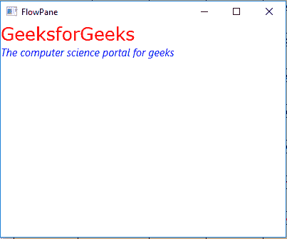

# JavaFX | TextFlow 类

> 原文: [https://www.geeksforgeeks.org/javafx-textflow-class/](https://www.geeksforgeeks.org/javafx-textflow-class/)

`TextFlow` 类是 JavaFX 的一部分。`TextFlow` 类旨在布局富文本。它可用于在单个文本流中布局多个文本节点。`TextFlow` 类扩展了 [`Pane`](https://www.geeksforgeeks.org/javafx-pane-class/) 类。

## 类的构造函数

1.  `TextFlow()` : 新建一个 `TextFlow` 对象。
2.  `TextFlow(Node… c)` : 用指定的节点创建一个新的 `TextFlow` 对象。

## 常用方法

| 方法 | 说明 |
| --- | --- |
| `getLineSpacing()` | 返回文本流的行距 |
| `getTextAlignment()` | 返回文本流的文本对齐方式 |
| `setLineSpacing(double s)` | 设置文本流的行距。 |
| `setTextAlignment(TextAlignment v)` | 设置文本流的文本对齐方式。 |

下面的程序说明了 `TextFlow` 类的使用:

## 示例 1：创建 TextFlow 并添加文本对象

在这个程序中，我们将创建一个名为 `text_flow` 的 `TextFlow` 和两个名为 `text_1` 和 `text_2` 的 `Text`。使用 `setFill()` 和 `setFont()` 设置填充和字体。我们将使用 `getChildren().add()` 函数将文本添加到 `text_flow`。将 `text_flow` 添加到场景，再将场景添加到舞台。调用 `show()` 函数显示最终结果。

```java
// Java program to create a TextFlow and 
// add text object to it .
import javafx.application.Application;
import javafx.scene.Scene;
import javafx.scene.control.*;
import javafx.scene.layout.*;
import javafx.stage.Stage;
import javafx.event.ActionEvent;
import javafx.scene.paint.*;
import javafx.scene.text.*;
import javafx.scene.web.*;
import javafx.scene.layout.*;
import javafx.scene.shape.*;

public class TextFlow_0 extends Application {

    // launch the application
    public void start(Stage stage) {
        try {
            // set title for the stage
            stage.setTitle("TextFlow");

            // create TextFlow
            TextFlow text_flow = new TextFlow();

            // create text
            Text text_1 = new Text("GeeksforGeeks\n");

            // set the text color
            text_1.setFill(Color.RED);

            // set font of the text
            text_1.setFont(Font.font("Verdana", 25));

            // create text
            Text text_2 = new Text("The computer science portal for geeks");

            // set the text color
            text_2.setFill(Color.BLUE);

            // set font of the text
            text_2.setFont(Font.font("Helvetica", FontPosture.ITALIC, 15));

            // add text to textflow
            text_flow.getChildren().add(text_1);
            text_flow.getChildren().add(text_2);

            // create a scene
            Scene scene = new Scene(text_flow, 400, 300);

            // set the scene
            stage.setScene(scene);

            stage.show();
        } catch (Exception e) {
            System.out.println(e.getMessage());
        }
    }

    // Main Method
    public static void main(String args[]) {
        // launch the application
        launch(args);
    }
}
```

**输出:**



## 示例 2：设置文本对齐和行间距

在这个程序中，我们将创建一个名为 `text_flow` 的 `TextFlow` 和两个名为 `text_1` 和 `text_2` 的 `Text`。使用 `setFill()` 和 `setFont()` 设置填充和字体。使用 `setTextAlignment()` 设置文本对齐方式，并使用 `setLineSpacing()` 函数设置行间距。使用 `getChildren().add()` 函数将文本添加到 `text_flow`。将 `text_flow` 添加到 `VBox`。将 `vbox` 场景和场景添加到舞台。调用 `show()` 函数显示最终结果。

```java
// Java program to create a TextFlow and 
// add text object to it, set text Alignment
// and set line spacing of the text flow.
import javafx.application.Application;
import javafx.scene.Scene;
import javafx.scene.control.*;
import javafx.scene.layout.*;
import javafx.stage.Stage;
import javafx.scene.layout.*;
import javafx.scene.paint.*;
import javafx.scene.text.*;
import javafx.geometry.*;
import javafx.scene.layout.*;
import javafx.scene.shape.*;

public class TextFlow_1 extends Application {

    // launch the application
    public void start(Stage stage) {
        try {
            // set title for the stage
            stage.setTitle("FlowPane");

            // create TextFlow
            TextFlow text_flow = new TextFlow();

            // create text
            Text text_1 = new Text("GeeksforGeeks\n");

            // set the text color
            text_1.setFill(Color.GREEN);

            // set font of the text
            text_1.setFont(Font.font("Verdana", 25));

            // create text
            Text text_2 = new Text("The computer science portal for geeks");

            // set the text color
            text_2.setFill(Color.BLUE);

            // set font of the text
            text_2.setFont(Font.font("Helvetica", FontPosture.ITALIC, 15));

            // add text to textflow
            text_flow.getChildren().add(text_1);
            text_flow.getChildren().add(text_2);

            // set text Alignment
            text_flow.setTextAlignment(TextAlignment.CENTER);

            // set line spacing
            text_flow.setLineSpacing(20.0f);

            // create VBox
            VBox vbox = new VBox(text_flow);

            // set alignment of vbox
            vbox.setAlignment(Pos.CENTER);

            // create a scene
            Scene scene = new Scene(vbox, 400, 300);

            // set the scene
            stage.setScene(scene);

            stage.show();
        } catch (Exception e) {
            System.out.println(e.getMessage());
        }
    }

    // Main Method
    public static void main(String args[]) {
        // launch the application
        launch(args);
    }
}
```

**输出:**


**注意:** 上述程序可能无法在联机 IDE 中运行，请使用脱机编译器。

**参考:** [https://docs.oracle.com/javase/8/javafx/api/javafx/scene/text/TextFlow.html](https://docs.oracle.com/javase/8/javafx/api/javafx/scene/text/TextFlow.html)