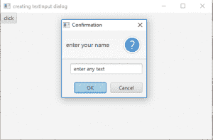
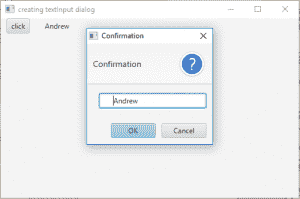

# JavaFX TextInputDialog

> 原文：[https://www.geeksforgeeks.org/javafx-textinputdialog/](https://www.geeksforgeeks.org/javafx-textinputdialog/)

`TextInputDialog` 是 JavaFX 库的一部分。文本输入对话框是一个允许用户输入文本的对话框，该对话框包含标题文本、文本字段和确认按钮。

## `TextInputDialog` 类的构造函数

1.  `TextInputDialog()`：创建没有初始文本的文本输入对话框。
2.  `TextInputDialog(String txt)`：用初始文本 `txt` 创建文本输入对话框。

## 常用方法

| 方法 | 说明 |
| --- | --- |
| `getDefaultValue()` | 返回文本输入对话框的默认值 |
| `getEditor()` | 返回文本输入对话框的编辑器 |
| `setHeaderText(String s)` | 设置文本输入对话框标题的标题文本 |

下面的程序说明了文本输入对话框类：

### 1. 创建 TextInputDialog 并将其添加到舞台

此程序创建一个带有初始文本和标题文本的 `TextInputDialog`。标题文本使用 `setHeaderText()` 函数设置。按钮由变量 `d` 表示，文本输入对话框将命名为 `td`。按钮将在场景（`Scene`）中创建，而场景又将托管在舞台（`Stage`）中。函数 `setTitle()` 用于为舞台提供标题。然后创建一个平铺窗格（`TilePane`），在其上调用 `getChildren().add()` 方法将按钮附加到场景中。最后，调用 `show()` 方法显示最终结果。单击按钮时将显示 `TextInputDialog`。

```java
// Java Program to create a text input
// dialog and add it to the stage
import javafx.application.Application;
import javafx.scene.Scene;
import javafx.scene.control.Button;
import javafx.scene.layout.*;
import javafx.event.ActionEvent;
import javafx.event.EventHandler;
import javafx.scene.control.*;
import javafx.stage.Stage;
import javafx.scene.control.Alert.AlertType;
import java.time.LocalDate;
public class TextInputDialog_1 extends Application {

    // launch the application
    public void start(Stage s)
    {
        // set title for the stage
        s.setTitle("creating textInput dialog");

        // create a tile pane
        TilePane r = new TilePane();

        // create a text input dialog
        TextInputDialog td = new TextInputDialog("enter any text");

        // setHeaderText
        td.setHeaderText("enter your name");

        // create a button
        Button d = new Button("click");

        // create a event handler
        EventHandler<ActionEvent> event = new EventHandler<ActionEvent>() {
            public void handle(ActionEvent e)
            {
                // show the text input dialog
                td.show();
            }
        };

        // set on action of event
        d.setOnAction(event);

        // add button and label
        r.getChildren().add(d);

        // create a scene
        Scene sc = new Scene(r, 500, 300);

        // set the scene
        s.setScene(sc);

        s.show();
    }

    public static void main(String args[])
    {
        // launch the application
        launch(args);
    }
}
```

**输出：**


### 2. 创建 TextInputDialog 并添加标签以显示输入的文本

此程序创建一个 `TextInputDialog`（`td`）。按钮由变量 `d` 表示，`TextInputDialog` 将命名为 `td`。按钮将在场景（`Scene`）中创建，而场景又将托管在舞台（`Stage`）中。函数 `setTitle()` 用于为舞台提供标题。然后创建一个平铺窗格（`TilePane`），在其上调用 `getChildren().add()` 方法将按钮附加到场景中。最后，调用 `showAndWait()` 方法显示对话框。当按钮被单击时，文本输入对话框将显示。将创建一个名为 `l` 的标签，该标签将被添加到场景中，用于显示用户在对话框中输入的文本。

```java
// Java Program to create a text input dialog
// and add a label to display the text entered
import javafx.application.Application;
import javafx.scene.Scene;
import javafx.scene.control.Button;
import javafx.scene.layout.*;
import javafx.event.ActionEvent;
import javafx.event.EventHandler;
import javafx.scene.control.*;
import javafx.stage.Stage;
import javafx.scene.control.Alert.AlertType;
import java.time.LocalDate;
public class TextInputDialog_2 extends Application {

    // launch the application
    public void start(Stage s)
    {
        // set title for the stage
        s.setTitle("creating textInput dialog");

        // create a tile pane
        TilePane r = new TilePane();

        // create a label to show the input in text dialog
        Label l = new Label("no text input");

        // create a text input dialog
        TextInputDialog td = new TextInputDialog();

        // create a button
        Button d = new Button("click");

        // create a event handler
        EventHandler<ActionEvent> event = new EventHandler<ActionEvent>() {
            public void handle(ActionEvent e)
            {
                // show the text input dialog
                td.showAndWait();

                // set the text of the label
                l.setText(td.getEditor().getText());
            }
        };

        // set on action of event
        d.setOnAction(event);

        // add button and label
        r.getChildren().add(d);
        r.getChildren().add(l);

        // create a scene
        Scene sc = new Scene(r, 500, 300);

        // set the scene
        s.setScene(sc);

        s.show();
    }

    public static void main(String args[])
    {
        // launch the application
        launch(args);
    }
}
```

**输出：**


**注意：** 上述程序可能无法在联机 IDE 中运行，请使用脱机 IDE。

**参考：** [https://docs.oracle.com/javase/8/javafx/api/javafx/scene/control/TextInputDialog.html](https://docs.oracle.com/javase/8/javafx/api/javafx/scene/control/TextInputDialog.html)