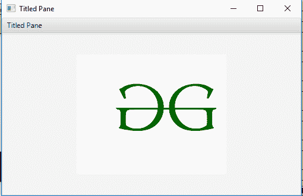

# JavaFX TitledPane 类

> 原文：[https://www.geeksforgeeks.org/javafx-titledpane-class/](https://www.geeksforgeeks.org/javafx-titledpane-class/)

`TitledPane` 类是 JavaFX 的一部分。该类创建一个标题可以打开或关闭的面板。`TitledPane` 类扩展了标记为的*类。*

## 该类的构造函数

*   `TitledPane()`: 创建一个新的 `TitledPane` 对象。
*   `TitledPane(String t, Node n)`: 用指定的内容和标题创建一个新的 `TitledPane` 对象。

## 常用方法

| 方法 | 说明 |
| --- | --- |
| `getContent()` | 返回 `TitledPane` 的内容。 |
| `isAnimated()` | 返回 `TitledPane` 是否动画化。 |
| `isCollapsible()` | 返回 `TitledPane` 是否可折叠。 |
| `isExpanded()` | 返回 `TitledPane` 是否展开。 |
| `setAnimated(boolean v)` | 设置 `TitledPane` 的动画状态。 |
| `setCollapsible(boolean v)` | 设置 `TitledPane` 的可折叠状态。 |
| `setContent(Node v)` | 设置 `TitledPane` 的内容窗格。 |
| `setExpanded(boolean v)` | 设置 `TitledPane` 的展开状态。 |

下面的程序说明了 `TitledPane` 类的使用：

### 1. Java program to create a TitledPane and add a label to it

*   在这个程序中，我们将创建一个 `TitledPane` 并给它添加一个标签。
*   标签将包含使用文件输入流导入的图片。
*   将此图片添加到标签中。
*   将标签添加到 `TitledPane`。
*   现在将 `TitledPane` 添加到场景中，并将场景添加到舞台中。
*   调用 `show()` 功能显示最终结果。

```java
// Java program to create a TitledPane
// and add a label to it.
import javafx.application.Application;
import javafx.scene.Scene;
import javafx.scene.control.*;
import javafx.scene.layout.*;
import javafx.stage.Stage;
import javafx.scene.layout.*;
import javafx.scene.paint.*;
import javafx.scene.text.*;
import javafx.geometry.*;
import javafx.scene.layout.*;
import javafx.scene.shape.*;
import javafx.scene.paint.*;
import javafx.scene.*;
import java.io.*;
import javafx.scene.image.*;

public class TitledPane_1 extends Application {

    // launch the application
    public void start(Stage stage) {
        try {
            // set title for the stage
            stage.setTitle("Titled Pane");

            // create a input stream
            FileInputStream input = new FileInputStream("D:\\GFG.png");

            // create a image
            Image image = new Image(input);

            // create a image View
            ImageView imageview = new ImageView(image);

            // create Label
            Label label = new Label("", imageview);

            // create TiledPane
            TitledPane titled_pane = new TitledPane("Titled Pane", label);

            // create a scene
            Scene scene = new Scene(titled_pane, 500, 300);

            // set the scene
            stage.setScene(scene);

            stage.show();
        } catch (Exception e) {
            System.out.println(e.getMessage());
        }
    }

    // Main Method
    public static void main(String args[]) {
        // launch the application
        launch(args);
    }
}
```

**输出:**

<video class="wp-video-shortcode" id="video-229167-1" width="640" height="360" preload="metadata" controls=""><source type="video/mp4" src="https://media.geeksforgeeks.org/wp-content/uploads/TitledPane.mp4?_=1">[https://media.geeksforgeeks.org/wp-content/uploads/TitledPane.mp4](https://media.geeksforgeeks.org/wp-content/uploads/TitledPane.mp4)</video>

### 2. Java program to create a TitledPane, state whether it is animated or not, collapsible or not and add a label to it

*   在这个程序中，我们将创建一个 `TitledPane` 并给它添加一个标签。
*   标签将包含使用文件输入流导入的图片。
*   将此图片添加到标签中，并将标签添加到 `TitledPane` 中。
*   将 `TitledPane` 添加到场景中，并将场景添加到舞台中。
*   调用 `show()` 功能显示最终结果。
*   使用 `setAnimated()` 功能将动画设置为假，并使用 `setCollapsible()` 功能将可折叠设置为假。

```java
// Java program to create a TitledPane, state
// whether it is animated or not, collapsible
// or not and add a label to it
import javafx.application.Application;
import javafx.scene.Scene;
import javafx.scene.control.*;
import javafx.scene.layout.*;
import javafx.stage.Stage;
import javafx.scene.layout.*;
import javafx.scene.paint.*;
import javafx.scene.text.*;
import javafx.geometry.*;
import javafx.scene.layout.*;
import javafx.scene.shape.*;
import javafx.scene.paint.*;
import javafx.scene.*;
import java.io.*;
import javafx.scene.image.*;

public class TitledPane_2 extends Application {

    // launch the application
    public void start(Stage stage) {
        try {
            // set title for the stage
            stage.setTitle("Titled Pane");

            // create a input stream
            FileInputStream input = new FileInputStream("D:\\GFG.png");

            // create a image
            Image image = new Image(input);

            // create a image View
            ImageView imageview = new ImageView(image);

            // create Label
            Label label = new Label("", imageview);

            // create TiledPane
            TitledPane titled_pane = new TitledPane("Titled Pane", label);

            // set Animated
            titled_pane.setAnimated(false);

            // set collapsible
            titled_pane.setCollapsible(false);

            // create a scene
            Scene scene = new Scene(titled_pane, 500, 300);

            // set the scene
            stage.setScene(scene);

            stage.show();
        } catch (Exception e) {
            System.out.println(e.getMessage());
        }
    }

    // Main Method
    public static void main(String args[]) {
        // launch the application
        launch(args);
    }
}
```

**输出:**



**注意:** 上述程序可能无法在联机 IDE 中运行，请使用脱机编译器。

**参考:** [https://docs.oracle.com/javase/8/javafx/api/javafx/scene/control/TitledPane.html](https://docs.oracle.com/javase/8/javafx/api/javafx/scene/control/TitledPane.html)