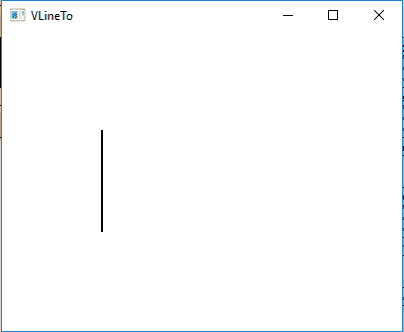
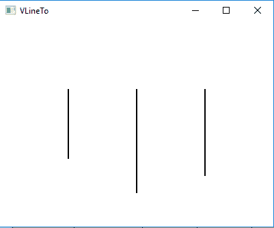

# JavaFX VLineTo 类

> 原文：[https://www.geeksforgeeks.org/javafx-vlineto-class/](https://www.geeksforgeeks.org/javafx-vlineto-class/)

`VLineTo` 类是 JavaFX 的一部分。`VLineTo` 类创建从当前位置到指定 Y 坐标的垂直线路径。`VLineTo` 类继承了 `PathElement` 类。

## 构造函数

1.  `VLineTo()`：创建一个 `VLineTo` 的空对象。
2.  `VLineTo(double y)`：创建一个具有指定 `y` 坐标值的 `VLineTo` 对象。

## 常用方法

| 方法 | 说明 |
| --- | --- |
| `getY()` | 返回 Y 坐标的值。 |
| `setY(double v)` | 设置 Y 坐标的值。 |
| `toString()` | 返回 `VLineTo` 对象的字符串表示形式。 |
| `yProperty()` | 定义 Y 坐标。 |

以下程序说明了 `VLineTo` 类的使用：

### 示例1：创建路径并添加单个 VLineTo 对象

1.  在这个程序中，我们将创建一个名为 `path` 的路径对象。
2.  用指定的 Y 坐标创建一个 `VLineTo` 对象。
3.  然后创建一个名为 `moveto` 的 `MoveTo` 对象，并将 `moveto` 和 `vlineto` 对象添加到路径中。
4.  将此路径添加到 `Group` 对象，并将 `Group` 对象添加到 `Scene`，并将 `Scene` 添加到 `Stage`。
5.  调用 `show()` 功能显示最终结果。

```java
// Java program to create a path
// and add VLineTo to it and display it
import javafx.application.Application;
import javafx.scene.Scene;
import javafx.scene.control.*;
import javafx.scene.layout.*;
import javafx.stage.Stage;
import javafx.scene.layout.*;
import javafx.scene.paint.*;
import javafx.scene.text.*;
import javafx.geometry.*;
import javafx.scene.layout.*;
import javafx.scene.shape.*;
import javafx.scene.paint.*;
import javafx.scene.*;

public class VLineTo_1 extends Application {

    // launch the application
    public void start(Stage stage) {
        try {
            // set title for the stage
            stage.setTitle("VLineTo");

            // create VLineTo
            VLineTo vlineto = new VLineTo(200);

            // create moveto
            MoveTo moveto = new MoveTo(100, 100);

            // create a Path
            Path path = new Path(moveto, vlineto);

            // set fill for path
            path.setFill(Color.BLACK);

            // set stroke width
            path.setStrokeWidth(2);

            // create a Group
            Group group = new Group(path);

            // create a scene
            Scene scene = new Scene(group, 400, 300);

            // set the scene
            stage.setScene(scene);

            stage.show();
        } catch (Exception e) {
            System.out.println(e.getMessage());
        }
    }

    // Main Method
    public static void main(String args[]) {
        // launch the application
        launch(args);
    }
}
```

**输出：**



### 示例2：创建路径并添加多个 VLineTo 对象

1.  在这个程序中，我们将创建一个名为 `path` 的路径对象。
2.  用指定的 Y 坐标创建三个 `VLineTo` 对象。
3.  然后创建三个名为 `moveto`、`moveto_1` 和 `moveto_2` 的对象。
4.  将所有 `MoveTo` 和 `VLineTo` 对象，按顺序添加到路径中。
5.  将此路径添加到 `Group` 对象，并将 `Group` 对象添加到 `Scene`，并将 `Scene` 添加到 `Stage`。
6.  调用 `show()` 功能显示最终结果。

```java
// Java program to create a path and add the
// multiple VLineTo object to it and display it
import javafx.application.Application;
import javafx.scene.Scene;
import javafx.scene.control.*;
import javafx.scene.layout.*;
import javafx.stage.Stage;
import javafx.scene.layout.*;
import javafx.scene.paint.*;
import javafx.scene.text.*;
import javafx.geometry.*;
import javafx.scene.layout.*;
import javafx.scene.shape.*;
import javafx.scene.paint.*;
import javafx.scene.*;

public class VLineTo_2 extends Application {

    // launch the application
    public void start(Stage stage) {
        try {
            // set title for the stage
            stage.setTitle("VLineTo");

            // create VLineTo
            VLineTo vlineto = new VLineTo(200);
            VLineTo vlineto_1 = new VLineTo(250);
            VLineTo vlineto_2 = new VLineTo(225);

            // create moveto
            MoveTo moveto = new MoveTo(100, 100);
            MoveTo moveto_1 = new MoveTo(200, 100);
            MoveTo moveto_2 = new MoveTo(300, 100);

            // create a Path
            Path path = new Path(moveto, vlineto, moveto_1,
                    vlineto_1, moveto_2, vlineto_2);

            // set fill for path
            path.setFill(Color.BLACK);

            // set stroke width
            path.setStrokeWidth(2);

            // create a Group
            Group group = new Group(path);

            // create a scene
            Scene scene = new Scene(group, 400, 300);

            // set the scene
            stage.setScene(scene);

            stage.show();
        } catch (Exception e) {
            System.out.println(e.getMessage());
        }
    }

    // Main Method
    public static void main(String args[]) {
        // launch the application
        launch(args);
    }
}
```

**输出：**



**注意：** 上述程序可能无法在联机 IDE 中运行，请使用脱机编译器。

**参考：** [https://docs.oracle.com/javase/8/javafx/api/javafx/scene/shape/VLineTo.html](https://docs.oracle.com/javase/8/javafx/api/javafx/scene/shape/VLineTo.html)