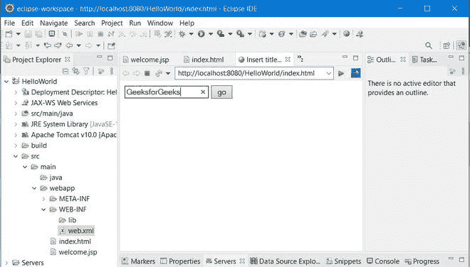
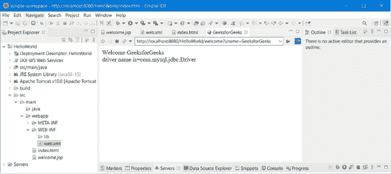

# JSP 应用程序–隐式对象

> 原文: [https://www.geeksforgeeks.org/jsp-application-implicit-objects/](https://www.geeksforgeeks.org/jsp-application-implicit-objects/)

在 JSP 中，`application`是一个类型为`ServletContext`的隐式对象。这是`javax.servlet.ServletContext`的一个实例。当 web 应用程序或 web 项目部署在服务器上时，它由 web 容器一次性生成。

该对象用于从配置文件(`web.xml`)中获取初始化参数。它用于在整个 JSP 页面上分配属性和属性值。这表明由`application`对象设置的任何属性都可以被所有 JSP 页面访问。在应用程序范围中，它还用于获取、设置和移除属性。

> `jsp application`隐式对象在所有 JSP 页面中都有作用域。

## 隐式对象的应用方法

`void setAttribute(String attributeName, Object object)`: 它在应用程序上下文中保存一个属性及其值，可用于 JSP 应用程序。例如:

```java
application.setAttribute(“Attribute”, “value of Attribute”);
```

上面给出的语句应该已经保存了属性及其值。

`Object getAttribute(String attributeName)`: 它返回保存在给定属性名中的对象。例如，让我们看看上面例子中给出的语句。现在，如果在任何 JSP 页面中使用下面的语句，`s`的值会是多少？

```java
String s = (String) application.getAttribute(“Attribute”);
```

`s`的值将是“属性的值”，毕竟我们已经在`setAttribute`方法的帮助下放置了它，并且这个值是使用`getAttribute`方法获得的。

`void removeAttribute(String objectName)`: 为了从应用程序中消除给定的属性，使用此方法。例如: 它将从应用程序中提取属性“Attribute”。如果我们试图在`getAttribute`方法的帮助下检索撤回属性的值，那么它将返回空值。

```java
application.removeAttribute(“Attribute”);
```

`Enumeration getAttributeNames()`: 该方法返回保存在`application`对象中的所有属性名称的枚举。

```java
Enumeration e = application.getAttributeNames();
```

`String getInitParameter(String paramName)`: 对于给定的参数名，它返回初始化参数的值。示例: `web.xml`

## 可扩展标记语言

```java
<web-app>
  …
  <context-param>
    <param-name>parameter</param-name>
    <param-value>ValueOfParameter</param-value>
  </context-param>
</web-app>
```

> **注意:** 这里我们假设上面给定的文件是`web.xml`文件。

```java
String s = application.getInitParameter("parameter");
```

`s`的值将是“ValueOfParameter”，它在配置文件(`web.xml`)的`param-value`标记中给出。

`Enumeration getInitParameterNames()`: 所有初始化参数的枚举都是用这个方法给出的。

```java
Enumeration e = application.getInitParameterNames();
```

`String getRealPath(String path)`: 在文件系统中，它将给定的路径转换为完整的路径。

```java
String abspath = application.getRealPath(“/index.html”);
```

根据实际的文件系统，`abspath`的值将是一个绝对的 http URL。

`void log(String message)`: 这个方法将给定的内容设置到与应用程序相关的 JSP 容器的默认日志文件中。

```java
application.log(“Error 404, Page not found”);
```

上面的调用会将消息“错误 404，找不到页面”写入默认日志文件。

`String getServerInfo()`: 这个方法返回 JSP 容器的名称和版本。

```java
application.getServerInfo();
```

## 例子

**`index.html`文件**

## 超文本标记语言

```java
<!DOCTYPE html>
<html>
<head>
<meta charset="ISO-8859-1">
<title>Insert title here</title>
</head>
<body>
<form action="welcome">
<input type="text" name="uname">
<input type="submit" value="go"><br/>
</form>
</body>
</html>
```

**`web.xml`文件**

## 可扩展标记语言

```java
<?xml version="1.0" encoding="UTF-8"?>
<web-app>
  <display-name>HelloWorld</display-name>
  <servlet>
    <servlet-name>welcome</servlet-name>
    <jsp-file>/welcome.jsp</jsp-file>
  </servlet>
  <servlet-mapping>
    <servlet-name>welcome</servlet-name>
    <url-pattern>/welcome</url-pattern>
  </servlet-mapping>
  <context-param>
    <param-name>dname</param-name>
    <param-value>com.mysql.jdbc.Driver</param-value>
  </context-param>
</web-app>
```

**`welcome.jsp`**

## 超文本标记语言

```java
<%@ page language="java" contentType="text/html; charset=ISO-8859-1"
    pageEncoding="ISO-8859-1"%>
<!DOCTYPE html>
<html>
<head>
<meta charset="ISO-8859-1">
<title>GeeksforGeeks</title>
</head>
<body>
<%
out.print("Welcome "+request.getParameter("uname"));
String driver=application.getInitParameter("dname");
out.print("<br/>driver name is="+driver);
%>
</body>
</html>
```

## 输出

 