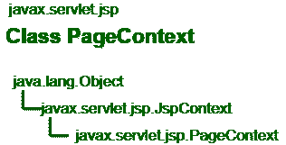
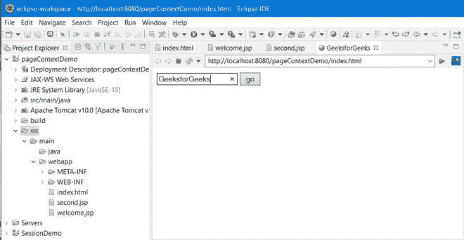
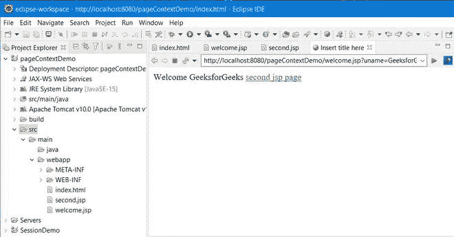
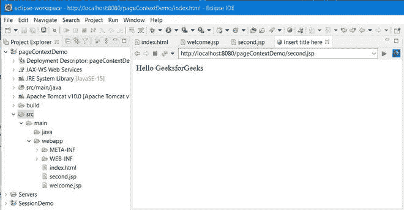

# JSP 页面上下文–隐式对象

> 原文: [https://www.geeksforgeeks.org/jsp-pagecontext-implicit-objects/](https://www.geeksforgeeks.org/jsp-pagecontext-implicit-objects/)

`PageContext` 扩展 `JspContext` 以贡献有用的上下文细节，同时 JSP 技术被应用在 Servlet 环境中。页面上下文是一个实例，它允许访问与 JSP 页面相关的所有名称空间，允许访问一些页面属性和应用程序细节的一个层。隐式对象因此连接到页面上下文。



## PageContext 类概述

*   `PageContext` 类是一个抽象类，它的形成是为了通过兼容的 JSP 引擎运行时环境来扩展应用程序相关的应用程序。在 JSP 中，`pageContext` 是 `javax.servlet.jsp.PageContext` 的一个实例。
*   整个 JSP 页面由 `PageContext` 对象表示。这个对象被认为是一种获取页面细节的方法，同时远离大部分执行信息。
*   对于每个请求，响应和请求对象的凭据都由该页面上下文对象保存。通过访问 `pageContext` 对象的属性，可以获得 `out`、`session`、`config` 和 `application` 对象。
*   这个页面上下文对象还保存了关于提供给 JSP 页面的指令的信息，以及页面范围、缓冲信息和错误页面 URL。
*   通过使用页面上下文对象，您可以设置属性、获取属性并移除不同范围内的属性，如 `page`、`request`、`session` 和 `application` 范围，如下所示:
    1.  `page` 范围: `PAGE_SCOPE`
    2.  `request` 范围: `REQUEST_SCOPE`
    3.  `session` 范围: `SESSION_SCOPE`
    4.  `application` 范围: `APPLICATION_SCOPE`

> **注意:** 页面范围是 JSP 中的默认范围。

**语法:**

```java
public abstract class PageContext extends JspContext
```

**语法:** 使用页面上下文

```java
pageContext.methodName(“name of attribute”, “scope”);
```

## 隐式对象与页面上下文的关系

继续向前，现在让我们讨论一下 `pageContext` 隐式对象中使用的方法。下面提出了几种在 `pageContext` 对象中使用的方法，其中最常涉及的方法将在下面单独深入讨论，接下来是干净的 Java 程序，以说明 JSP `PageContext` 类中隐式对象的实现。

> **记住:** 它支持 40 多种继承自 `JspContext` 类的方法。

## PageContext 的方法

### 方法 1: `getAttribute(String attributeName, int scope)`

`getAttribute` 方法在描述的范围内找到一个属性。例如，`getAttribute` 方法下面给出的语句在 Session (会话层) 的范围内找到属性 `"GeeksforGeeks"`。如果它找到属性，那么它将把属性分配给对象 `obj`，否则它将返回空值。

**语法:**

```java
Object obj = pageContext.getAttribute("GeeksforGeeks", PageContext.SESSION_SCOPE);
```

相应地，该方法也可以用于更多的其他范围，如下所示:

*   `Object obj = pageContext.getAttribute("GeeksforGeeks", PageContext.REQUEST_SCOPE);`
*   `Object obj = pageContext.getAttribute("GeeksforGeeks", PageContext.PAGE_SCOPE);`
*   `Object obj = pageContext.getAttribute("GeeksforGeeks", PageContext.APPLICATION_SCOPE);`

### 方法 2: `findAttribute(String attributeName)`

`findAttribute()` 方法按照下面列出的顺序在所有四个级别中查找所描述的属性。在任何级别，如果没有找到属性，那么它将返回空值。

```java
Page --> Request --> Session and Application
```

### 方法 3: `void setAttribute(String attributeName, Object attributeValue, int scope)`

此方法在给定的范围内设置属性。例如，考虑下面给出的语句将在应用范围内保存一个属性 `"data"`，值为 `"This is data"`。

**语法:**

```java
pageContext.setAttribute(“data”, “This is data”, PageContext.APPLICATION_SCOPE);
```

相应地，该方法将在请求范围内设计一个名为 `attr1` 的属性，其值 `"Attr1 value"` 如下:

```java
pageContext.setAttribute(“attr1”, “Attr1 value”, PageContext.REQUEST_SCOPE);
```

### 方法 4: `void removeAttribute(String attributeName, int scope)`

在命令到从给定范围移除属性时，使用此方法。例如，考虑下面给出的 JSP 语句将从页面范围中移除属性 `"Attr"`。

**语法:**

```java
pageContext.removeAttribute(“Attr”, PageContext.PAGE_SCOPE);
```

## 代码示例

最后，让我们通过演示页面上下文隐式对象的 HTML 代码示例来实现。

### 例 1: index.html

**第 1 页:** 在这个 HTML 页面中，我们只是要求用户输入姓名。

```html
<!DOCTYPE html>
<html>
<head>
<meta charset="ISO-8859-1">
<title>GeeksforGeeks</title>
</head>
<body>

<form action="welcome.jsp">
<input type="text" name="uname">
<input type="submit" value="go"><br/>
</form>

</body>
</html>
```

### 例 2: welcome.jsp

**页面 2:** 这是一个 JSP 页面，我们正在使用带有会话范围的 `pageContext` 隐式对象保存用户名，这意味着我们将能够访问详细信息，直到用户的会话处于活动状态。

```jsp
<%@ page language="java" contentType="text/html; charset=ISO-8859-1"
    pageEncoding="ISO-8859-1"%>
<!DOCTYPE html>
<html>
<head>
<meta charset="ISO-8859-1">
<title>Insert title here</title>
</head>
<body>

<%
String name=request.getParameter("uname");
out.print("Welcome "+name);
pageContext.setAttribute("user",name,PageContext.SESSION_SCOPE);
%>

<a href="second.jsp">second jsp page</a>

</body>
</html>
```

### 例 3: second.jsp

**第 3 页:** 在这个 JSP 页面中，我们正在使用 `getAttribute` 方法检索保存的属性。这里需要考虑的一点是，我们已经保存了具有会话范围的属性，因此我们需要将范围声明为会话，以便检索这些属性的值。

```jsp
<%@ page language="java" contentType="text/html; charset=ISO-8859-1"
    pageEncoding="ISO-8859-1"%>
<!DOCTYPE html>
<html>
<head>
<meta charset="ISO-8859-1">
<title>Insert title here</title>
</head>
<body>

<%
String name=(String)pageContext.getAttribute("user",PageContext.SESSION_SCOPE);
out.print("Hello "+name);
%>

</body>
</html>
```

## 输出

一个我们接收用户名的网页。



**B** JSP 页面连同详细信息页面链接。



**C** 用户凭据显示页面，我们已经通过页面上下文实例从 html 页面移动到该页面。

