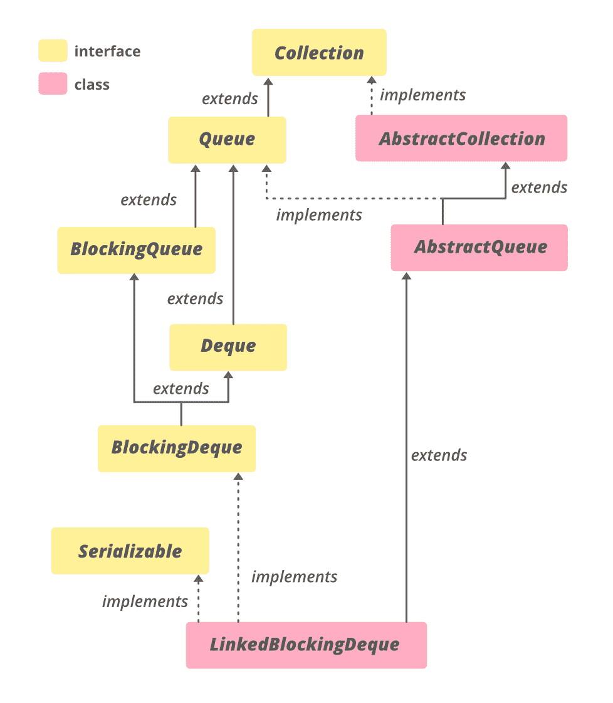

# 用示例链接 Java 中的锁定请求

> 原文: [https://www.geeksforgeeks.org/linkedblockingdeque-in-java-with-examples/](https://www.geeksforgeeks.org/linkedblockingdeque-in-java-with-examples/)

Java 中的 `LinkedBlockingDeque` 类是 [Java 集合框架](https://www.geeksforgeeks.org/collections-in-java-2/)的一部分。在 JDK 1.6 推出，属于 `java.util.concurrent` 包。它是一个[双端队列](https://www.geeksforgeeks.org/deque-interface-java-example/)，如果线程试图在双端队列为空时从中取出元素，它就会阻塞该线程。它实现了阻塞队列，并提供了基于链接节点的可选有界功能。这种可选的有界性是通过在构造函数中传递所需的大小来实现的，有助于防止内存浪费。未指定时，容量默认为 `Integer.MAX_VALUE`。这个类及其迭代器实现了 `Collection` 和 `Iterator` 接口的所有可选方法。`LinkedBlockingDeque` 提供的实现是线程安全的。类中的所有排队方法都是通过内部使用[可重入锁](https://www.geeksforgeeks.org/reentrant-lock-java/)自动实现其效果的。

## 链接锁定请求的层次结构



它实现了 `Serializable`、`Iterable<E>`、`Collection<E>`、[`BlockingDeque<E>`](https://www.geeksforgeeks.org/blockingdeque-in-java/)、[`BlockingQueue<E>`](https://www.geeksforgeeks.org/blockingqueue-interface-in-java/)、[`Deque<E>`](https://www.geeksforgeeks.org/deque-interface-java-example/)、[`Queue<E>`](https://www.geeksforgeeks.org/queue-interface-java/) 接口并扩展 [`AbstractQueue<E>`](https://www.geeksforgeeks.org/abstractqueue-in-java-with-examples/)。

## 声明

```java
public class LinkedBlockingDeque<E> extends AbstractQueue<E> implements BlockingDeque<E>, Serializable
```

这里，`E` 是集合中存储的元素类型。

### Java 中的构造函数链接锁定请求

为了创建 `LinkedBlockingDeque` 的实例，我们需要从 `java.util.concurrent` 包导入。

**1. `LinkedBlockingDeque()`**: 这个构造函数用来构造一个空的双端队列。在这种情况下，容量设置为 `Integer.MAX_VALUE`。

```java
LinkedBlockingDeque<Integer> lbd = new LinkedBlockingDeque<>();
```

**2. `LinkedBlockingDeque(int capacity)`**: 此构造函数创建一个具有给定(固定)容量的 `LinkedBlockingDeque`。

```java
LinkedBlockingDeque<Integer> lbd = new LinkedBlockingDeque<>(int capacity);
```

**3. `LinkedBlockingDeque(Collection<? extends E> c)`**: 这个构造函数用来构造一个双端队列，集合的元素作为参数传递。

```java
LinkedBlockingDeque<E> lbd = new LinkedBlockingDeque<>(Collection<? extends E> c);
```

下面是一个示例程序，用于说明 Java 中的 `LinkedBlockingDeque`:

**示例 1:**

```java
// Java Program Demonstrate LinkedBlockingDeque

import java.util.concurrent.LinkedBlockingDeque;
import java.util.*;

public class LinkedBlockingDequeDemo {
    public static void main(String[] args)
        throws InterruptedException
    {

        // create object of LinkedBlockingDeque
        // using LinkedBlockingDeque() constructor
        LinkedBlockingDeque<Integer> LBD
            = new LinkedBlockingDeque<Integer>();

        // Add numbers to end of LinkedBlockingDeque
        LBD.add(7855642);
        LBD.add(35658786);
        LBD.add(5278367);
        LBD.add(74381793);

        // print Dequee
        System.out.println("Linked Blocking Deque1: "
                           + LBD);
        System.out.println("Size of Linked Blocking Deque1: "
                           + LBD.size());

        // create object of LinkedBlockingDeque
        // using LinkedBlockingDeque(int capacity) constructor
        LinkedBlockingDeque<Integer> LBD1
            = new LinkedBlockingDeque<Integer>(3);

        // Add numbers to end of LinkedBlockingDeque
        LBD1.add(7855642);
        LBD1.add(35658786);
        LBD1.add(5278367);

        try {
            // adding the 4th element
            // will throw exception for Deque full
            LBD1.add(74381793);
        }
        catch (Exception e) {
            System.out.println("Exception: " + e);
        }

        // print Dequee
        System.out.println("Linked Blocking Deque2: "
                           + LBD1);
        System.out.println("Size of Linked Blocking Deque2: "
                           + LBD1.size());

        // create object of LinkedBlockingDeque
        // using LinkedBlockingDeque(Collection c) constructor
        LinkedBlockingDeque<Integer> LBD2
            = new LinkedBlockingDeque<Integer>(LBD1);

        // print Dequee
        System.out.println("Linked Blocking Deque3: "
                           + LBD2);
    }
}
```

**Output**

```java
Linked Blocking Deque1: [7855642, 35658786, 5278367, 74381793]
Size of Linked Blocking Deque1: 4
Exception: java.lang.IllegalStateException: Deque full
Linked Blocking Deque2: [7855642, 35658786, 5278367]
Size of Linked Blocking Deque2: 3
Linked Blocking Deque3: [7855642, 35658786, 5278367]
```

**例 2:**

```java
// Java code to illustrate methods of LinkedBlockingDeque

import java.util.concurrent.LinkedBlockingDeque;
import java.util.*;

public class LinkedBlockingDequeDemo {
    public static void main(String[] args)
        throws InterruptedException
    {

        // create object of LinkedBlockingDeque
        LinkedBlockingDeque<Integer> LBD
            = new LinkedBlockingDeque<Integer>();

        // Add numbers to end of LinkedBlockingDeque
        // using add() method
        LBD.add(7855642);
        LBD.add(35658786);
        LBD.add(5278367);
        LBD.add(74381793);

        // prints the Deque
        System.out.println("Linked Blocking Deque: "
                           + LBD);

        // prints the size of Deque after removal
        // using size() method
        System.out.println("Size of Linked Blocking Deque: "
                           + LBD.size());

        // removes the front element and prints it
        // using removeFirst() method
        System.out.println("First element: "
                           + LBD.removeFirst());

        // prints the Deque
        System.out.println("Linked Blocking Deque: "
                           + LBD);

        // prints the size of Deque after removal
        // using size() method
        System.out.println("Size of Linked Blocking Deque: "
                           + LBD.size());

        // Add numbers to end of LinkedBlockingDeque
        // using offer() method
        LBD.offer(20);

        // prints the Deque
        System.out.println("Linked Blocking Deque: "
                           + LBD);

        // prints the size of Deque after removal
        // using size() method
        System.out.println("Size of Linked Blocking Deque: "
                           + LBD.size());
    }
}
```

**Output**

```java
Linked Blocking Deque: [7855642, 35658786, 5278367, 74381793]
Size of Linked Blocking Deque: 4
First element: 7855642
Linked Blocking Deque: [35658786, 5278367, 74381793]
Size of Linked Blocking Deque: 3
Linked Blocking Deque: [35658786, 5278367, 74381793, 20]
Size of Linked Blocking Deque: 4
```

### 基本操作

**1. 添加元素**

`LinkedBlockingDeque` 提供了各种方法在两端添加或插入元素。分别是 [`add(E e)`](https://www.geeksforgeeks.org/linkedblockingdeque-add-method-in-java/)、[`addAll(Collection c)`](https://www.geeksforgeeks.org/linkedblockingdeque-addall-method-in-java-with-examples/)、[`addFirst(E e)`](https://www.geeksforgeeks.org/linkedblockingdeque-addfirst-method-in-java/)、[`addLast(E e)`](https://www.geeksforgeeks.org/linkedblockingdeque-addlast-method-in-java/) 等。

## Java 语言

```java
// Java Program Demonstrate adding
// elements to LinkedBlockingDeque

import java.util.concurrent.LinkedBlockingDeque;
import java.util.*;

public class AddingElementsExample {
    public static void main(String[] args)
        throws IllegalStateException
    {

        // create object of LinkedBlockingDeque
        LinkedBlockingDeque<Integer> lbd
            = new LinkedBlockingDeque<Integer>();

        // Add number to end of LinkedBlockingDeque
        lbd.add(7855642);

        // Add integer at the head or front
        lbd.addFirst(35658786);

        // Add integer at the tail or end
        lbd.addLast(5278367);

        // print Deque
        System.out.println("Linked Blocking Deque: " + lbd);

          // Create object of ArrayList collection
        ArrayList<Integer> ArrLis
            = new ArrayList<Integer>();

        // Add number to ArrayList
        ArrLis.add(55);
        ArrLis.add(66);
        ArrLis.add(77);
        ArrLis.add(88);

        // Print ArrayList
        System.out.println("ArrayList: " + ArrLis);

        // Function addAll() adds all the elements of
        // ArrayList to Deque
        lbd.addAll(ArrLis);

        // Print deque
        System.out.println("Linked Blocking Deque: " + lbd);
    }
}
```

**输出**

```java
Linked Blocking Deque: [35658786, 7855642, 5278367]
ArrayList: [55, 66, 77, 88]
Linked Blocking Deque: [35658786, 7855642, 5278367, 55, 66, 77, 88]
```

### 2. 拆卸元件

`LinkedBlockingDeque` 提供了各种方法来从两端删除或移除元素。分别是 [`remove()`](https://www.geeksforgeeks.org/linkedblockingdeque-remove-method-in-java/#:~:text=The%20remove()%20method%20of,the%20Deque%20container%20is%20empty.&text=Parameters%3A%20This%20method%20does%20not%20accepts%20any%20parameter.)、[`removeFirst()`](https://www.geeksforgeeks.org/linkedblockingdeque-removefirst-method-in-java/)、[`removeLast()`](https://www.geeksforgeeks.org/linkedblockingdeque-removelast-method-in-java/) 等。

## Java 语言

```java
// Java Program Demonstrate removing
// elements of LinkedBlockingDeque

import java.util.concurrent.LinkedBlockingDeque;
import java.util.*;

public class RemovingElementsExample {
    public static void main(String[] args)
        throws InterruptedException
    {

        // create object of LinkedBlockingDeque
        LinkedBlockingDeque<Integer> lbd
            = new LinkedBlockingDeque<Integer>();

        // Add numbers to end of LinkedBlockingDeque
        lbd.add(7855642);
        lbd.add(35658786);
        lbd.add(5278367);
        lbd.add(74381793);
        lbd.add(12345566);

        // print Dequeue
        System.out.println("Linked Blocking Deque: " + lbd);

        // removes the front element
        lbd.remove();

        // print the modified deque
        System.out.println("Linked Blocking Deque: " + lbd);

        // removes the front element
        lbd.removeFirst();

        // print the modified deque
        System.out.println("Linked Blocking Deque: " + lbd);

        // removes the last element
        lbd.removeLast();

        // print the modified deque
        System.out.println("Linked Blocking Deque: " + lbd);
    }
}
```

**输出**

```java
Linked Blocking Deque: [7855642, 35658786, 5278367, 74381793, 12345566]
Linked Blocking Deque: [35658786, 5278367, 74381793, 12345566]
Linked Blocking Deque: [5278367, 74381793, 12345566]
Linked Blocking Deque: [5278367, 74381793]
```

### 3. 迭代

`LinkedBlockingDeque` 的 `iterator()` 方法返回一个迭代器，该迭代器以正确的顺序遍历该对象中的元素。元素将按从第一个(头)到最后一个(尾)的顺序返回。返回的迭代器是“弱一致”迭代器。

## Java 语言

```java
// Java Program Demonstrate iterating
// over LinkedBlockingDeque

import java.util.concurrent.LinkedBlockingDeque;
import java.util.*;

public class IteratingExample {
    public static void main(String[] args)

    {

        // create object of LinkedBlockingDeque
        LinkedBlockingDeque<Integer> LBD
            = new LinkedBlockingDeque<Integer>();

        // Add numbers to front of LinkedBlockingDeque
        LBD.addFirst(7855642);
        LBD.addFirst(35658786);
        LBD.addFirst(5278367);
        LBD.addFirst(74381793);

        // Call iterator() method of LinkedBlockingDeque
        Iterator iteratorVals = LBD.iterator();

        // Print elements of iterator
        // created from PriorityBlockingQueue
        System.out.println("The iterator values"
            + " of LinkedBlockingDeque are:");

        // prints the elements using an iterator
        while (iteratorVals.hasNext()) {
            System.out.println(iteratorVals.next());
        }
    }
}
```

**输出**

```java
The iterator values of LinkedBlockingDeque are:
74381793
5278367
35658786
7855642
```

### LinkedBlockingDeque 的方法

| 方法 | 描述 |
| --- | --- |
| | |

# LinkedBlockingDeque 方法说明

## 添加元素

| 方法 | 描述 |
| --- | --- |
| `add(E e)` | 除非违反容量限制，否则将指定的元素插入到此 deque 的末尾。 |
| `addAll(Collection<? extends E> c)` | 按照指定集合的迭代器返回元素的顺序，将指定集合中的所有元素追加到这个 deque 的末尾。 |
| `addFirst(E e)` | 如果可以在不违反容量限制的情况下立即插入指定的元素，则在该元素的前面插入指定的元素，如果当前没有可用空间，则抛出 `IllegalStateException`。 |
| `addLast(E e)` | 如果可以在不违反容量限制的情况下立即插入指定的元素，则在该元素的末尾插入指定的元素，如果当前没有可用空间，则引发 `IllegalStateException`。 |
| `offer(E e)` | 如果可以在不违反容量限制的情况下立即将指定的元素插入到由这个 deque 表示的队列中(换句话说，在这个 deque 的尾部)，成功时返回 `true`，如果当前没有可用空间，则返回 `false`。 |
| `offer(E e, long timeout, TimeUnit unit)` | 将指定的元素插入到由这个 deque 表示的队列中(换句话说，在这个 deque 的尾部)，如果空间变得可用，等待指定的等待时间。 |
| `offerFirst(E e)` | 如果可以在不违反容量限制的情况下立即插入指定元素，则在该元素的前面插入指定元素，如果成功，则返回 `true`，如果当前没有可用空间，则返回 `false`。 |
| `offerFirst(E e, long timeout, TimeUnit unit)` | 将指定的元素插入到这个队列的前面，如果需要空间变得可用，等待指定的等待时间。 |
| `offerLast(E e)` | 如果可以在不违反容量限制的情况下立即插入指定的元素，则在该元素的末尾插入指定的元素，如果成功，则返回 `true` 如果当前没有可用空间，则返回 `false`。 |
| `offerLast(E e, long timeout, TimeUnit unit)` | 将指定的元素插入到这个 deque 的末尾，如果需要空间变得可用，等待指定的等待时间。 |
| `push(E e)` | 如果可以在不违反容量限制的情况下立即将一个元素推送到由这个 deque 表示的堆栈上(换句话说，在这个 deque 的头部)，如果当前没有可用空间，则抛出 `IllegalStateException`。 |
| `put(E e)` | 将指定的元素插入到由这个 deque 表示的队列中(换句话说，在这个 deque 的尾部)，如果需要等待空间变得可用。 |
| `putFirst(E e)` | 将指定的元素插入到这个元素的前面，如果需要的话等待空间变得可用。 |
| `putLast(E e)` | 将指定的元素插入到这个 deque 的末尾，如果需要等待空间变得可用。 |

## 移除元素

| 方法 | 描述 |
| --- | --- |
| `clear()` | 原子性地从这个对象中移除所有元素。 |
| `remove()` | 检索并移除由这个 deque 表示的队列头。 |
| `remove(Object o)` | 从此列表中移除指定元素的第一个匹配项。 |
| `removeAll(Collection<?> c)` | 移除此集合中也包含在指定集合中的所有元素(可选操作)。 |
| `removeFirst()` | 检索并移除此数据的第一个元素。 |
| `removeFirstOccurrence(Object o)` | 移除此 deque 中第一次出现的指定元素。 |
| `removeLast()` | 检索并移除此数据的最后一个元素。 |
| `removeLastOccurrence(Object o)` | 移除此 deque 中最后一次出现的指定元素。 |
| `removeIf(Predicate<? super E> filter)` | 移除此集合中满足给定谓词的所有元素。 |
| `poll()` | 检索并移除由这个 deque 表示的队列头，如果此 deque 为空，则返回 `null`。 |
| `poll(long timeout, TimeUnit unit)` | 检索并移除由这个 deque 表示的队列头，等待指定的等待时间（如果需要）此 deque 为空。 |
| `pollFirst()` | 检索并移除此 deque 的第一个元素，如果此 deque 为空，则返回 `null`。 |
| `pollFirst(long timeout, TimeUnit unit)` | 检索并移除此 deque 的第一个元素，等待指定的等待时间（如果需要）此 deque 为空。 |
| `pollLast()` | 检索并移除此 deque 的最后一个元素，如果此 deque 为空，则返回 `null`。 |
| `pollLast(long timeout, TimeUnit unit)` | 检索并移除此 deque 的最后一个元素，等待指定的等待时间（如果需要）此 deque 为空。 |
| `pop()` | 从这个 deque 表示的堆栈中弹出一个元素。 |
| `drainTo(Collection<? super E> c)` | 从此队列中移除所有可用元素，并将它们添加到给定集合中。 |
| `drainTo(Collection<? super E> c, int maxElements)` | 从该队列中最多移除给定数量的可用元素，并将它们添加到给定集合中。 |

## 检查与检索

| 方法 | 描述 |
| --- | --- |
| `contains(Object o)` | 如果此元素包含指定的元素，则返回 `true`。 |
| `element()` | 检索但不移除由这个 deque 表示的队列头。 |
| `getFirst()` | 检索但不移除此 deque 的第一个元素。 |
| `getLast()` | 检索但不移除此 deque 的最后一个元素。 |
| `peek()` | 检索但不移除由这个 deque 表示的队列头，如果此 deque 为空，则返回 `null`。 |
| `peekFirst()` | 检索但不移除此 deque 的第一个元素，如果此 deque 为空，则返回 `null`。 |
| `peekLast()` | 检索但不移除此 deque 的最后一个元素，如果此 deque 为空，则返回 `null`。 |
| `take()` | 检索并移除由这个 deque 表示的队列头，如果需要，则等待直到有可用元素。 |
| `takeFirst()` | 检索并移除此 deque 的第一个元素，如果需要，则等待直到有可用元素。 |
| `takeLast()` | 检索并移除此 deque 的最后一个元素，如果需要，则等待直到有可用元素。 |
| `size()` | 返回此列表中的元素数量。 |
| `remainingCapacity()` | 返回在没有阻塞的情况下(在没有内存或资源限制的情况下)这个 deque 可以理想地接受的附加元素的数量。 |
| `toArray()` | 按适当的顺序(从第一个元素到最后一个元素)返回一个数组，该数组包含此 deque 中的所有元素。 |
| `toArray(T[] a)` | 按正确的顺序返回一个数组，该数组包含这个 deque 中的所有元素；返回数组的运行时类型是指定数组的运行时类型。 |

## 迭代与其他

| 方法 | 描述 |
| --- | --- |
| `descendingIterator()` | 以相反的顺序返回此对象中元素的迭代器。 |
| `forEach(Consumer<? super E> action)` | 对 `Iterable` 的每个元素执行给定的操作，直到所有元素都被处理完或者该操作引发异常。 |
| `iterator()` | 以正确的顺序返回这个序列中元素的迭代器。 |
| `spliterator()` | 在此对象的元素上返回一个 `Spliterator`。 |
| `retainAll(Collection<?> c)` | 仅保留此集合中包含在指定集合中的元素(可选操作)。 |

### `java.util.AbstractCollection` 类中声明的方法

| 方法 | 描述 |
| --- | --- |
| [`containsAll(Collection<?> c)`](https://www.geeksforgeeks.org/abstractcollection-containsall-method-in-java-with-examples/) | 如果此集合包含指定集合中的所有元素，则返回 `true`。 |
| [`isEmpty()`](https://www.geeksforgeeks.org/abstractcollection-isempty-method-in-java-with-examples/) | 如果此集合不包含元素，则返回 `true`。 |
| [`toString()`](https://www.geeksforgeeks.org/abstractcollection-tostring-method-in-java-with-examples/) | 返回此集合的字符串表示形式。 |

### 在接口 `java.util.concurrent.BlockingDeque` 中声明的方法

| 方法 | 描述 |
| --- | --- |
| [`peek()`](https://www.geeksforgeeks.org/blockingdeque-peek-method-in-java-with-examples/) | 检索但不移除由该 deque 表示的队列头（换句话说，该 deque 的第一个元素），或者如果该 deque 为空，则返回 `null`。 |
| [`poll()`](https://www.geeksforgeeks.org/blockingdeque-poll-method-in-java-with-examples/) | 检索并移除由这个 deque 表示的队列头（换句话说，这个 deque 的第一个元素），如果这个 deque 为空，则返回 `null`。 |
| [`poll(long timeout, TimeUnit unit)`](https://www.geeksforgeeks.org/blockingdeque-poll-method-in-java-with-examples/) | 检索并移除由这个 deque 表示的队列头（换句话说，这个 deque 的第一个元素），如果需要，等待指定的等待时间，直到某个元素变得可用。 |
| [`pollFirst(long timeout, TimeUnit unit)`](https://www.geeksforgeeks.org/blockingdeque-pollfirst-method-in-java-with-examples/) | 检索并移除此 deque 的第一个元素，如果需要某个元素变得可用，则等待指定的等待时间。 |
| [`pollLast(long timeout, TimeUnit unit)`](https://www.geeksforgeeks.org/blockingdeque-polllast-method-in-java-with-examples/) | 检索并移除此 deque 的最后一个元素，如果需要，等待指定的等待时间，直到某个元素变得可用。 |
| [`removeFirstOccurrence(Object o)`](https://www.geeksforgeeks.org/blockingdeque-removefirstoccurrence-method-in-java-with-examples/) | 从此列表中移除指定元素的第一个匹配项。 |
| [`removeLastOccurrence(Object o)`](https://www.geeksforgeeks.org/blockingdeque-removelastoccurrence-method-in-java-with-examples/) | 从此列表中移除指定元素的最后一次出现。 |
| [`take()`](https://www.geeksforgeeks.org/blockingdeque-take-method-in-java-with-examples/) | 检索并移除由这个 deque 表示的队列头（换句话说，这个 deque 的第一个元素），如有必要，等待直到某个元素变得可用。 |
| [`takeFirst()`](https://www.geeksforgeeks.org/blockingdeque-takefirst-method-in-java-with-examples/) | 检索并移除此 deque 的第一个元素，如有必要，等待直到某个元素变得可用。 |
| [`takeLast()`](https://www.geeksforgeeks.org/blockingdeque-takelast-method-in-java-with-examples/) | 检索并移除此 deque 的最后一个元素，如有必要，等待直到某个元素变得可用。 |

### 接口 `java.util.Collection` 中声明的方法

| 方法 | 描述 |
| --- | --- |
| `containsAll(Collection<?> c)` | 如果此集合包含指定集合中的所有元素，则返回 `true`。 |
| `equals(Object o)` | 将指定的对象与此集合进行比较，看是否相等。 |
| `hashCode()` | 返回此集合的哈希代码值。 |
| `isEmpty()` | 如果此集合不包含元素，则返回 `true`。 |
| `parallelStream()` | 以此集合为源返回一个可能并行的流。 |
| `stream()` | 返回以此集合为源的顺序流。 |
| `toArray(IntFunction<T[]> generator)` | 使用提供的生成器函数分配返回的数组，返回包含此集合中所有元素的数组。 |

### 接口 `java.util.Deque` 中声明的方法

| 方法 | 描述 |
| --- | --- |
| `peekFirst()` | 检索但不移除此 deque 的第一个元素，如果此 deque 为空，则返回 `null`。 |
| `peekLast()` | 检索但不移除此 deque 的最后一个元素，如果此 deque 为空，则返回 `null`。 |
| `pollFirst()` | 检索并移除此 deque 的第一个元素，如果此 deque 为空，则返回 `null`。 |
| `pollLast()` | 检索并移除此 deque 的最后一个元素，如果此 deque 为空，则返回 `null`。 |

**参考:** [`https://docs.oracle.com/en/java/javase/11/docs/api/java.base/java/util/concurrent/LinkedBlockingDeque.html`](https://docs.oracle.com/en/java/javase/11/docs/api/java.base/java/util/concurrent/LinkedBlockingDeque.html)