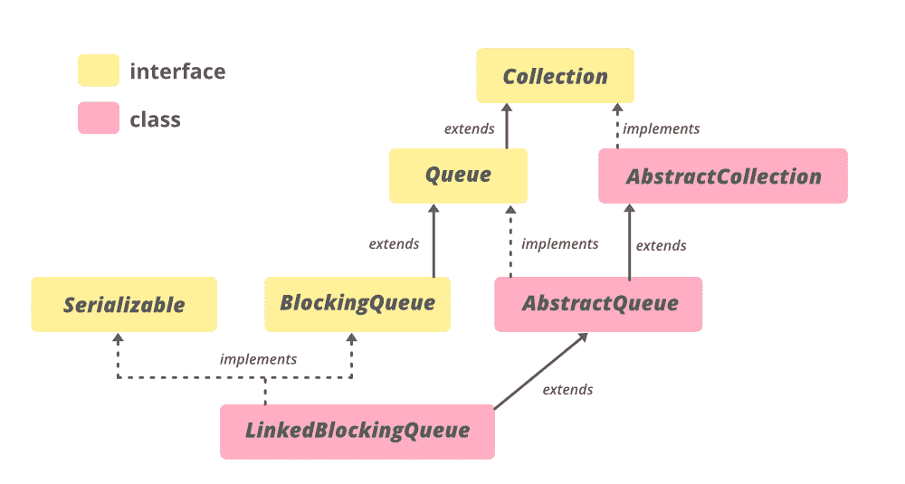

# Java 中的 LinkedBlockingQueue 类

> 原文: [https://www.geeksforgeeks.org/linkedblockingqueue-class-in-java/](https://www.geeksforgeeks.org/linkedblockingqueue-class-in-java/)

**链接锁定队列**是一个基于链接节点的*可选有界*阻塞队列。这意味着 `LinkedBlockingQueue` 可以是有界的，如果给定它的容量，否则 `LinkedBlockingQueue` 将是无界的。容量可以作为参数提供给 `LinkedBlockingQueue` 的构造函数。该队列对元素**先进先出**进行排序。这意味着该队列的头部是该队列中存在的元素中最老的元素。这个队列的尾部是这个队列元素的最新元素。新插入的元素总是被插入到队列的尾部，队列检索操作在队列的头部获取元素。在大多数并发应用程序中，链接队列通常比基于阵列的队列具有更高的吞吐量，但可预测性较差。

容量，如果未指定，等于 `Integer.MAX_VALUE`。每次插入时都会动态创建链接节点，直到队列的容量没有被填满。这个类及其迭代器实现了 `Collection` 和 `Iterator` 接口的所有可选方法。它是 Java 集合框架的成员。

## 链接锁定队列的层次结构



`LinkedBlockingQueue<E>` 扩展 `AbstractQueue<E>` 并实现 `Serializable`、`Iterable<E>`、`Collection<E>`、`BlockingQueue<E>`、`Queue<E>` 接口。

**声明:**

> `public class LinkedBlockingQueue<E> extends AbstractQueue<E> implements BlockingQueue<E>, Serializable`

`E` – 该集合中包含的元素类型。

## LinkedBlockingQueue 的构造函数

要构造一个 `LinkedBlockingQueue`，我们需要从 `java.util.concurrent.LinkedBlockingQueue` 导入。这里，`容量` 是链接阻塞队列的大小。

**1. `LinkedBlockingQueue()`** : 创建一个容量为 `Integer.MAX_VALUE` 的 `LinkedBlockingQueue`。

> `LinkedBlockingQueue<E> lbq = new LinkedBlockingQueue<E>();`

**示例:**

```java
// Java program to demonstrate
// LinkedBlockingQueue() constructor

import java.util.concurrent.LinkedBlockingQueue;

public class LinkedBlockingQueueDemo {

    public static void main(String[] args)
    {

        // create object of LinkedBlockingQueue
        // using LinkedBlockingQueue() constructor
        LinkedBlockingQueue<Integer> lbq
            = new LinkedBlockingQueue<Integer>();

        // add  numbers
        lbq.add(1);
        lbq.add(2);
        lbq.add(3);
        lbq.add(4);
        lbq.add(5);

        // print queue
        System.out.println("LinkedBlockingQueue:" + lbq);
    }
}
```

**Output**

```java
LinkedBlockingQueue:[1, 2, 3, 4, 5]
```

**2. `LinkedBlockingQueue(int capacity)`**: 创建具有给定(固定)容量的 `LinkedBlockingQueue`。

> `LinkedBlockingQueue<E> lbq = new LinkedBlockingQueue(int capacity);`

**示例:**

```java
// Java program to demonstrate
// LinkedBlockingQueue(int initialCapacity) constructor

import java.util.concurrent.LinkedBlockingQueue;

public class GFG {

    public static void main(String[] args)
    {
        // define capacity of LinkedBlockingQueue
        int capacity = 15;

        // create object of LinkedBlockingQueue
        // using LinkedBlockingQueue(int initialCapacity)
        // constructor
        LinkedBlockingQueue<Integer> lbq
            = new LinkedBlockingQueue<Integer>(capacity);

        // add  numbers
        lbq.add(1);
        lbq.add(2);
        lbq.add(3);

        // print queue
        System.out.println("LinkedBlockingQueue:" + lbq);
    }
}
```

**Output**

```java
LinkedBlockingQueue:[1, 2, 3]
```

**3. `LinkedBlockingQueue(Collection<? extends E> c)`** : 创建一个容量为 `Integer.MAX_VALUE` 的 `LinkedBlockingQueue`，最初包含给定集合的元素，按照集合迭代器的遍历顺序添加。

> `LinkedBlockingQueue<E> lbq = new LinkedBlockingQueue(Collection extends E> c);`

**示例:**

```java
// Java program to demonstrate
// LinkedBlockingQueue(Collection c) constructor

import java.util.concurrent.LinkedBlockingQueue;
import java.util.*;

public class GFG {

    public static void main(String[] args)
    {

        // Creating a Collection
        Vector<Integer> v = new Vector<Integer>();
        v.addElement(1);
        v.addElement(2);
        v.addElement(3);
        v.addElement(4);
        v.addElement(5);

        // create object of LinkedBlockingQueue
        // using LinkedBlockingQueue(Collection c)
        // constructor
        LinkedBlockingQueue<Integer> lbq
            = new LinkedBlockingQueue<Integer>(v);

        // print queue
        System.out.println("LinkedBlockingQueue:" + lbq);
    }
}
```

**Output**

```java
LinkedBlockingQueue:[1, 2, 3, 4, 5]
```

## 基本操作

### 1. 添加元素

如果队列未满，`LinkedBlockingQueue` 的 `add(E)` 方法会将作为参数传递的元素插入到该 `LinkedBlockingQueue` 尾部的方法中。如果队列已满，则此方法将等待空间变得可用，在空间可用后，它将元素插入到 `LinkedBlockingQueue` 中。

```java
// Java Program to Demonstrate adding 
// elements to the LinkedBlockingQueue

import java.util.concurrent.LinkedBlockingQueue;

public class AddingElementsExample {

    public static void main(String[] args)
    {
        // define capacity of LinkedBlockingQueue
        int capacity = 15;

        // create object of LinkedBlockingQueue
        LinkedBlockingQueue<Integer> lbq
            = new LinkedBlockingQueue<Integer>(capacity);

        // add  numbers
        lbq.add(1);
        lbq.add(2);
        lbq.add(3);

        // print queue
        System.out.println("LinkedBlockingQueue:" + lbq);
    }
}
```

**Output:**

```java
LinkedBlockingQueue:[1, 2, 3]
```

### 2. 拆卸元件

`LinkedBlockingQueue` 的 [`remove(Object obj)`](https://www.geeksforgeeks.org/linkedblockingqueue-remove-method-in-java/) 方法只从这个 `LinkedBlockingQueue` 中移除给定对象的一个实例(如果存在的话)，该实例作为参数传递。如果这个队列包含一个或多个元素 `e` 的实例，这个方法返回真，如果这个队列包含现在从 `LinkedBlockingQueue` 中删除的元素。

```java
// Java Program to Demonstrate removing 
// elements from the LinkedBlockingQueue

import java.util.concurrent.LinkedBlockingQueue;

public class RemovingElementsExample {

    public static void main(String[] args)
    {
        // define capacity of LinkedBlockingQueue
        int capacity = 15;

        // create object of LinkedBlockingQueue
        LinkedBlockingQueue<Integer> lbq
            = new LinkedBlockingQueue<Integer>(capacity);

        // add  numbers
        lbq.add(1);
        lbq.add(2);
        lbq.add(3);

        // print queue
        System.out.println("LinkedBlockingQueue:" + lbq);

        // remove all the elements
        lbq.clear();

        // print queue
        System.out.println("LinkedBlockingQueue:" + lbq);
    }
}
```

**Output:**

```java
LinkedBlockingQueue:[1, 2, 3]
LinkedBlockingQueue:[]
```

### 3. 迭代

`LinkedBlockingQueue` 的 [`iterator()`](https://www.geeksforgeeks.org/linkedblockingqueue-iterator-method-in-java/) 方法以适当的顺序返回与这个 `LinkedBlockingQueue` 相同元素的迭代器。从这个方法返回的元素包含了从 `LinkedBlockingQueue` 的**第一个(头)**到**最后一个(尾)**的所有元素。返回的迭代器弱一致。

```java
// Java Program Demonstrate iterating
// over LinkedBlockingQueue 

import java.util.concurrent.LinkedBlockingQueue; 
import java.util.Iterator; 

public class IteratingExample { 

    public static void main(String[] args) 
    { 
        // define capacity of LinkedBlockingQueue 
        int capacityOfQueue = 7; 

        // create object of LinkedBlockingQueue 
        LinkedBlockingQueue<String> linkedQueue 
            = new LinkedBlockingQueue<String>(capacityOfQueue); 

        // Add element to LinkedBlockingQueue 
        linkedQueue.add("John"); 
        linkedQueue.add("Tom"); 
        linkedQueue.add("Clark"); 
        linkedQueue.add("Kat"); 

        // create Iterator of linkedQueue using iterator() method 
        Iterator<String> listOfNames = linkedQueue.iterator(); 

        // print result 
        System.out.println("list of names:"); 
        while (listOfNames.hasNext()) 
            System.out.println(listOfNames.next()); 
    } 
} 
```

**Output**

```java
list of names:
John
Tom
Clark
Kat
```

### 4. 访问元素

`LinkedBlockingQueue` 的 [`peek()`](https://www.geeksforgeeks.org/linkedblockingqueue-peek-method-in-java/) 方法返回 `LinkedBlockingQueue` 的头。它检索 `LinkedBlockingQueue` 头的值，但不删除它。如果 `LinkedBlockingQueue` 为空，则此方法返回 `null`。

# Java 语言(一种计算机语言，尤用于创建网站)

```java
// Java Program Demonstrate accessing
// elements of LinkedBlockingQueue

import java.util.concurrent.LinkedBlockingQueue;
public class AccessingElementsExample {

    public static void main(String[] args)
    {
        // define capacity of LinkedBlockingQueue
        int capacityOfQueue = 7;

        // create object of LinkedBlockingQueue
        LinkedBlockingQueue<String> linkedQueue
            = new LinkedBlockingQueue<String>(capacityOfQueue);

        // Add element to LinkedBlockingQueue
        linkedQueue.add("John");
        linkedQueue.add("Tom");
        linkedQueue.add("Clark");
        linkedQueue.add("Kat");

        // find head of linkedQueue using peek() method
        String head = linkedQueue.peek();

        // print result
        System.out.println("Queue is " + linkedQueue);

        // print head of queue
        System.out.println("Head of Queue is " + head);

        // removing one element
        linkedQueue.remove();

        // again get head of queue
        head = linkedQueue.peek();

        // print result
        System.out.println("\nRemoving one element from Queue\n");
        System.out.println("Queue is " + linkedQueue);

        // print head of queue
        System.out.println("Head of Queue is " + head);
    }
}
```

**Output**

```java
Queue is [John, Tom, Clark, Kat]
Head of Queue is John

Removing one element from Queue

Queue is [Tom, Clark, Kat]
Head of Queue is Tom
```

## 链接锁定队列的方法

| 方法 | 描述 |
| --- | --- |
| `clear()` | 自动从该队列中移除所有元素。 |
| `contains(Object o)` | 如果此队列包含指定的元素，则返回 true。 |
| `drainTo(Collection<? super E> c)` | 从此队列中移除所有可用元素，并将它们添加到给定集合中。 |
| `drainTo(Collection<? super E> c, int maxElements)` | 从该队列中最多移除给定数量的可用元素，并将它们添加到给定集合中。 |
| `forEach(Consumer<? super E> action)` | 对 `Iterable` 的每个元素执行给定的操作，直到所有元素都被处理完或者该操作引发异常。 |
| `iterator()` | 以正确的顺序返回该队列中元素的迭代器。 |
| `offer(E e)` | 如果可以在不超出队列容量的情况下立即插入指定元素，则在该队列的尾部插入指定元素，成功时返回 true，如果该队列已满，则返回 false。 |
| `offer(E e, long timeout, TimeUnit unit)` | 在这个队列的尾部插入指定的元素，必要时等待指定的等待时间，直到空间变得可用。 |
| `put(E e)` | 在这个队列的尾部插入指定的元素，必要时等待空间变得可用。 |
| `remainingCapacity()` | 返回该队列在没有阻塞的情况下(在没有内存或资源限制的情况下)可以理想地接受的附加元素的数量。 |
| `remove(Object o)` | 从该队列中移除指定元素的单个实例(如果存在)。 |
| `removeAll(Collection<?> c)` | 移除此集合中也包含在指定集合中的所有元素(可选操作)。 |
| `removeIf(Predicate<? super E> filter)` | 移除此集合中满足给定谓词的所有元素。 |
| `retainAll(Collection<?> c)` | 仅保留此集合中包含在指定集合中的元素(可选操作)。 |
| `size()` | 返回此队列中的元素数量。 |
| `spliterator()` | 返回该队列中元素的拆分器。 |
| `toArray()` | 按正确的顺序返回包含该队列中所有元素的数组。 |
| `toArray(T[] a)` | 按正确的顺序返回包含该队列中所有元素的数组；返回数组的运行时类型是指定数组的运行时类型。 |

## java.util.AbstractCollection 类中声明的方法

| 方法 | 描述 |
| --- | --- |
| `containsAll(Collection<?> c)` | 如果此集合包含指定集合中的所有元素，则返回 true。 |
| `isEmpty()` | 如果此集合不包含元素，则返回 true。 |
| `toString()` | 返回此集合的字符串表示形式。 |

## java.util.AbstractQueue 类中声明的方法

| 方法 | 描述 |
| --- | --- |
| `add(E e)` | 如果可以在不违反容量限制的情况下立即将指定的元素插入到该队列中，成功时返回 true，如果当前没有可用空间，则抛出 `IllegalStateException`。 |
| `addAll(Collection<? extends E> c)` | 将指定集合中的所有元素添加到该队列中。 |
| `element()` | 检索但不移除该队列的头。 |
| `remove()` | 检索并删除该队列的头。 |

## 接口 java.util.concurrent.BlockingQueue 中声明的方法

| 方法 | 描述 |
| --- | --- |
| `add(E e)` | 如果可以在不违反容量限制的情况下立即将指定的元素插入到该队列中，成功时返回 true，如果当前没有可用空间，则抛出 `IllegalStateException`。 |
| `poll(long timeout, TimeUnit unit)` | 检索并删除该队列的头，如果需要某个元素变得可用，则等待指定的等待时间。 |
| `take()` | 检索并移除该队列的头，如有必要，等待直到某个元素变得可用。 |

### 接口 `java.util.Collection` 中声明的方法

| 方法 | 描述 |
| --- | --- |
| `addAll(Collection<? extends T> c)` | 将指定集合中的所有元素添加到此集合中(可选操作)。 |
| `containsAll(Collection<?> c)` | 如果此集合包含指定集合中的所有元素，则返回 `true`。 |
| `equals(Object o)` | 将指定的对象与此集合进行比较，看是否相等。 |
| `hashCode()` | 返回此集合的哈希代码值。 |
| `isEmpty()` | 如果此集合不包含元素，则返回 `true`。 |
| `parallelStream()` | 以此集合为源返回一个可能并行的流。 |
| `stream()` | 返回以此集合为源的顺序流。 |
| `toArray(IntFunction<T[]> generator)` | 使用提供的生成器函数分配返回的数组，返回包含此集合中所有元素的数组。 |

### 接口 `java.util.Queue` 中声明的方法

| 方法 | 描述 |
| --- | --- |
| [`element()`](https://www.geeksforgeeks.org/queue-element-method-in-java/) | 检索但不移除该队列的头。 |
| [`peek()`](https://www.geeksforgeeks.org/queue-peek-method-in-java/) | 检索但不移除该队列的头，如果该队列为空，则返回 `null`。 |
| [`poll()`](https://www.geeksforgeeks.org/queue-poll-method-in-java/) | 检索并删除该队列的头，如果该队列为空，则返回 `null`。 |
| [`remove()`](https://www.geeksforgeeks.org/queue-remove-method-in-java/) | 检索并删除该队列的头。 |

**参考:** [`https://docs.oracle.com/en/java/javase/11/docs/api/java.base/java/util/concurrent/LinkedBlockingQueue.html`](https://docs.oracle.com/en/java/javase/11/docs/api/java.base/java/util/concurrent/LinkedBlockingQueue.html)