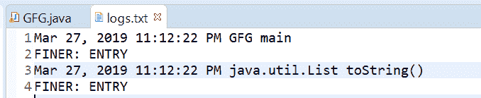
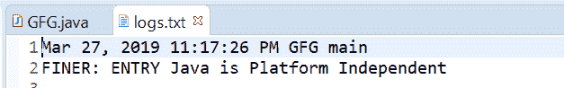
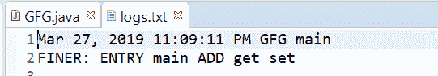

# Java中Logger类entering()方法的示例说明

> 原文：[https://www.geeksforgeeks.org/logger-entering-method-in-java-with-examples/](https://www.geeksforgeeks.org/logger-entering-method-in-java-with-examples/)

`Logger`类的`entering()`方法用于记录方法条目。

根据传递的参数，有三种类型的`entering()`方法。

## entering(String sourceClass, String sourceMethod)

此方法用于记录一个方法条目。在应用程序开发中，我们经常需要在进入类的方法时进行记录，因此这是一个方便的方法，可用于记录方法的进入。此方法使用消息“ENTRY”、日志级别`FINER`进行记录，并记录给定的`sourceMethod`和`sourceClass`。

**语法：**

```java
public void entering(String sourceClass,
                     String sourceMethod)
```

**参数：** 该方法接受两个参数：
*   `sourceClass`：发出日志记录请求的类的名称。
*   `sourceMethod`：正在进入的方法的名称。

**返回值：** 此方法不返回任何内容。

下面的程序举例说明了`entering(String sourceClass, String sourceMethod)`方法：

**程序 1：**

```java
// Java program to demonstrate
// entering(String, String) method

import java.io.IOException;
import java.util.List;
import java.util.logging.*;

public class GFG {

    public static void main(String[] args)
        throws SecurityException, IOException
    {
        // Create a Logger
        Logger logger
            = Logger.getLogger(
                GFG.class.getName());

        // Create a file handler object
        FileHandler handler
            = new FileHandler("logs.txt");
        handler.setFormatter(new SimpleFormatter());

        // Add file handler as
        // handler of logs
        logger.addHandler(handler);

        // set Logger level()
        logger.setLevel(Level.FINER);

        // call entering methods with class
        // name = GFG and method name = main
        logger.entering(GFG.class.getName(), "main");

        // calling again for List class toString()
        logger.entering(List.class.getName(), "toString()");
    }
}
```

在`log.txt`文件上打印的输出如下所示。

**输出：**


## entering(String sourceClass, String sourceMethod, Object param1)

此方法用于记录一个方法条目，带有一个参数，其中传递的参数是我们想要记录的对象。在应用程序开发中，我们经常需要在进入类的方法时进行记录，因此这是一个方便的方法，可用于记录方法的进入。此方法使用消息“ENTRY {0}”、日志级别`FINER`进行记录，并记录给定的`sourceMethod`、`sourceClass`和参数。

**语法：**

```java
public void entering(String sourceClass,
                     String sourceMethod,
                     Object param1)
```

**参数：** 该方法接受三个参数：
*   `sourceClass`：发出日志记录请求的类的名称。
*   `sourceMethod`：正在进入的方法的名称。
*   `param1`：正在进入的方法的参数。

**返回值：** 此方法不返回任何内容。

以下程序说明了`entering(String sourceClass, String sourceMethod, Object param1)`方法：

**程序 1：**

```java
// Java program to demonstrate
// entering(String, String, Object) method

import java.io.IOException;
import java.util.logging.*;

public class GFG {

    public static void main(String[] args)
        throws SecurityException, IOException
    {
        // Create a Logger
        Logger logger
            = Logger.getLogger(
                GFG.class.getName());

        // Create a file handler object
        FileHandler handler
            = new FileHandler("logs.txt");
        handler.setFormatter(new SimpleFormatter());

        // Add file handler as
        // handler of logs
        logger.addHandler(handler);

        // set Logger level()
        logger.setLevel(Level.FINER);

        // call entering method with class
        // name = GFG and method name = main
        logger.entering(
            GFG.class.getName(), "main",
            new String("Java is Platform Independent"));
    }
}
```

在`log.txt`上打印的输出如下所示。


## entering(String sourceClass, String sourceMethod, Object[] params)

此方法用于记录一个方法条目，带有一个参数数组。在应用程序开发中，我们经常需要在进入类的方法时进行记录，因此这是一个方便的方法，可用于记录方法的进入。此方法使用消息“ENTRY”（后跟参数数组中每个条目的格式`{N}`指示符）、日志级别`FINER`进行记录，并记录给定的`sourceMethod`、`sourceClass`和参数。

**语法：**

```java
public void entering(String sourceClass,
                     String sourceMethod,
                     Object[] params)
```

**参数：** 该方法接受三个参数：
*   `sourceClass`：发出日志记录请求的类的名称。
*   `sourceMethod`：正在进入的方法的名称。
*   `params`：正在进入的方法的参数数组。

**返回值：** 此方法不返回任何内容。

以下程序说明了`entering(String sourceClass, String sourceMethod, Object[] params)`方法：

**程序 1：**

```java
// Java program to demonstrate
// entering(String, String, Object[]) method

import java.io.IOException;
import java.util.logging.*;

public class GFG {

    public static void main(String[] args)
        throws SecurityException, IOException
    {
        // Create a Logger
        Logger logger
            = Logger.getLogger(
                GFG.class.getName());

        // Create a file handler object
        FileHandler handler
            = new FileHandler("logs.txt");
        handler.setFormatter(new SimpleFormatter());

        // Add file handler as
        // handler of logs
        logger.addHandler(handler);

        // set Logger level()
        logger.setLevel(Level.FINER);

        // create a array of String object
        String[] methods = {
            "main", "ADD", "get", "set"
        };

        // call entering method with class
        // name = GFG and method name = main
        logger.entering(GFG.class.getName(), "main",
                        methods);
    }
}
```

在`log.txt`上打印的输出如下所示。


**参考文献：**
*   [https://docs.oracle.com/javase/10/docs/api/java/util/logging/Logger.html#entering(java.lang.String, java.lang.String)](https://docs.oracle.com/javase/10/docs/api/java/util/logging/Logger.html#entering(java.lang.String, java.lang.String))
*   [https://docs.oracle.com/javase/10/docs/api/java/util/logging/Logger.html#entering(java.lang.String, java.lang.String, java.lang.Object)](https://docs.oracle.com/javase/10/docs/api/java/util/logging/Logger.html#entering(java.lang.String, java.lang.String, java.lang.Object))
*   [https://docs.oracle.com/javase/10/docs/api/java/util/logging/Logger.html#entering(java.lang.String, java.lang.String, java.lang.Object%5B%5D)](https://docs.oracle.com/javase/10/docs/api/java/util/logging/Logger.html#entering(java.lang.String, java.lang.String, java.lang.Object%5B%5D))