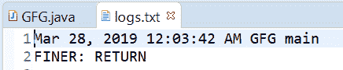
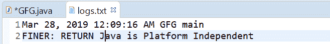

# 在 Java 中退出()方法的记录器，示例

> 原文：[https://www.geeksforgeeks.org/logger-exiting-method-in-java-with-examples/](https://www.geeksforgeeks.org/logger-exiting-method-in-java-with-examples/)

用于记录方法返回的`Logger`类的`exiting()`方法。

根据传递的参数，有两种类型的`exiting()`方法。

## exiting(String sourceClass, String sourceMethod)

此方法用于记录方法返回。我们需要记录方法返回的内容，这是一个方便的方法，可用于记录从方法返回。此方法记录消息“RETURN”，日志级别为`FINER`，并记录给定的`sourceMethod`和`sourceClass`。

**语法：**

```java
public void exiting(String sourceClass,
                    String sourceMethod)
```

**参数：** 该方法接受两个参数：
*   `sourceClass` 是发出日志记录请求的类的名称，
*   `sourceMethod` 是方法的名称

**返回值：** 此方法不返回任何内容。

下面的程序说明了`exiting(String sourceClass, String sourceMethod)`的方法：

**程序 1：**

```java
// Java program to demonstrate
// exiting(String, String) method

import java.io.IOException;
import java.util.logging.FileHandler;
import java.util.logging.Level;
import java.util.logging.Logger;
import java.util.logging.SimpleFormatter;

public class GFG {

    public static void main(String[] args)
        throws SecurityException, IOException
    {
        // Create a Logger
        Logger logger
            = Logger.getLogger(
                GFG.class.getName());

        // Create a file handler object
        FileHandler handler
            = new FileHandler("logs.txt");
        handler.setFormatter(new SimpleFormatter());

        // Add file handler as
        // handler of logs
        logger.addHandler(handler);

        // set Logger level()
        logger.setLevel(Level.FINER);

        // call exiting methods with class
        // name = GFG and method name = main
        logger.exiting(GFG.class.getName(),
                       GFG.class.getMethods()[0].getName());
    }
}
```

`log.txt` 文件上打印的输出如下所示。

**输出：**


## exiting(String sourceClass, String sourceMethod, Object result)

此方法用于记录方法条目，并包含结果对象。这是一个非常有用的方法，用于记录与类方法的条目及其返回值。此方法记录消息“RETURN {0}”，日志级别为`FINER`，并记录给定的`sourceMethod`、`sourceClass`和结果对象。

**语法：**

```java
public void exiting(String sourceClass,
                    String sourceMethod,
                    Object result)
```

**参数：** 该方法接受三个参数：
*   `sourceClass` 是发出日志记录请求的类的名称，
*   `sourceMethod` 是方法的名称，并且
*   `result` 是正在返回的对象。

**返回值：** 此方法不返回任何内容。

以下程序说明了`exiting(String sourceClass, String sourceMethod, Object result)`方法：

**程序 1：**

```java
// Java program to demonstrate
// exiting(String, String, Object) method

import java.io.IOException;
import java.util.logging.FileHandler;
import java.util.logging.Level;
import java.util.logging.Logger;
import java.util.logging.SimpleFormatter;

public class GFG {

    public static void main(String[] args)
        throws SecurityException, IOException
    {
        // Create a Logger
        Logger logger
            = Logger.getLogger(
                GFG.class.getName());

        // Create a file handler object
        FileHandler handler
            = new FileHandler("logs.txt");
        handler.setFormatter(new SimpleFormatter());

        // Add file handler as
        // handler of logs
        logger.addHandler(handler);

        // set Logger level()
        logger.setLevel(Level.FINER);

        // call exiting method with class
        // name = GFG and method name = main
        logger.exiting(GFG.class.getName(),
                       GFG.class.getMethods()[0].getName(),
                       new String("Java is Platform Independent"));
    }
}
```

`log.txt` 上打印的输出如下所示。

**输出：**


**参考文献：**
*   [https://docs.oracle.com/javase/10/docs/api/java/util/logging/Logger.html#exiting(java.lang.String, java.lang.String, java.lang.Object)](https://docs.oracle.com/javase/10/docs/api/java/util/logging/Logger.html#exiting(java.lang.String, java.lang.String, java.lang.Object))
*   [https://docs.oracle.com/javase/10/docs/api/java/util/logging/Logger.html#exiting(java.lang.String, java.lang.String)](https://docs.oracle.com/javase/10/docs/api/java/util/logging/Logger.html#exiting(java.lang.String, java.lang.String))