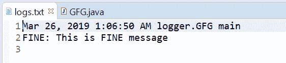
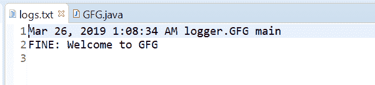

# Java 中的 Logger fine()方法，示例

> 原文：[https://www.geeksforgeeks.org/logger-fine-method-in-java-with-examples/](https://www.geeksforgeeks.org/logger-fine-method-in-java-with-examples/)

用于记录精细消息的`Logger`类的`fine()`方法。此方法用于将 FINE 类型日志传递给所有注册的输出处理程序对象。

`FINE`、`FINER`和`FINEST`在我们的应用程序中提供了正在发生/已经发生的跟踪信息。`FINE`显示其中最重要的信息。

根据传递的参数数量，有两种类型的`fine()`方法。

## fine(String msg)

此方法用于记录 fine 消息。如果记录器被启用来记录精细级别的消息，那么给定的消息被转发到所有注册的输出处理程序对象。

**语法：**

```java
public void fine(String msg)
```

**参数：** 该方法接受单个参数`String`，即字符串消息。

**返回值：** 此方法不返回任何内容。

下面的程序说明了`fine(String msg)`方法：

**程序 1：**

```java
// Java program to demonstrate
// Logger.fine(String msg) method

import java.io.IOException;
import java.util.logging.*;

public class GFG {

    public static void main(String[] args)
        throws SecurityException, IOException
    {

        // Create a Logger
        Logger logger
            = Logger.getLogger(
                GFG.class.getName());

        // Create a file handler object
        FileHandler handler
            = new FileHandler("logs.txt");
        handler.setFormatter(new SimpleFormatter());

        // Add file handler as
        // handler of logs
        logger.addHandler(handler);

        // Set Logger level()
        logger.setLevel(Level.FINE);

        // Call fine method
        logger.fine("This is FINE message");
    }
}
```

`logs.txt`文件上打印的输出如下所示。

**输出：**



## fine(Supplier msgSupplier)

此方法用于记录 FINE 消息，仅在日志级别确实会记录该消息时才构造。这意味着如果记录器已为 FINE 消息级别启用，则通过调用提供的供应商函数来构造消息，并将其转发到所有已注册的输出处理程序对象。

**语法：**

```java
public void fine(Supplier<String> msgSupplier)
```

**参数：** 该方法接受单个参数`msgSupplier`，这是一个函数，当调用该函数时，会产生所需的日志消息。

**返回值：** 此方法不返回任何内容。

以下程序说明了`fine(Supplier msgSupplier)`方法：

**程序 1：**

```java
// Java program to demonstrate
// Logger.fine(Supplier<String>) method

import java.io.IOException;
import java.util.function.Supplier;
import java.util.logging.*;

public class GFG {

    public static void main(String[] args)
        throws SecurityException, IOException
    {

        // Create a Logger
        Logger logger
            = Logger.getLogger(
                GFG.class.getName());

        // Create a file handler object
        FileHandler handler
            = new FileHandler("logs.txt");
        handler.setFormatter(
            new SimpleFormatter());

        // Add file handler as
        // handler of logs
        logger.addHandler(handler);

        // Set Logger level()
        logger.setLevel(Level.FINE);

        // Create a supplier<String> method
        Supplier<String> StrSupplier
            = () -> new String("Welcome to GFG");

        // Call fine(Supplier<String>)
        logger.fine(StrSupplier);
    }
}
```

`log.txt`上打印的输出如下所示。

**输出：**



## 参考文献

*   [https://docs.oracle.com/javase/10/docs/api/java/util/logging/Logger.html#fine(java.lang.String)](https://docs.oracle.com/javase/10/docs/api/java/util/logging/Logger.html#fine(java.lang.String))
*   [https://docs.oracle.com/javase/10/docs/api/java/util/logging/Logger.html#fine(java.util.function.Supplier)](https://docs.oracle.com/javase/10/docs/api/java/util/logging/Logger.html#fine(java.util.function.Supplier))