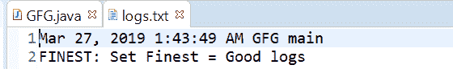
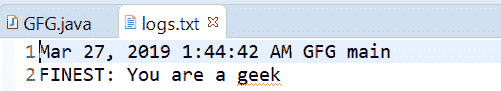

# Java 中最精细的 `Logger.finest()` 方法示例

> 原文：[https://www.geeksforgeeks.org/logger-finest-method-in-java-with-examples/](https://www.geeksforgeeks.org/logger-finest-method-in-java-with-examples/)

一个`Logger`类用来记录最精细消息的`finest()`方法。此方法用于将最精细类型的日志传递给所有注册的输出处理程序对象。

**最细消息：**最细提供高度详细的追踪消息。

根据传递的参数数量，有两种类型的`finest()`方法。

## `finest(String msg)`

此方法用于记录最细的消息。如果记录器被允许记录最精细级别的消息，那么给定的消息被转发到所有注册的输出处理程序对象。

### 语法

```java
public void finest(String msg)
```

### 参数

该方法接受单个参数`String`，即字符串消息。

### 返回值

此方法不返回任何内容。

下面的程序说明了`finest(String msg)`方法：

### 程序 1

```java
// Java program to demonstrate
// Logger.finest(String msg) method

import java.io.IOException;
import java.util.logging.*;

public class GFG {

    public static void main(String[] args)
        throws SecurityException, IOException
    {

        // Create a Logger
        Logger logger
            = Logger.getLogger(
                GFG.class.getName());

        // Create a file handler object
        // and set formatter to simple formatter
        FileHandler handler = new FileHandler("logs.txt");
        handler.setFormatter(new SimpleFormatter());

        // Add file handler as
        // handler of logs
        logger.addHandler(handler);

        // Set Logger level()
        logger.setLevel(Level.FINEST);

        // Call finest method
        logger.finest("Set Geeks=CODING");
    }
}
```

`logs.txt`文件上打印的输出如下所示。

### 输出



## `finest(Supplier msgSupplier)`

此方法用于记录一个`FINEST`消息，仅当记录级别满足该消息将被实际记录时才构造。这意味着如果记录器被启用到`FINEST`消息级别，则通过调用提供的`Supplier`函数来构造消息，并转发给所有已注册的输出`Handler`对象。

### 语法

```java
public void finest(Supplier msgSupplier)
```

### 参数

这个方法接受一个单参数`msgSupplier`，它是一个函数，当被调用时，会产生想要的日志消息。

### 返回值

此方法不返回任何内容。

以下程序说明了`finest(Supplier msgSupplier)`方法：

### 程序 1

```java
// Java program to demonstrate
// Logger.finest(Supplier<String>) method

import java.io.IOException;
import java.util.function.Supplier;
import java.util.logging.*;

public class GFG {

    public static void main(String[] args)
        throws SecurityException, IOException
    {

        // Create a Logger
        Logger logger
            = Logger.getLogger(
                GFG.class.getName());

        // Create a file handler object
        // and set formatter to simple formatter
        FileHandler handler
            = new FileHandler("logs.txt");
        handler.setFormatter(new SimpleFormatter());

        // Add file handler as
        // handler of logs
        logger.addHandler(handler);

        // Set Logger level()
        logger.setLevel(Level.FINEST);

        // Create a supplier<String> method
        Supplier<String> StrSupplier
            = () -> new String("You are a geek");

        // Call finest(Supplier<String>)
        logger.finest(StrSupplier);
    }
}
```

`log.txt`上打印的输出如下所示。

### 输出



## 参考文献

*   [https://docs.oracle.com/javase/10/docs/api/java/util/logging/Logger.html#finest(java.lang.String)](https://docs.oracle.com/javase/10/docs/api/java/util/logging/Logger.html#finest(java.lang.String))
*   [https://docs.oracle.com/javase/10/docs/api/java/util/logging/Logger.html#finest(java.util.function.Supplier)](https://docs.oracle.com/javase/10/docs/api/java/util/logging/Logger.html#finest(java.util.function.Supplier))