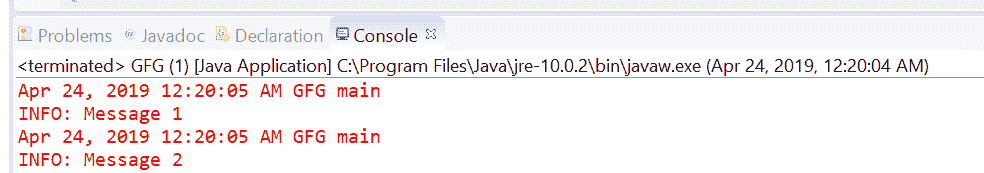
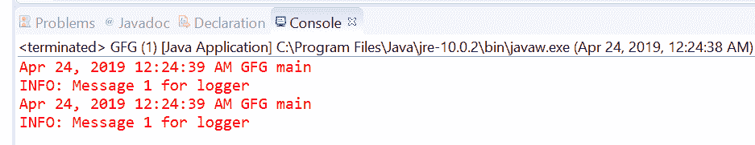

# Java 中的 Logger getAnonymousLogger()方法，带示例

> 原文: [https://www.geeksforgeeks.org/logger-getanonymouslogger-method-in-java-with-examples/](https://www.geeksforgeeks.org/logger-getanonymouslogger-method-in-java-with-examples/)

用于创建匿名记录器的 [`Logger`](https://www.geeksforgeeks.org/logging-in-java/) 类的 `getAnonymousLogger()` 方法。

有两种类型的 `getAnonymousLogger()` 方法，具体取决于传递的参数数量。

## 1. `getAnonymousLogger()`

此方法用于创建一个**匿名** `Logger`。这个新创建的匿名 `Logger` 没有在 `LogManager` 命名空间中注册，并且对记录器的更新没有访问检查。那么问题是，如果没有访问检查，为什么我们需要这个记录器？因为这个工厂方法主要旨在从 applet 中使用。由于生成的 `Logger` 是匿名的，它可以被创建类保持私有。这消除了对常规安全检查的需要，从而允许不受信任的 applet 代码更新 `Logger` 的控制状态。例如，applet 可以对匿名 `Logger` 执行 `setLevel` 或 `addHandler`。

此记录器被配置为将根记录器（`""`）作为其父记录器。它从根记录器继承其有效级别和处理程序。通过 `setParent` 方法更改其父级仍然需要该方法指定的安全权限。

### 语法

```java
public static Logger getAnonymousLogger()
```

### 参数

此方法不接受任何东西。

### 返回值

这个方法返回一个新创建的私有记录器。

下面的程序说明了 `getAnonymousLogger()` 方法：

**程序 1:**

```java
// Java program to demonstrate
// Logger.getAnonymousLogger() method

import java.util.logging.*;

public class GFG {
    public static void main(String[] args) {
        // Create a Logger with class name GFG
        Logger logger = Logger.getAnonymousLogger();

        // Call info method
        logger.info("Message 1");
        logger.info("Message 2");
    }
}
```

控制台上打印的输出如下所示。

**输出:**


**程序 2:**

```java
// Java program to demonstrate Exception thrown by
// Logger.getAnonymousLogger(java.lang.String) method

import java.util.logging.*;

public class GFG {
    public static void main(String[] args) {
        String LoggerName = null;

        // Create a Logger with a null value
        try {
            Logger logger = Logger.getAnonymousLogger(LoggerName);
        } catch (NullPointerException e) {
            System.out.println("Exception Thrown :" + e);
        }
    }
}
```

控制台上打印的输出如下所示。

**输出:**


## 2. `getAnonymousLogger(String resourceBundleName)`

此方法用于创建一个匿名 `Logger`。这个新创建的匿名 `Logger` 没有在 `LogManager` 命名空间中注册，并且对记录器的更新没有访问检查。此 `Logger` 有一个作为参数传递的 `ResourceBundle`，用于为此记录器本地化消息。

### 语法

```java
public static Logger getAnonymousLogger(String resourceBundleName)
```

### 参数

此方法接受单个参数 `resourceBundleName`，这是用于定位此记录器消息的 `ResourceBundle` 的名称。

### 返回值

这个方法返回一个合适的 `Logger`。

### 异常

如果 `resourceBundleName` 为非空且找不到对应的资源，此方法将抛出 `MissingResourceException`。

下面的程序说明了 `getAnonymousLogger(String resourceBundleName)` 方法：

**程序 1:**

```java
// Java program to demonstrate
// getAnonymousLogger(String resourceBundleName) method

import java.util.ResourceBundle;
import java.util.logging.*;

public class GFG {
    public static void main(String[] args) {
        // Create ResourceBundle using getBundle
        // myResource is a properties file
        ResourceBundle bundle = ResourceBundle.getBundle("resourceBundle");

        // Create a Logger with resourceBundle
        Logger logger = Logger.getAnonymousLogger(bundle.getBaseBundleName());

        // Log the info
        logger.info("Message 1 for logger");
        logger.info("Message 1 for logger");
    }
}
```

对于上面的程序，有一个属性文件名 `resourceBundle`。我们必须在类旁边添加这个文件来执行程序。


## 参考文献

*   [https://docs.oracle.com/javase/10/docs/api/java/util/logging/Logger.html#getAnonymousLogger()](https://docs.oracle.com/javase/10/docs/api/java/util/logging/Logger.html#getAnonymousLogger())
*   [https://docs.oracle.com/javase/10/docs/api/java/util/logging/Logger.html#getAnonymousLogger(java.lang.String)](https://docs.oracle.com/javase/10/docs/api/java/util/logging/Logger.html#getAnonymousLogger(java.lang.String))