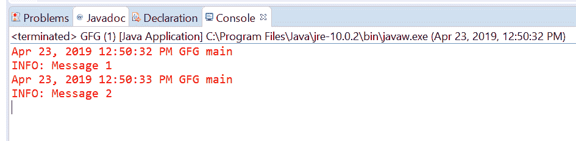
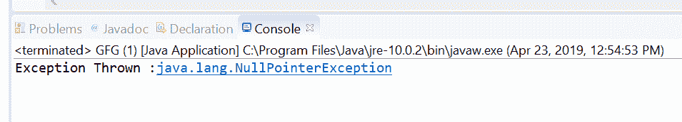
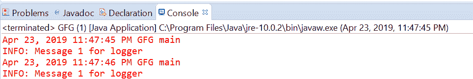

# Java 中的 Logger getLogger()方法，示例

> 原文: [https://www.geeksforgeeks.org/logger-getlogger-method-in-java-with-examples/](https://www.geeksforgeeks.org/logger-getlogger-method-in-java-with-examples/)

一个 [`Logger`](https://www.geeksforgeeks.org/logging-in-java/) 类的 `getLogger()` 方法用于查找或创建一个 Logger。如果存在一个具有传递名称的记录器，那么该方法将返回该记录器，否则该方法将创建一个具有该名称的新记录器并返回它。

有两种类型的 `getLogger()` 方法，具体取决于传递的参数数量。

## 1. `getLogger(java.lang.String)`

此方法用于查找或创建一个以传递参数为名称的记录器。如果传递的名称对应的记录器不存在，则创建一个新的记录器。如果此方法创建了一个新的记录器，其日志级别将根据 `LogManager` 配置进行配置，并且它也将被配置为将其日志输出发送到其父记录器的 `Handler`。它将在 `LogManager` 全局命名空间中注册。

### 语法

```java
public static Logger getLogger(String name)
```

### 参数

该方法接受单个参数 `name`，这是代表记录器名称的字符串。这应该是一个点分隔的名称，通常应该基于子系统的包名或类名，例如 `java.net` 或 `javax.swing`。

### 返回值

这个方法返回一个合适的 `Logger`。

### 异常

如果传递的名称为空，该方法将抛出 `NullPointerException`。

下面的程序说明了 `getLogger(java.lang.String)` 方法：

### 程序 1

```java
// Java program to demonstrate
// Logger.getLogger(java.lang.String) method

import java.util.logging.*;

public class GFG {

    public static void main(String[] args)
    {

        // Create a Logger with class name GFG
        Logger logger
            = Logger.getLogger(GFG.class.getName());

        // Call info method
        logger.info("Message 1");
        logger.info("Message 2");
    }
}
```

控制台上打印的输出如下所示。

### 输出



### 程序 2

```java
// Java program to demonstrate Exception thrown by
// Logger.getLogger(java.lang.String) method
import java.util.logging.*;

public class GFG {

    public static void main(String[] args)
    {

        String LoggerName = null;

        // Create a Logger with a null value
        try {
            Logger logger
                = Logger.getLogger(LoggerName);
        }
        catch (NullPointerException e) {
            System.out.println("Exception Thrown: "
                               + e);
        }
    }
}
```

控制台上打印的输出如下所示。

### 输出



## 2. `getLogger(String name, String resourceBundleName)`

此方法用于查找或创建一个具有传递名称的记录器。如果已经创建了具有给定名称的记录器，则返回它。否则，创建一个新的记录器。如果传递名称对应的 `Logger` 已经存在并且没有本地化资源束，则给定的资源束名称将用作此记录器的本地化资源束。如果命名的 `Logger` 具有不同的资源束名称，则此方法将抛出 `IllegalArgumentException`。

### 语法

```java
public static Logger getLogger(String name, String resourceBundleName)
```

### 参数

该方法接受两个不同的参数：

*   `name`: 是记录器的名称。这个名称应该是一个点分隔的名称，通常应该基于子系统的包名或类名，比如 `java.net` 或 `javax.swing`。
*   `resourceBundleName`: 是用于本地化此记录器消息的 `ResourceBundle` 的名称。

### 返回值

这个方法返回一个合适的 `Logger`。

### 异常

该方法将抛出以下异常：

1.  `NullPointerException`: 如果传递的名称为空。
2.  `MissingResourceException`: 如果 `resourceBundleName` 为非空且找不到对应的资源。
3.  `IllegalArgumentException`: 如果记录器已经存在并使用不同的资源包名称；或者，如果 `resourceBundleName` 为空，但命名的记录器具有资源包集。

下面的程序说明了 `getLogger(String name, String resourceBundleName)` 方法：

### 程序 1

```java
// Java program to demonstrate
// getLogger(String name, String resourceBundleName) method

import java.util.ResourceBundle;
import java.util.logging.*;

public class GFG {

    public static void main(String[] args)
    {

        // Create ResourceBundle using getBundle
        // myResource is a properties file
        ResourceBundle bundle
            = ResourceBundle
                  .getBundle("resourceBundle");

        // Create a Logger
        // with GFG.class and resourceBundle
        Logger logger
            = Logger.getLogger(
                GFG.class.getName(),
                bundle.getBaseBundleName());

        // Log the info
        logger.info("Message 1 for logger");
    }
}
```

对于上面的程序，有一个属性文件名 `resourceBundle`。我们必须在类旁边添加这个文件来执行程序。

### 输出



## 参考文献

*   [https://docs.oracle.com/javase/10/docs/api/java/util/logging/Logger.html#getLogger(java.lang.String, java.lang.String)](https://docs.oracle.com/javase/10/docs/api/java/util/logging/Logger.html#getLogger(java.lang.String, java.lang.String))
*   [https://docs.oracle.com/javase/10/docs/api/java/util/logging/Logger.html#getLogger(java.lang.String)](https://docs.oracle.com/javase/10/docs/api/java/util/logging/Logger.html#getLogger(java.lang.String))