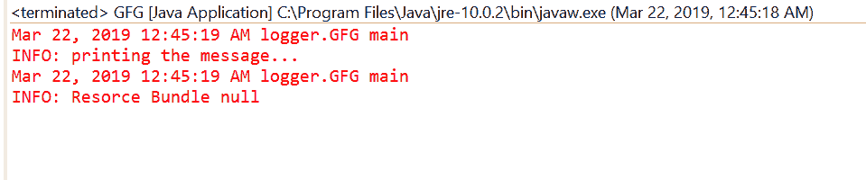
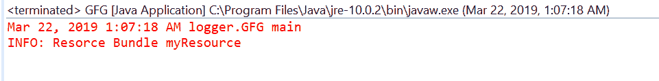

# Java 中的 `Logger.getResourceBundle()` 方法，带示例

> 原文: [https://www.geeksforgeeks.org/logger-getresourcebundle-method-in-java-with-examples/](https://www.geeksforgeeks.org/logger-getresourcebundle-method-in-java-with-examples/)

`getResourceBundle()` 是 `Logger` 类的一个方法，用于获取此记录器本地化的资源包。我们可以通过 `setResourceBundle()` 方法设置 `ResourceBundle`，或者通过 `getLogger()` 工厂方法从当前默认区域设置的资源包名称进行映射。该方法将通过上述方式返回一个 `ResourceBundle`。如果结果为空，则记录器将使用从其父级继承的资源包或资源包名称。

## 语法

```java
public ResourceBundle getResourceBundle()
```

## 参数
此方法不接受任何参数。

## 返回值
此方法返回本地化的 `ResourceBundle`。

以下程序说明了 `getResourceBundle()` 方法：

## 程序 1

```java
// Java program to demonstrate
// Logger.getParent() method

import java.util.logging.*;
import java.util.ResourceBundle;

public class GFG {

    private static Logger logger
        = Logger.getLogger(
            String.class.getPackage().getName());

    public static void main(String args[])
    {
        logger.info("printing the message...");

        ResourceBundle rs = logger.getResourceBundle();

        logger.info("Resource Bundle " + rs);
    }
}
```

**输出:**
输出打印在 eclipse IDE 上如下所示-



## 程序 2

```java
// Java program to demonstrate
// Logger.getParent() method

import java.util.logging.*;
import java.util.ResourceBundle;

public class GFG {

    private static Logger logger
        = Logger.getLogger(
            GFG.class.getPackage().getName());

    public static void main(String args[])
    {
        // Create ResourceBundle using getBundle
        // myResource is a properties file
        ResourceBundle bundle
            = ResourceBundle.getBundle("myResource");

        // Set ResourceBundle to logger
        logger.setResourceBundle(bundle);

        // Get ResourceBundle from logger
        ResourceBundle rs = logger.getResourceBundle();

        // Log the ResourceBundle details
        logger.info("Resource Bundle "
                    + rs.getBaseBundleName());
    }
}
```

对于上面的程序，有一个名为 `myResource` 的属性文件。我们必须在类的旁边添加这个文件来执行程序。

**输出:**
输出打印在 eclipse IDE 上如下所示-



**参考:** [https://docs.oracle.com/javase/10/docs/api/java/util/logging/Logger.html#getResourceBundle()](https://docs.oracle.com/javase/10/docs/api/java/util/logging/Logger.html#getResourceBundle())