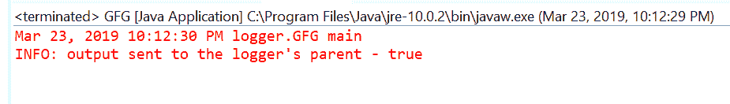
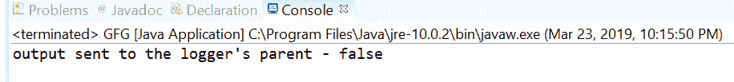

# Java 中的 Logger getUseParentHandlers() 方法，带示例

> 原文: [https://www.geeksforgeeks.org/logger-getuseparenthandlers-method-in-java-with-examples/](https://www.geeksforgeeks.org/logger-getuseparenthandlers-method-in-java-with-examples/)

`getUseParentHandlers()` 是 `Logger` 类的一个方法，用于获取一个布尔值，该值指示此记录器是否将其输出发送给其父记录器。

## 语法

```java
public boolean getUseParentHandlers()
```

## 参数

此方法不接受任何参数。

## 返回值

如果输出要发送到记录器的父级，该方法返回 `true`。

下面的程序说明了 `getUseParentHandlers()` 方法：

## 程序 1

```java
// Java program to demonstrate
// Logger.getUseParentHandlers() method

import java.util.logging.Logger;

public class GFG {

    private static Logger logger
        = Logger.getLogger(
            GFG.class
                .getPackage()
                .getName());

    public static void main(String args[])
    {
        // Check output is to be
        // sent to the logger's parent
        boolean flag
            = logger.getUseParentHandlers();

        // Log the flag value
        logger.info("output sent to the"
                    + " logger's parent - "
                    + flag);
    }
}
```

在 eclipse IDE 上打印的输出如下所示-


## 程序 2

```java
// Java program to demonstrate
// Logger.getUseParentHandlers() method

import java.util.logging.Logger;

public class GFG {

    private static Logger logger
        = Logger.getLogger(
            GFG.class
                .getPackage()
                .getName());

    public static void main(String args[])
    {
        // Set setUseParentHandlers
        logger.setUseParentHandlers(false);

        // Check output is to be
        // sent to the logger's parent
        boolean flag = logger.getUseParentHandlers();

        // Print value
        System.out.println("output sent to the"
                           + " logger's parent - "
                           + flag);
    }
}
```

在 eclipse IDE 上打印的输出如下所示-


### 参考

[https://docs.oracle.com/javase/10/docs/api/java/util/logging/Logger.html#getUseParentHandlers()](https://docs.oracle.com/javase/10/docs/api/java/util/logging/Logger.html#getUseParentHandlers())