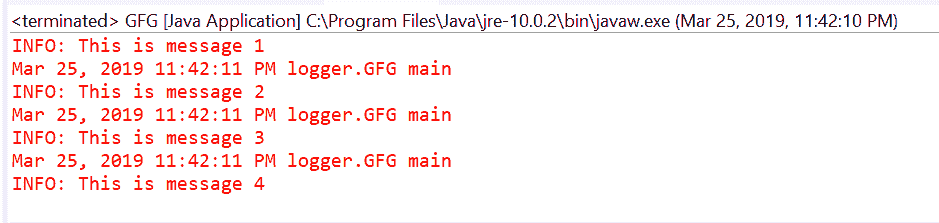
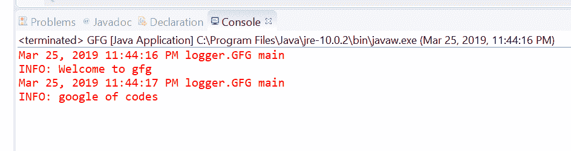
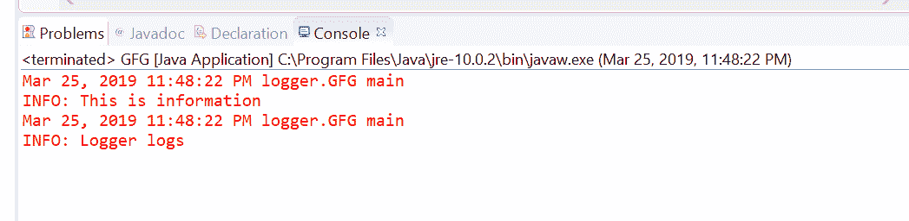

# Java中的Logger.info(String)方法及示例

> 原文：[https://www.geeksforgeeks.org/logger-infostring-method-in-java-with-examples/](https://www.geeksforgeeks.org/logger-infostring-method-in-java-with-examples/)

`Logger`类的`info()`方法用于记录信息消息。此方法用于将日志转发给所有已注册的输出处理程序对象。

**INFO消息：** Info 供管理员或高级用户使用。它主要表示导致应用程序状态改变的操作。

根据传递的参数数量，有两种类型的`info()`方法。

## info(String msg)

该方法用于将作为参数传递的字符串转发给所有注册的输出`Handler`对象。

**语法：**

```java
public void info(String msg)
```

**参数：** 该方法接受单个参数`String`，这是我们要传递给日志的信息。

**返回值：** 此方法不返回任何内容。

下面的程序说明了`info(String msg)`方法：

### 程序 1

```java
// Java program to demonstrate
// Logger.info(String msg) method

import java.util.logging.Logger;

public class GFG {

    public static void main(String[] args)
    {

        // Create a Logger
        Logger logger
            = Logger.getLogger(
                GFG.class.getName());

        // Call info method
        logger.info("This is message 1");
        logger.info("This is message 2");
        logger.info("This is message 3");
        logger.info("This is message 4");
    }
}
```

在Eclipse IDE上打印的输出如下所示。

**输出：**


### 程序 2

```java
// Java program to demonstrate
// Logger.info(String msg) method

import java.util.logging.Logger;

public class GFG {

    public static void main(String[] args)
    {

        // Create a Logger
        Logger logger
            = Logger
                  .getLogger("com.api.jar");

        // Call info method
        logger.info("Welcome to gfg");
        logger.info("google of codes");
    }
}
```

在IDE上打印的输出如下所示。

**输出：**


## info(Supplier msgSupplier)

此方法用于记录一条`INFO`消息，仅在日志级别满足该消息将被实际记录时才构造。这意味着，如果记录器在`INFO`消息级别被启用，则通过调用提供的`Supplier`函数来构造消息，并将其转发给所有已注册的输出`Handler`对象。

**语法：**

```java
public void info(Supplier msgSupplier)
```

**参数：** 这个方法接受一个单参数`msgSupplier`，它是一个函数，当被调用时，会产生想要的日志消息。

**返回值：** 此方法不返回任何内容。

以下程序说明`info(Supplier)`方法：

### 程序 1

```java
// Java program to demonstrate
// Logger.info(Supplier) method

import java.util.logging.Logger;
import java.util.function.Supplier;

public class GFG {

    public static void main(String[] args)
    {

        // Create a Logger
        Logger logger
            = Logger.getLogger(
                GFG.class.getName());

        // Create a supplier<String> method
        Supplier<String> StrSupplier
            = () -> new String("Logger logs");

        // Call info(Supplier<String>)
        logger.info(StrSupplier);
    }
}
```

在Eclipse IDE上打印的输出如下所示。

**输出：**


## 参考文献

*   [https://docs.oracle.com/javase/10/docs/api/java/util/logging/Logger.html#info(java.lang.String)](https://docs.oracle.com/javase/10/docs/api/java/util/logging/Logger.html#info(java.lang.String))
*   [https://docs.oracle.com/javase/10/docs/api/java/util/logging/Logger.html#info(java.util.function.Supplier)](https://docs.oracle.com/javase/10/docs/api/java/util/logging/Logger.html#info(java.util.function.Supplier))