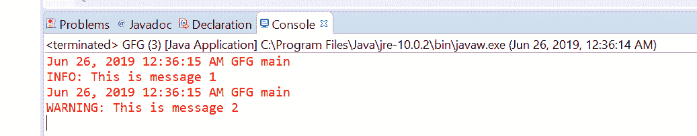
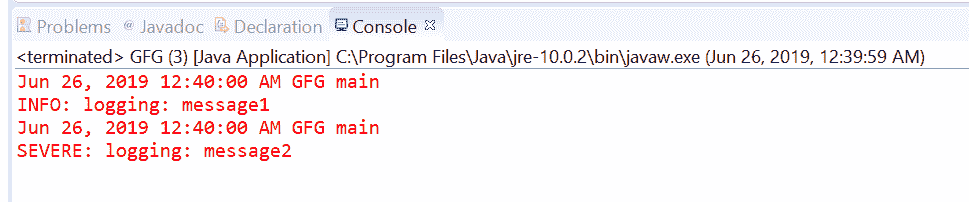
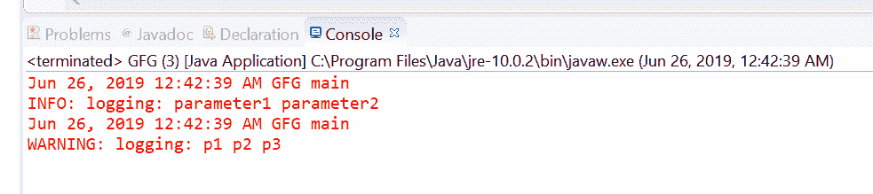
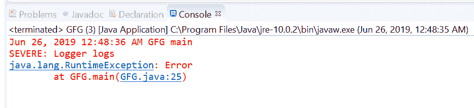
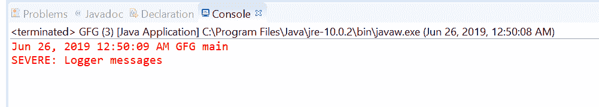
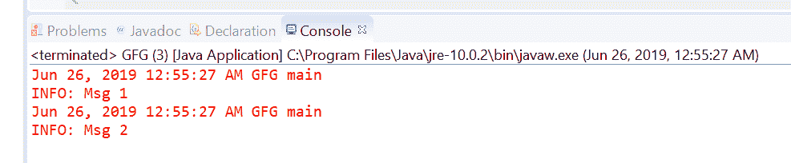

# Java 中的 Logger log()方法，示例

> 原文: [https://www.geeksforgeeks.org/logger-log-method-in-java-with-examples/](https://www.geeksforgeeks.org/logger-log-method-in-java-with-examples/)

`log()`方法用于记录消息。如果记录器当前为作为参数传递的给定消息级别启用，则创建相应的日志记录，并将其转发给所有注册的输出处理程序对象。但是在`Logger`类中，根据传递给方法的参数，有七种不同的`log()`方法。

## 1. log(Level level, String msg)

此方法用于记录消息，不带参数。只有消息会被写入日志器输出。

**语法:**

```java
public void log(Level level, String msg)
```

**参数:** 该方法接受两个参数：`level`，这是消息级别标识符之一，例如`SEVERE`；`msg`，这是字符串消息（或消息目录中的一个键）。

**返回值:** 此方法不返回任何内容。

**程序 1:** 方法`log(Level level, String msg)`

```java
// Java program to demonstrate
// Logger.log(Level level, String msg) method

import java.util.logging.Level;
import java.util.logging.Logger;

public class GFG {
    public static void main(String[] args) {
        // Create a Logger
        Logger logger = Logger.getLogger(GFG.class.getName());

        // log messages using log(Level level, String msg)
        logger.log(Level.INFO, "This is message 1");
        logger.log(Level.WARNING, "This is message 2");
    }
}
```

**输出**

[](https://media.geeksforgeeks.org/wp-content/uploads/20190626005731/1003.png)

## 2. log(Level level, String msg, Object param1)

此方法用于记录带有一个对象参数的消息。

**语法:**

```java
public void log(Level level, String msg, Object param1)
```

**参数:** 此方法接受三个参数：`level`，它是消息级别标识符之一，例如`SEVERE`；`msg`，它是字符串消息（或消息目录中的一个键）；`param1`，它是消息的参数。

**返回值:** 此方法不返回任何内容。

**程序 2:** 方法`log(Level level, String msg, Object param1)`

```java
// Java program to demonstrate
// Logger.log(Level level, String msg, Object param1)

import java.util.logging.Level;
import java.util.logging.Logger;

public class GFG {
    public static void main(String[] args) {
        // Create a Logger
        Logger logger = Logger.getLogger(GFG.class.getName());

        // log messages using
        // log(Level level, String msg, Object param1)
        logger.log(Level.INFO, "logging: {0} ", "message1");
        logger.log(Level.SEVERE, "logging: {0} ", "message2");
    }
}
```

**输出:**

[](https://media.geeksforgeeks.org/wp-content/uploads/20190626005747/200.png)

## 3. log(Level level, String msg, Object[] params)

此方法用于记录带有一个对象参数数组的消息。

**语法:**

```java
public void log(Level level, String msg, Object[] params)
```

**参数:** 该方法接受三个参数：`level`，它是消息级别标识符之一，例如`SEVERE`；`msg`，它是字符串消息（或消息目录中的一个键）；`params`，它是消息的参数数组。

**返回值:** 此方法不返回任何内容。

**程序 3:** 方法`log(Level level, String msg, Object[] params)`

```java
// Java program to demonstrate
// Logger.log(Level level, String msg, Object[] param1)

import java.util.logging.Level;
import java.util.logging.Logger;

public class GFG {
    public static void main(String[] args) {
        // Create a Logger
        Logger logger = Logger.getLogger(GFG.class.getName());

        // log messages using
        // log(Level level, String msg, Object[] param1)
        logger.log(Level.INFO, "logging: {0} {1}",
                   new Object[] { "parameter1", "parameter2" });
        logger.log(Level.WARNING, "logging: {0} {1} {2}",
                   new Object[] { "p1", "p2", "p3" });
    }
}
```

**输出:**

[](https://media.geeksforgeeks.org/wp-content/uploads/20190626005806/300.png)

## 4. log(Level level, String msg, Throwable thrown)

此方法用于记录带有相关`Throwable`信息的消息。

**语法:**

```java
public void log(Level level, String msg, Throwable thrown)
```

**参数:** 该方法接受三个参数：`level`，它是消息级别标识符之一，例如`SEVERE`；`msg`，它是字符串消息（或消息目录中的一个键）；`thrown`，它是与日志消息相关联的可抛出对象。

**返回值:** 此方法不返回任何内容。

**程序 4:** 方法`log(Level level, String msg, Throwable thrown)`

## 5. `log(Level level, Throwable thrown, Supplier msgSupplier)`

此方法用于记录一条延迟构造的消息，并附带相关的`Throwable`信息。消息和给定的`Throwable`随后被存储到一个`LogRecord`中，并转发给所有已注册的输出处理器。

### 语法:

```java
public void log(Level level, Throwable thrown, Supplier msgSupplier)
```

### 参数:
该方法接受三个参数：`级别`，它是消息级别标识符之一，例如`SEVERE`；`抛出`，它是与日志消息相关联的可抛出对象；以及`msgSupplier`，它是一个函数，当被调用时，它产生所需的日志消息。

### 返回值:
此方法不返回任何内容。

### 程序 5: 方法`log(Level level, Throwable thrown, Supplier<String> msgSupplier)`

```java
// Java program to demonstrate
// Logger.log(Level level, Throwable thrown, Supplier<String> msgSupplier)

import java.util.function.Supplier;
import java.util.logging.Level;
import java.util.logging.Logger;

public class GFG {

    public static void main(String[] args)
    {

        // Create a Logger
        Logger logger
            = Logger.getLogger(
                GFG.class.getName());

        // Create a supplier<String> method
        Supplier<String> StrSupplier
            = () -> new String("Logger logs");

        // log messages using
        // log(Level level, Throwable thrown, Supplier<String> msgSupplier)
        logger.log(Level.SEVERE,
                   new RuntimeException("Error"),
                   StrSupplier);
    }
}
```

### 输出:
[](https://media.geeksforgeeks.org/wp-content/uploads/20190626005911/500.png)

## 6. `log(Level level, Supplier msgSupplier)`

此方法用于记录一条消息，该消息仅在日志级别满足条件（即消息将被实际记录）时才会被构造。

### 语法:

```java
public void log(Level level, Supplier msgSupplier)
```

### 参数:
该方法接受两个参数：`级别`，它是消息级别标识符之一，例如`SEVERE`；以及`msgSupplier`，它是一个函数，当被调用时，产生所需的日志消息。

### 返回值:
此方法不返回任何内容。

### 程序 6: 方法`log(Level level, Supplier<String> msgSupplier)`

```java
// Java program to demonstrate
// Logger.log(Level level, Supplier<String> msgSupplier)

import java.util.function.Supplier;
import java.util.logging.Level;
import java.util.logging.Logger;

public class GFG {

    public static void main(String[] args)
    {

        // Create a Logger
        Logger logger
            = Logger.getLogger(
                GFG.class.getName());

        // Create a supplier<String> method
        Supplier<String> StrSupplier
            = () -> new String("Logger messages");

        // log messages using
        // log(Level level, Supplier<String> msgSupplier)
        logger.log(Level.SEVERE,
                   StrSupplier);
    }
}
```

### 输出:
[](https://media.geeksforgeeks.org/wp-content/uploads/20190626005930/600.png)

## 7. `log(LogRecord record)`

此方法用于记录一个`LogRecord`。使用`logRecord`，我们将信息记录到日志输出中。

### 语法:

```java
public void log(LogRecord record)
```

### 参数:
该方法接受一个参数`记录`，即待发布的日志记录。

### 返回值:
此方法不返回任何内容。

### 程序 7: 方法`log(LogRecord record)`

```java
// Java program to demonstrate
// Logger.log(LogRecord record)

import java.util.logging.Level;
import java.util.logging.LogRecord;
import java.util.logging.Logger;

public class GFG {

    public static void main(String[] args)
    {

        // Create a Logger
        Logger logger
            = Logger.getLogger(
                GFG.class.getName());

        // create logRecords
        LogRecord record1 = new LogRecord(Level.INFO,
                                          "Msg 1");
        LogRecord record2 = new LogRecord(Level.INFO,
                                          "Msg 2");

        // log messages using
        // log(LogRecord record)
        logger.log(record1);
        logger.log(record2);
    }
}
```

### 输出:
[](https://media.geeksforgeeks.org/wp-content/uploads/20190626005946/7002.png)

**参考文献:**T2