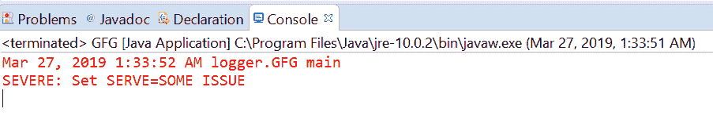
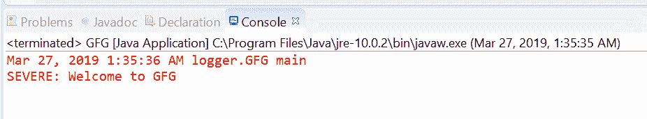

# Java 中的 Logger.severe() 方法示例

> 原文: [https://www.geeksforgeeks.org/logger-severe-method-in-java-with-examples/](https://www.geeksforgeeks.org/logger-severe-method-in-java-with-examples/)

`Logger` 类的 `severe()` 方法用于记录严重消息。此方法用于将严重类型日志传递给所有注册的输出处理程序对象。

## 严重信息
[严重信息](https://www.geeksforgeeks.org/logging-in-java/)：当发生了可怕的事情，应用程序无法继续运行时，就会出现严重情况。比如数据库不可用，内存不足。

根据传递的参数数量，有两种类型的 `severe()` 方法。

### 1. severe(String msg)
此方法用于记录严重消息。如果记录器能够记录严重级别的消息，那么给定的消息将被转发到所有注册的输出处理程序对象。

**语法:**
```java
public void severe(String msg)
```

**参数:** 该方法接受单个参数 `String`，即字符串消息。

**返回值:** 此方法不返回任何内容。

下面的程序说明了 `severe(String msg)` 的方法:

**程序 1:**
```java
// Java program to demonstrate
// Logger.severe(String msg) method

import java.io.IOException;
import java.util.logging.*;

public class GFG {

    public static void main(String[] args)
        throws SecurityException, IOException
    {

        // Create a Logger
        Logger logger
            = Logger.getLogger(
                GFG.class.getName());

        // Set Logger level()
        logger.setLevel(Level.SEVERE);

        // Call severe method
        logger.severe("Set SERVE=SOME ISSUE");
    }
}
```

控制台上打印的输出如下所示。
**输出:**


### 2. severe(Supplier msgSupplier)
此方法用于记录一条 SEVERE 消息，仅当记录级别满足该消息将被实际记录时才构造该消息。这意味着如果记录器启用了 SEVERE 消息级别，则通过调用提供的供应商函数来构造消息，并将其转发给所有已注册的输出处理程序对象。

**语法:**
```java
public void severe(Supplier msgSupplier)
```

**参数:** 这个方法接受一个单参数 `msgSupplier`，它是一个函数，当被调用时，会产生想要的日志消息。

**返回值:** 此方法不返回任何内容。

以下程序说明了 `severe(Supplier msgSupplier)` 方法:

**程序 1:**
```java
// Java program to demonstrate
// Logger.severe(Supplier<String>) method

import java.io.IOException;
import java.util.function.Supplier;
import java.util.logging.*;

public class GFG {

    public static void main(String[] args)
        throws SecurityException, IOException
    {

        // Create a Logger
        Logger logger
            = Logger.getLogger(
                GFG.class.getName());

        // Set Logger level()
        logger.setLevel(Level.SEVERE);

        // Create a supplier<String> method
        Supplier<String> StrSupplier
            = () -> new String("Welcome to GFG");

        // Call severe(Supplier<String>)
        logger.severe(StrSupplier);
    }
}
```

控制台上打印的输出如下所示。
**输出:**


## 参考文献
*   [https://docs.oracle.com/javase/10/docs/api/java/util/logging/Logger.html#severe(java.lang.String)](https://docs.oracle.com/javase/10/docs/api/java/util/logging/Logger.html#severe(java.lang.String))
*   [https://docs.oracle.com/javase/10/docs/api/java/util/logging/Logger.html#severe(java.util.function.Supplier)](https://docs.oracle.com/javase/10/docs/api/java/util/logging/Logger.html#severe(java.util.function.Supplier))