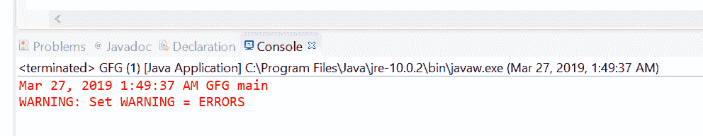
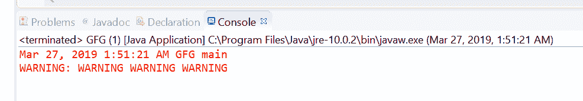

# Java 中的 `Logger.warning()` 方法示例

> 原文：[https://www.geeksforgeeks.org/logger-warning-method-in-java-with-examples/](https://www.geeksforgeeks.org/logger-warning-method-in-java-with-examples/)

`Logger` 类的 `warning()` 方法用于记录警告消息。此方法用于将警告类型日志传递给所有已注册的输出处理程序对象。

[警告消息](https://www.geeksforgeeks.org/logging-in-java/)：只要用户输入了错误的输入或凭据，就会出现警告。

根据传递的参数的数量，有两种类型的 `warning()` 方法。

## `warning(String msg)`

此方法用于记录警告消息。如果记录器启用了记录警告级别的消息，那么给定的消息将被转发到所有注册的输出处理程序对象。

**语法：**

```java
public void warning(String msg)
```

**参数：** 该方法接受单个参数 `String`，即字符串消息。

**返回值：** 此方法不返回任何内容。

以下程序说明 `warning(String msg)` 方法：

**程序 1：**

```java
// Java program to demonstrate
// Logger.warning(String msg) method

import java.io.IOException;
import java.util.logging.*;

public class GFG {

    public static void main(String[] args)
        throws SecurityException, IOException
    {

        // Create a Logger
        Logger logger
            = Logger.getLogger(
                GFG.class.getName());

        // Set Logger level()
        logger.setLevel(Level.WARNING);

        // Call warning method
        logger.warning("Set WARNING = ERRORS");
    }
}
```

控制台上打印的输出如下所示。

**输出：**


## `warning(Supplier msgSupplier)`

此方法用于记录一条警告消息，仅在日志级别满足该消息将被实际记录的条件时才构造。这意味着如果记录器启用了 `WARNING` 消息级别，则通过调用提供的 `Supplier` 函数来构造消息，并将其转发给所有已注册的输出处理程序对象。

**语法：**

```java
public void warning(Supplier msgSupplier)
```

**参数：** 这个方法接受一个单参数 `msgSupplier`，它是一个函数，当被调用时，会产生想要的日志消息。

**返回值：** 此方法不返回任何内容。

以下程序说明了 `warning(Supplier msgSupplier)` 方法：

**程序 1：**

```java
// Java program to demonstrate
// Logger.warning(Supplier<String>) method

import java.io.IOException;
import java.util.function.Supplier;
import java.util.logging.*;

public class GFG {

    public static void main(String[] args)
        throws SecurityException, IOException
    {

        // Create a Logger
        Logger logger
            = Logger.getLogger(
                GFG.class.getName());

        // Set Logger level()
        logger.setLevel(Level.WARNING);

        // Create a supplier<String> method
        Supplier<String> StrSupplier
            = () -> new String("WARNING WARNING WARNING");

        // Call warning(Supplier<String>)
        logger.warning(StrSupplier);
    }
}
```

控制台上打印的输出如下所示。

**输出：**


**参考文献：**

*   [https://docs.oracle.com/javase/10/docs/api/java/util/logging/Logger.html#warning(java.lang.String)](https://docs.oracle.com/javase/10/docs/api/java/util/logging/Logger.html#warning(java.lang.String))
*   [https://docs.oracle.com/javase/10/docs/api/java/util/logging/Logger.html#warning(java.util.function.Supplier)](https://docs.oracle.com/javase/10/docs/api/java/util/logging/Logger.html#warning(java.util.function.Supplier))