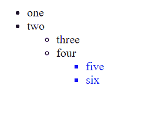

# jQuery 中 `find()` 和 `closest()` 的区别

> 原文：[https://www.geeksforgeeks.org/difference-between-find-and-closest-in-jquery/](https://www.geeksforgeeks.org/difference-between-find-and-closest-in-jquery/)

在了解 [`find()`](https://www.geeksforgeeks.org/javascript-array-find-method/) 和 [`closest()`](https://www.geeksforgeeks.org/jquery-closest-with-examples/) 方法之间的区别之前，让我们简单了解一下这些是什么以及它们是做什么的。

## 1. `find()` 方法

此方法用于获取当前匹配元素集中每个元素的所有过滤后代。

**语法：**

```html
$(selector).find('filter-expression')
```

**参数：** 用于过滤后代搜索的选择器表达式、元素或 jQuery 对象。

**返回值：** 返回调用 `find()` 方法的元素的所有匹配后代。这个方法遍历 DOM 直到最后一个后代。这意味着它会遍历 DOM 的所有层次，比如孩子、孙子、曾孙等等。

**示例：** 在下面的代码中，它会在 [`p`](https://www.geeksforgeeks.org/html-paragraph/) 标签中找到所有的 [`span`](https://www.geeksforgeeks.org/span-tag-html/) 标签，并将其颜色更改为蓝色。

### HTML

```html
<!DOCTYPE html>

<head>
    <!-- jQuery library -->
    <script src=
        "https://code.jquery.com/jquery-git.js">
    </script>
</head>

<body>
    <p><span>Hello </span>Geeks!</p>

    <div>
        <p>Hey! <span>How </span>are you</p>
    </div>

    <p>Hello Geeks</p>

    <script>
        $('p').find('span').css('color', 'blue')
    </script>
</body>

</html>
```

**输出：**


## 2. `closest()` 方法

此方法用于获取所选元素的第一个祖先。祖先可以是父母、祖父母、曾祖父母等。

**语法：**

```html
$(selector).closest(filter-expression)
```

**参数：** 用于筛选祖先搜索的选择器表达式、元素或 jQuery 对象。

**示例：** 该方法一直遍历到文档的根元素，即 `<html>`，找到所选元素的第一个祖先。我们有三个级别的无序列表 [`ul`](https://www.geeksforgeeks.org/html-ul-tag/) 标签。在 [`li`](https://www.geeksforgeeks.org/html-li-tag/) 标签上调用 `closest()` 方法后，返回第一个最近的 `<ul>` 标签。

### HTML

```html
<!DOCTYPE html>

<head>
    <!-- jQuery library -->
    <script src=
        "https://code.jquery.com/jquery-git.js">
    </script>
</head>

<body>
    <ul>
        <li>one</li>
        <li>two</li>
        <ul>
            <li>three</li>
            <li>four</li>
            <ul>
                <li id="select-Me">five</li>
                <li>six</li>
            </ul>
        </ul>
    </ul>
    <script>
        $("#select-Me")
            .closest("ul")
            .css("color", "blue");
    </script>
</body>

</html>
```

**输出：**



## `find()` 与 `closest()` 的区别

| 特性 | `find()` | `closest()` |
| :--- | :--- | :--- |
| **用途** | 此方法用于获取当前匹配元素集中每个元素的所有过滤后代。 | 此方法用于获取所选元素的第一个祖先。 |
| **遍历方向** | 此方法遍历 DOM 直到最后一个后代。 | 此方法遍历 DOM 到文档的根元素。 |
| **遍历目标** | 此方法是向下查找树中的子元素和子元素的子元素。 | 此方法是向上查找树中的父元素。 |