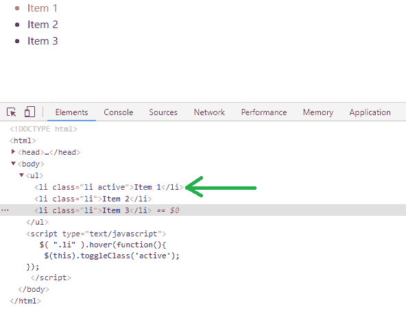
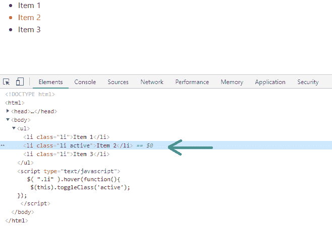
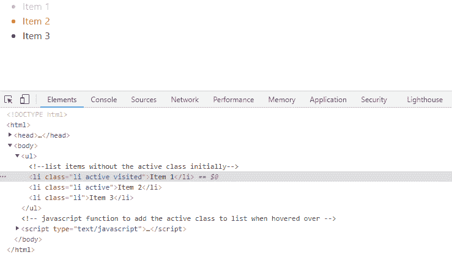

# 如何添加

*   如何使用 jQuery 为 `<li>` 添加 `active` 类并在悬停后移除它？

> 原文: [https://www.geeksforgeeks.org/how-to-add-li-class-to-active-and-leave-it-after-hover-using-jquery/](https://www.geeksforgeeks.org/how-to-add-li-class-to-active-and-leave-it-after-hover-using-jquery/) 将 li 类添加到活动状态并在悬停后离开它

Bootstrap 4 是一个开源的 CSS 框架，用于 web 应用程序的前端开发。Bootstrap 与 HTML 和 Javascript 一起丰富了用户界面，以获得更好的用户体验。jQuery 是一个用于执行 Javascript 函数的 Javascript 框架。jQuery 具有类似于 javascript 的功能，但唯一的区别是 jQuery 包含的代码行更少。使用 jQuery 和 CSS，我们可以编写一个代码，演示当光标悬停在列表项上时添加活动类，以及随后当光标移出时移除活动类。

## 第一种方法

在第一种方法中，我们使用 jQuery 的 `hover()` 方法。`hover()` 方法触发或注册 `mouseenter` 和 `mouseleave` 事件。`hover()` 方法接受两个函数作为参数。第一个参数是 `infunction`，当鼠标进入选定项时必须触发；第二个参数是 `outfunction`，当鼠标离开选定项时必须执行。第一个参数是必需的，而第二个参数是可选的。在此示例中，我们仅指定了 `infunction`。如果只指定一个函数，则它会同时用于 `mouseenter` 和 `mouseleave` 事件。此外，`toggleClass()` 方法会切换 `active` 类，即如果 `<li>` 项中不存在 `active` 类则添加它，否则移除它。

**语法:**

```
hover(infunction, outfunction)
```

**示例:**

```html
<!DOCTYPE html>
<html>
    <head>
        <!-- CSS only -->
        <link rel="stylesheet"
              href="https://stackpath.bootstrapcdn.com/bootstrap/4.5.2/css/bootstrap.min.css"
              integrity="sha384-JcKb8q3iqJ61gNV9KGb8thSsNjpSL0n8PARn9HuZOnIxN0hoP+VmmDGMN5t9UJ0Z"
              crossorigin="anonymous" />
        <!-- JS, Popper.js, jquery -->
        <script src="https://code.jquery.com/jquery-3.5.1.slim.min.js"
                integrity="sha384-DfXdz2htPH0lsSSs5nCTpuj/zy4C+OGpamoFVy38MVBnE+IbbVYUew+OrCXaRkfj"
                crossorigin="anonymous">
      </script>
        <script src="https://cdn.jsdelivr.net/npm/popper.js@1.16.1/dist/umd/popper.min.js"
                integrity="sha384-9/reFTGAW83EW2RDu2S0VKaIzap3H66lZH81PoYlFhbGU+6BZp6G7niu735Sk7lN"
                crossorigin="anonymous"></script>
        <script src="https://stackpath.bootstrapcdn.com/bootstrap/4.5.2/js/bootstrap.min.js"
                integrity="sha384-B4gt1jrGC7Jh4AgTPSdUtOBvfO8shuf57BaghqFfPlYxofvL8/KUEfYiJOMMV+rV"
                crossorigin="anonymous"></script>
        <!--CSS stylesheet-->
        <style type="text/css">
            .active,
            li:hover {
                color: red;
            }
        </style>
    </head>
    <body>
        <ul>
            <!--list items without the active class initially-->
            <li class="li">Item 1</li>
            <li class="li">Item 2</li>
            <li class="li">Item 3</li>
        </ul>
        <!-- javascript function to add the active class to list when hovered over -->
        <script type="text/javascript">
            $(".li").hover(function () {
                //toggleClass() switches the active class
                $(this).toggleClass("active");
            });
        </script>
    </body>
</html>
```

**输出**





**说明:** 输出在网络浏览器的控制台中检查。当光标悬停在列表项上时，我们会在控制台中看到添加到列表项的活动类。当光标悬停在外面时，活动类将从最近悬停的项中移除，并添加到下一项中。

## 第二种方法

在第二种方法中，我们添加 `outfunction` 来标记一个已被访问的列表项。这里，`active` 类在 `mouseenter` 时添加，在 `mouseleave` 时移除。当 `mouseleave` 事件被触发时，`visited` 类会被添加到最近访问的列表项上。

```html
<!DOCTYPE html>
<html>
    <head>
        <!-- CSS only -->
        <link rel="stylesheet"
              href="https://stackpath.bootstrapcdn.com/bootstrap/4.5.2/css/bootstrap.min.css"
              integrity="sha384-JcKb8q3iqJ61gNV9KGb8thSsNjpSL0n8PARn9HuZOnIxN0hoP+VmmDGMN5t9UJ0Z"
              crossorigin="anonymous" />
        <!-- JS, Popper.js, jquery -->
        <script src="https://code.jquery.com/jquery-3.5.1.slim.min.js"
                integrity="sha384-DfXdz2htPH0lsSSs5nCTpuj/zy4C+OGpamoFVy38MVBnE+IbbVYUew+OrCXaRkfj"
                crossorigin="anonymous"></script>
        <script src="https://cdn.jsdelivr.net/npm/popper.js@1.16.1/dist/umd/popper.min.js"
                integrity="sha384-9/reFTGAW83EW2RDu2S0VKaIzap3H66lZH81PoYlFhbGU+6BZp6G7niu735Sk7lN"
                crossorigin="anonymous"></script>
        <script src="https://stackpath.bootstrapcdn.com/bootstrap/4.5.2/js/bootstrap.min.js"
                integrity="sha384-B4gt1jrGC7Jh4AgTPSdUtOBvfO8shuf57BaghqFfPlYxofvL8/KUEfYiJOMMV+rV"
                crossorigin="anonymous"></script>
        <!--CSS stylesheet-->
        <style type="text/css">
            .active,
            li:hover {
                color: red;
            }
            .visited {
                color: violet;
            }
        </style>
    </head>
    <body>
        <ul>
            <!--list items without the active class initially-->
            <li class="li">Item 1</li>
            <li class="li">Item 2</li>
            <li class="li">Item 3</li>
        </ul>
        <!-- javascript function to add the active class to list when hovered over -->
        <script type="text/javascript">
            $(".li").hover(
                function () {
                    //toggleClass() switches the active class
                    $(this).toggleClass("active");
                },
                function () {
                    $(this).addClass("visited");
                }
            );
        </script>
    </body>
</html>
```

**输出**



**说明:** 输出在网络浏览器的控制台中检查。当光标悬停在列表项上时，我们会在控制台中看到添加到列表项 2 的活动类。此外，列表项 1 以前被访问过，因此被访问的类被添加到列表项 1 中，并且根据 CSS 样式表中被访问类的规范，列表项 1 的颜色变为紫色。