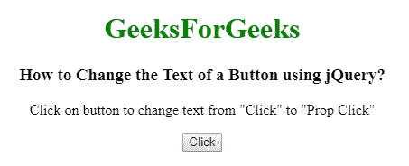
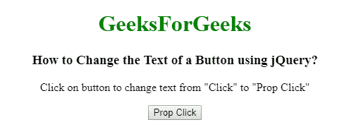
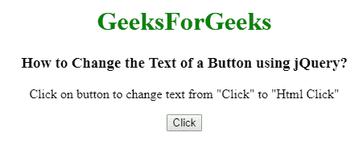
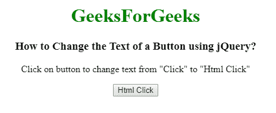

# 如何使用 jQuery 更改按钮的文本？

> 原文：[https://www.geeksforgeeks.org/how-to-change-the-text-of-a-button-using-jquery/](https://www.geeksforgeeks.org/how-to-change-the-text-of-a-button-using-jquery/)

下面是使用 jQuery 更改按钮文本的问题。要完成这项任务，我们可以使用以下两种方法：

## 1. `prop()` 方法

`prop()` 方法用于设置属性值，它为选中的元素设置一个或多个属性。

**语法：**

```html
$(selector).prop(para1, para2)
```

**步骤：**
1.  从`<input>`元素获取文本。
2.  第一个匹配元素基于 `para1`。
3.  将选中元素的值从 `para1` 更改为 `para2`。

**示例：**

```html
<!DOCTYPE html>
<html>
<head>
    <title>Change the Text of a Button using jQuery</title>
    <script src="https://code.jquery.com/jquery-1.12.4.min.js"></script>
</head>
<body style="text-align:center;">
    <h1 style="color:green;">GeeksForGeeks</h1>
    <h3>Change the Text of a Button using jQuery</h3>
    <p>Click on button to change text from "Click" to "Prop Click"</p>
    <input type="button" id="Geeks" value="Click">
    <script>
        $(document).ready(function() {
            $("input").click(function() {
                // Change text of input button
                $("#Geeks").prop("value", "Prop Click");
            });
        });
    </script>
</body>
</html>
```

**输出：**
**点击按钮前：**

**点击按钮后：**


## 2. `html()` 方法

`html()` 方法用于设置或返回选中元素的内容（innerHTML）。

**语法：**

```html
$(selector).html(content)
```

**步骤：**
1.  从`<button>`元素获取文本。
2.  它匹配选择器元素。
3.  将选中元素的值更改为 `content`。

**示例：**

```html
<!DOCTYPE html>
<html>
<head>
    <title>How to Change the Text of a Button using jQuery?</title>
    <script src="https://code.jquery.com/jquery-1.12.4.min.js"></script>
</head>
<body style="text-align:center;">
    <h1 style="color:green;">GeeksForGeeks</h1>
    <h3>How to Change the Text of a Button using jQuery?</h3>
    <p>Click on button to change text from "Click" to "Html Click"</p>
    <button type="button" id="Geeks">Click</button>
    <script>
        $(document).ready(function() {
            $("button").click(function() {
                // Change text of button element
                $("#Geeks").html("Html Click");
            });
        });
    </script>
</body>
</html>
```

**输出：**
**点击按钮前：**

**点击按钮后：**
